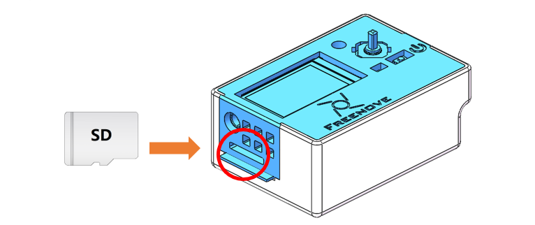

##############################################################################
Chapter 0 Assembly
##############################################################################

If the product you received is pre-assembled, you can skip this chapter.

.. table:: 
    :align: center

    +----------------+----------------+
    | |Chapter00_00| | |Chapter00_01| |
    +----------------+----------------+

If you need to assemble it, please follow the following instructions step by step to proceed.

.. table:: 
    :align: center

    +------------------------------------------------------------------------------------------------------------+
    | First, connect the camera to the board.                                                                    |
    |                                                                                                            |
    | |Chapter00_02|                                                                                             |
    |                                                                                                            |
    | 1. Do not remove or install the camera while power is on to avoids potential short circuits                |
    |                                                                                                            |
    |    or damage during hot-plugging.                                                                          |
    |                                                                                                            |
    | 2. The camera socket features a flip-top design—gently lift the cover to install the camera.               |
    |                                                                                                            |
    |    Avoid forceful handling.                                                                                |
    |                                                                                                            |
    | 3. Fully insert the camera into the socket until it reaches the end.                                       |
    +------------------------------------------------------------------------------------------------------------+
    | Plug the ESP32S3 onto the extension board.                                                                 |
    |                                                                                                            |
    | |Chapter00_03|                                                                                             |
    |                                                                                                            |
    | :red:`1. Pay attention to the orientation of the board. Installing reversely may damage the board.`        |
    |                                                                                                            |
    | :red:`2. Align the two board pin to pin.`                                                                  |
    +------------------------------------------------------------------------------------------------------------+
    | Connect the battery to the battery interface.                                                              |
    |                                                                                                            |
    | (Note: The battery is optional. You can also power the device via USB cable without installing a battery.) |
    |                                                                                                            |
    | |Chapter00_04|                                                                                             |
    |                                                                                                            |
    | Caution: Observe correct battery polarity during connection. Reverse polarity may damage the product.      |
    |                                                                                                            |
    | (If you do not use the battery, you may skip this step.)                                                   |
    +------------------------------------------------------------------------------------------------------------+
    | Place the battery as shwon below. (Skip this if you do not have a battery.)                                |
    |                                                                                                            |
    | |Chapter00_05|                                                                                             |
    +------------------------------------------------------------------------------------------------------------+
    | Place the board upside down with the extension board facing up, then secure the housing cover on it.       |
    |                                                                                                            |
    | |Chapter00_06|                                                                                             |
    +------------------------------------------------------------------------------------------------------------+
    | Align the housing cover with the base and secure both components together.                                 |
    |                                                                                                            |
    | |Chapter00_07|                                                                                             |
    |                                                                                                            |
    | :red:`Align the housing cover with the snap-fit on the base.`                                              |
    |                                                                                                            |
    | :red:`Gently press down until fully seated.`                                                               |
    |                                                                                                            |
    | |Chapter00_08|                                                                                             |
    |                                                                                                            |
    | :red:`Note: The housing is fragile. Avoid forceful installation.`                                          |
    +------------------------------------------------------------------------------------------------------------+
    | The installation should look like the image below once completed.                                          |
    |                                                                                                            |
    | |Chapter00_09|                                                                                             |
    |                                                                                                            |
    | Please note that the typical accuracy of FDM-type 3D printers is 0.1-0.2 mm, so snap-fit structures        |
    |                                                                                                            |
    | may have slight looseness, which is normal.                                                                |
    +------------------------------------------------------------------------------------------------------------+
    | Finally, insert the SD card to the ESP32S3.                                                                |
    |                                                                                                            |
    | |Chapter00_10|                                                                                             |
    +------------------------------------------------------------------------------------------------------------+
    
To depart the housing, please do as following:

.. table:: 
    :align: center
 
    +----------------------------------------------------------------------------------------------------+
    | :red:`Caution: The housing is fragile. Avoid using excessive force during disassembly`             |
    |                                                                                                    |
    | Gently push upward on the antenna area of the ESP32-S3 (highlighted in the circled section below)  |
    |                                                                                                    |
    | with your finger.                                                                                  |
    |                                                                                                    |
    | |Chapter00_11|                                                                                     |
    +----------------------------------------------------------------------------------------------------+

.. |Chapter00_02| image:: ../_static/imgs/Main/0_Assembly/Chapter00_02.png

.. |Chapter00_04| image:: ../_static/imgs/Main/0_Assembly/Chapter00_04.png

