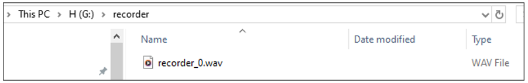

##############################################################################
Chapter 10 Record Test
##############################################################################

In this chapter, we will explore the audio recording functionality of the Freenove Media Kit for ESP32.

Project 10.1 Record To WAV
**************************************

Component List 
=================================

.. list-table::
    :align: center

    * - Freenove Media Kit for ESP32-S3 x1
      - USB cable x1

    * - |Chapter03_01|
      - |Chapter03_02|

    * - SD card x1
      - Card reader x1 (random color)

    * - |Chapter04_00|
      - |Chapter04_01|

.. |Chapter03_01| image:: ../_static/imgs/Main/3_5-Way_Navigation_Switch_Test/Chapter03_01.png
.. |Chapter03_02| image:: ../_static/imgs/Main/3_5-Way_Navigation_Switch_Test/Chapter03_02.png
.. |Chapter04_00| image:: ../_static/imgs/Main/4_SD_Card_Read_&_Write_Test/Chapter04_00.png
.. |Chapter04_01| image:: ../_static/imgs/Main/4_SD_Card_Read_&_Write_Test/Chapter04_01.png

Component knowledge
================================

MEMS-MIC
--------------------------------------------

A MEMS Microphone (Micro-Electro-Mechanical Systems Microphone) is a miniature microphone manufactured using MEMS technology. It integrates mechanical sensing elements and electronic circuits on the same chip to achieve sound signal acquisition and conversion. Its working principle primarily involves a tiny vibrating diaphragm that detects sound pressure changes, then converts these mechanical vibrations into electrical signals, enabling sound capture and transmission.

MEMS microphones are characterized by their compact size, high sensitivity, excellent stability, and ease of mass production. They are widely used in electronic devices such as smartphones, earphones, and smart speakers. Compared to traditional microphones, MEMS microphones better meet the dual demands of modern electronic products for both miniaturization and performance.

Circuit
=================================

Connect Freenove Media Kit for ESP32-S3 to your computer using the USB cable.

.. image:: ../_static/imgs/Main/3_5-Way_Navigation_Switch_Test/Chapter03_03.png
    :align: center

Before connecting the USB cable, insert the SD card into the SD card slot on the back of the ESP32-S3.

.. image:: ../_static/imgs/Main/7_Video_Web_Server/Chapter07_03.png
    :align: center

Sketch
==================================

Sketch_10_1_Record_To_WAV
-----------------------------------

The following is the program code:

.. literalinclude:: ../../../freenove_Kit/Sketches/Sketch_10_1_Record_To_WAV/Sketch_10_1_Record_To_WAV.ino
    :linenos:
    :language: c
    :dedent:

Add required header files and definitions.

.. literalinclude:: ../../../freenove_Kit/Sketches/Sketch_10_1_Record_To_WAV/Sketch_10_1_Record_To_WAV.ino
    :linenos:
    :language: c
    :lines: 10-11
    :dedent:

Define SD card and microphone pins using macros.

.. literalinclude:: ../../../freenove_Kit/Sketches/Sketch_10_1_Record_To_WAV/Sketch_10_1_Record_To_WAV.ino
    :linenos:
    :language: c
    :lines: 15-20
    :dedent:

Initialize microphone and SD card.

.. literalinclude:: ../../../freenove_Kit/Sketches/Sketch_10_1_Record_To_WAV/Sketch_10_1_Record_To_WAV.ino
    :linenos:
    :language: c
    :lines: 29-35
    :dedent:

Record 5 seconds of audio and save.

.. literalinclude:: ../../../freenove_Kit/Sketches/Sketch_10_1_Record_To_WAV/Sketch_10_1_Record_To_WAV.ino
    :linenos:
    :language: c
    :lines: 39-52
    :dedent:

After uploading the code, a 5-second audio clip will be recorded and saved in WAV format on the SD card.

After recording is complete, remove the SD card and insert it into a card reader. Connect the card reader to your computer.

In the SD card directory, you will find a folder named "recorder", which contains the recorded audio file.

Reference
------------------------------

.. py:function:: audio_input_init(uint8_t sck, uint8_t ws, uint8_t din)	
    
    This functions is used to initialize I2S pins.

.. py:function:: uint8_t* audio_input_record_wav(uint32_t duration, size_t& wav_size)	

    This function is used to record audio data and returns a pointer to the audio data buffer.

    **Parameters:**
    
    duration: Recording duration (in seconds)
    
    wav_size: Total size of the audio data in bytes

.. py:function:: void write_file(const char *path, const uint8_t *buffer, size_t size)	

    This function writes data from memory to the SD card.

    **Parameters:**

    path: Target file path

    buffer: Data buffer to be written

    size: Number of bytes to write

.. py:function:: uint8_t* audio_input_record_wav(uint32_t duration, size_t& wav_size)	

    This function captures audio samples and returns a pointer to the audio buffer.

    **Parameters:**
    
    duration: Recording duration (seconds)
    
    wav_size: Total bytes of generated WAV data 

**If you have any concerns, please feel free to contact us via** support@freenove.com

Project 10.2 Record and Play
*********************************************

Component List 
=============================================

.. list-table::
    :align: center

    * - Freenove Media Kit for ESP32-S3 x1
      - USB cable x1

    * - |Chapter03_01|
      - |Chapter03_02|

    * - SD card x1
      - Card reader x1 (random color)

    * - |Chapter04_00|
      - |Chapter04_01|

Circuit
=================================

Connect Freenove Media Kit for ESP32-S3 to your computer using the USB cable.

.. image:: ../_static/imgs/Main/3_5-Way_Navigation_Switch_Test/Chapter03_03.png
    :align: center

Before connecting the USB cable, insert the SD card into the SD card slot on the back of the ESP32-S3.

.. image:: ../_static/imgs/Main/7_Video_Web_Server/Chapter07_03.png
    :align: center

Sketch
================================

Sketch_10_2_Record_And_Play
--------------------------------

The following is the program code:

.. literalinclude:: ../../../freenove_Kit/Sketches/Sketch_10_2_Record_And_Play/Sketch_10_2_Record_And_Play.ino
    :linenos:
    :language: c
    :dedent:

Include the required header files.

.. literalinclude:: ../../../freenove_Kit/Sketches/Sketch_10_2_Record_And_Play/Sketch_10_2_Record_And_Play.ino
    :linenos:
    :language: c
    :lines: 11-13
    :dedent:

Macro definitions for button, SD card, and microphone pins, and for the audio file storage directory.

.. literalinclude:: ../../../freenove_Kit/Sketches/Sketch_10_2_Record_And_Play/Sketch_10_2_Record_And_Play.ino
    :linenos:
    :language: c
    :lines: 15-25
    :dedent:

Initialize the microphone and SD card.

.. literalinclude:: ../../../freenove_Kit/Sketches/Sketch_10_2_Record_And_Play/Sketch_10_2_Record_And_Play.ino
    :linenos:
    :language: c
    :lines: 38-45
    :dedent:

Record an audio for five seconds.

.. literalinclude:: ../../../freenove_Kit/Sketches/Sketch_10_2_Record_And_Play/Sketch_10_2_Record_And_Play.ino
    :linenos:
    :language: c
    :lines: 87-102
    :dedent:

After uploading the code, press and hold the button to start recording; release the button to automatically stop. Once recording is complete, the system will automatically play back the recorded audio, and the file will be saved in the 'recorder' folder

.. note::
    
    :red:`For optimal recording quality, please stay as close to the microphone as possible during recording (the microphone location is shown in the figure below).`

**If you have any concerns, please feel free to contact us via** support@freenove.com

Project 10.3 Record and Play
***************************************

Component List 
=======================================

.. list-table::
    :align: center

    * - Freenove Media Kit for ESP32-S3 x1
      - USB cable x1

    * - |Chapter03_01|
      - |Chapter03_02|

    * - SD card x1
      - Card reader x1 (random color)

    * - |Chapter04_00|
      - |Chapter04_01|

Sketch
=======================================

Sketch_10_3_Record_And_Play
---------------------------------------

The following is the program code:

.. literalinclude:: ../../../freenove_Kit/Sketches/Sketch_10_3_Record_And_Play/Sketch_10_3_Record_And_Play.ino
    :linenos:
    :language: c
    :dedent:

Pressing different directions of the 5-way navigation switch will trigger corresponding function events.

.. literalinclude:: ../../../freenove_Kit/Sketches/Sketch_10_3_Record_And_Play/Sketch_10_3_Record_And_Play.ino
    :linenos:
    :language: c
    :lines: 87-114
    :dedent:

After uploading the code, pressing different directions of the 5-way navigation switch will trigger corresponding function events. Note that directions 4 and 5 currently have no assigned functions.

    - Long-pressing Button 1 starts recording, and releasing it stops recording.
    
    - Pushing Forward (2) plays back the recording.
    
    - Pushing Backward (3) stops playback.

**(Refer to the diagram below for button numbering.)**

.. note::

    :red:`1. In the initial state, playback and stop functions (Directions 2 & 3) are disabled. They become active only after a recording is initiated via Button 1.`

    :red:`2. For optimal recording quality, please stay as close to the microphone as possible during recording (the microphone location is shown in the figure below).`

