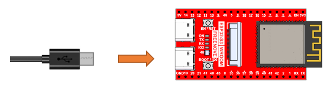

##############################################################################
Chapter 11 ESP32_SR
##############################################################################

Project 11.1 ESP32_SR
**************************************

Component knowledge
======================================

ESP32_SR
------------------------------------

ESP32_SR, also known as the ESP-SR Speech Recognition Framework, is a voice recognition solution developed by Espressif Systems for its ESP32 series chips. Designed specifically for low-power, high-efficiency on-device speech processing, this technology integrates core functionalities such as acoustic front-end processing, voice wake-up, and command recognition.

By leveraging built-in hardware acceleration modules and optimized algorithms, the system can perform full-process audio operations—including signal acquisition, noise reduction, feature extraction, and semantic parsing—directly on embedded devices without relying on cloud servers.

The framework supports custom wake words and multilingual command sets, allowing developers to quickly train and deploy models using the provided toolchain, enabling offline voice interaction capabilities for embedded devices.

Component List
=====================================

.. list-table::
    :header-rows: 1
    :align: center

    * - Freenove Media Kit for ESP32-S3 x1
      - USB cable x1

    * - |Chapter03_01|
      - |Chapter03_02|

.. |Chapter03_01| image:: ../_static/imgs/Main/3_5-Way_Navigation_Switch_Test/Chapter03_01.png
.. |Chapter03_02| image:: ../_static/imgs/Main/3_5-Way_Navigation_Switch_Test/Chapter03_02.png

Circuit
====================================

Connect Freenove Media Kit for ESP32-S3 to your computer using the USB cable.

Sketch
====================================

Uploading Voice Models
------------------------------------

Connect Freenove Media Kit for ESP32-S3 to your computer using the USB cable.

Enter the path **Freenove_Media_Kit_for_ESP32-S3\\Sketches\\Sketch_10_ESP32_SR\\Upload_Sr_Models**

Type cmd in the input bar and press Enter to open the Terminal.

Enter the following command in the terminal and press Enter to begin uploading the model to the Freenove Media Kit for ESP32-S3. During this process, **do not disconnect the USB cable** to avoid write failures or device damage.

.. code-block:: console
    
    python upload_models.py

Or

.. code-block:: console
    
    python3 upload_models.py

:red:`Important Notes:`

    :red:`1. Close the Arduino IDE Serial Monitor before running the upload_models.py script.`

    :red:`2. If the prompt shown in the right-side diagram appears, please verify whether the serial port is already in use.`

Generating Custom Voice Commands (On-Device)
---------------------------------------------------------

The system supports fully customizable voice commands that can be generated locally. Follow these steps to create your own:

Windows
^^^^^^^^^^^^^^^^^^^^^^^^^^^^^^^

Enter the path Freenove_Media_Kit_for_ESP32-S3\\Sketches\\Sketch_10_ESP32_SR\\Get_Sr_Commands

Type cmd in the input bar and press Enter to open the Terminal.

Input the following command, press Enter, and wait for the gen_en library to finish installing.

.. code-block:: console
    
    python3 install_gen_en.py

Input the following command and press Enter key to generate voice commands.

.. code-block:: console
    
    python3 gen_sr_commands.py "Turn on the light,Switch on the light;Turn off the light,Switch off the light,Go dark;Start fan;Stop fan"

Copy the generated commands to the code to use the voice commands.

:red:`Important Notes:`

:red:`1. You can customize the voice commands you need based on your actual requirements.`
    
.. code-block:: console

    python gen_sr_commands.py "command sets"

:red:`The contents inside the quotation marks can be multiple command. Each segment separated by a comma represents different expressions of the same command (i.e., equivalent voice commands). Different commands are separated by semicolons, representing distinct operational instructions.`

:red:`2. If you encounter a "command not found" error, please install the Python environment first.`

Mac
^^^^^^^^^^^^^^^^^^^^^^^^^^^^^^^

Open **Freenove_Media_Kit_for_ESP32-S3\\Sketches\\Sketch_10_ESP32_SR,** Press the **Ctrl** key **while right click "Get_Sr_Commands",** click **New Terminal at Folder**

Run the following comamnd to install the g2p_en library.

.. code-block:: console
    
    python3 install_gen_en.py

You will see the following promts upon the g2p_en library finishes installing.

Input the following command and press Enter key to generate the voice commands.
 
.. code-block:: console
    
    python3 gen_sr_commands.py "Turn on the light,Switch on the light;Turn off the light,Switch off the light,Go dark;Start fan;Stop fan"

Copy the generated commands to the code to use voice commands.

:red:`Important Notes:`

    :red:`You can customize the voice commands you need based on your actual requirements.`

.. code-block:: console
    
    python gen_sr_commands.py "command sets"

The contents inside the quotation marks can be multiple command. Each segment separated by a comma represents different expressions of the same command (i.e., equivalent voice commands). Different commands are separated by semicolons, representing distinct operational instructions.

Linux
^^^^^^^^^^^^^^^^^^^^^^^^^^^^^^^^

Right click **Freenove_Media_Kit_for_ESP32-S3\\Sketches\\Sketch_10_ESP32_SR,** right click Get_Sr_Commands, select **Open in Terminal**.

Run the following command to install the g2p_en library.

.. code-block:: console
    
    python3 install_gen_en.py

Input the following command and press Enter key to generate the voice commands.

.. code-block:: console
    
    python3 gen_sr_commands.py "Turn on the light,Switch on the light;Turn off the light,Switch off the light,Go dark;Start fan;Stop fan"

Copy the generated commands to the code to use voice commands.

:red:`Important Notes:`

:red:`You can customize the voice commands you need based on your actual requirements.`

.. code-block:: console
    
    python gen_sr_commands.py "commands sets"

:red:`The contents inside the quotation marks can be multiple command. Each segment separated by a comma represents different expressions of the same command (i.e., equivalent voice commands). Different commands are separated by semicolons, representing distinct operational instructions.`

Sketch_11_ESP32_SR
-----------------------------------

The following is the program code:

.. literalinclude:: ../../../freenove_Kit/Sketches/Sketch_11_ESP32_SR/Sketch_11_ESP32_SR.ino
    :linenos:
    :language: c
    :dedent:

Include the required header files.

.. literalinclude:: ../../../freenove_Kit/Sketches/Sketch_11_ESP32_SR/Sketch_11_ESP32_SR.ino
    :linenos:
    :language: c
    :lines: 13-14
    :dedent:

Define related pins.

.. literalinclude:: ../../../freenove_Kit/Sketches/Sketch_11_ESP32_SR/Sketch_11_ESP32_SR.ino
    :linenos:
    :language: c
    :lines: 16-22
    :dedent:

Custom voice commands, which need to be generated from :ref:`locally produced voice command sets <fnk0102/codes/main/11_esp32_sr:generating custom voice commands (on-device)>`.

.. literalinclude:: ../../../freenove_Kit/Sketches/Sketch_11_ESP32_SR/Sketch_11_ESP32_SR.ino
    :linenos:
    :language: c
    :lines: 29-39
    :dedent:

Initialize ESP32-SR and I2S.

.. literalinclude:: ../../../freenove_Kit/Sketches/Sketch_11_ESP32_SR/Sketch_11_ESP32_SR.ino
    :linenos:
    :language: c
    :lines: 91-97
    :dedent:

It is necessary to change the settings in Arduino IDE before clicking the Uploading button, as shown below.

:red:`Caution: Incorrect settings will result in compilation error or uploading failure. To achieve desired result, please configure exactly the same as below.`

After uploading the code, say the activating command ("Hi ESP") into the microphone. The serial monitor will display the following information:

After activation, you can use the following voice commands to control the Freenove Media Kit for ESP32-S3.

.. note:: Commands with the same number perform the same function.

**To ensure accurate voice command recognition for the Freenove Media Kit for ESP32-S3, please follow these guidelines:**

    - **Microphone Distance: Stay close to the microphone when issuing commands.**  
    
    - **Speech Speed: Maintain a moderate pace—avoid speaking too fast or too slow.**  
    
    - **Clear Pronunciation: Speak loudly and clearly, ensuring each word is articulated properly.**  

To change the activating word, please refer to the involved documentation and examples. For more detial ,refer to https://github.com/espressif/esp-sr