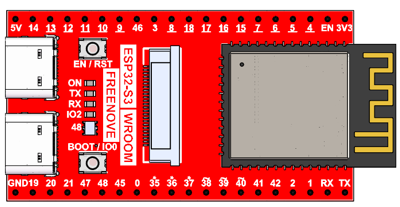
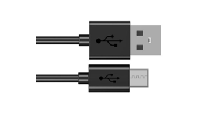
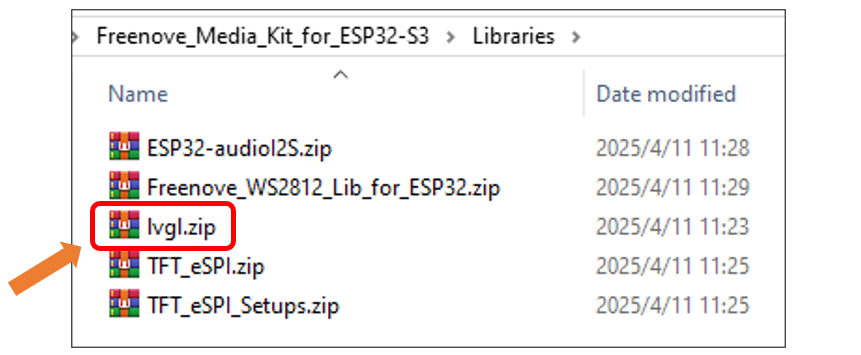
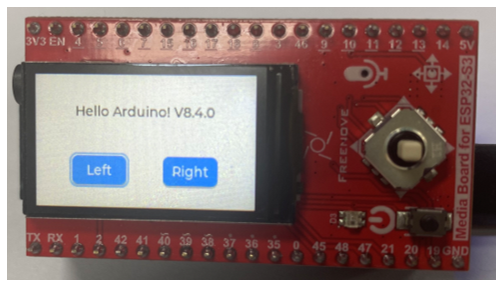
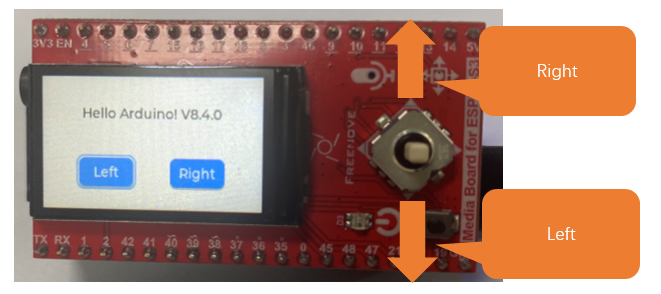

##############################################################################
Chapter 12 LVGL
##############################################################################

Project 12.1 LVGL
*************************************

Component List 
===================================

.. table:: 
    :align: center

    +------------------------------------+----------------+
    | Freenove Media Kit for ESP32-S3 x1 | USB cable x1   |
    |                                    |                |
    | |Chapter01_00|                     | |Chapter01_01| |
    +------------------------------------+----------------+

Component knowledge
====================================

LVGL is a widely-used embedded GUI library that is implemented in pure C, making it highly portable and performant. It offers rich features and content, supporting both display and input devices such as touchscreens and keyboards.

+-----+-----------------------------------------------------------------------------------------------------------------+
|     |                                           Features supported by LVGL                                            |
+=====+=================================================================================================================+
| 1   | Powerful building blocks such as buttons, charts, lists, sliders, images, and more.                             |
+-----+-----------------------------------------------------------------------------------------------------------------+
| 2   | Advanced graphics with animation, anti-aliasing, opacity, and smooth scrolling.                                 |
+-----+-----------------------------------------------------------------------------------------------------------------+
| 3   | Various input devices, such as touchpads, mice, keyboards, encoders, and more.                                  |
+-----+-----------------------------------------------------------------------------------------------------------------+
| 4   | Multiple languages with UTF-8 encoding.                                                                         |
+-----+-----------------------------------------------------------------------------------------------------------------+
| 5   | Multiple display types, including TFT and monochrome displays.                                                  |
+-----+-----------------------------------------------------------------------------------------------------------------+
| 6   | Fully customizable graphical elements.                                                                          |
+-----+-----------------------------------------------------------------------------------------------------------------+
| 7   | LVGL can be used independently of any microcontroller or display hardware.                                      |
+-----+-----------------------------------------------------------------------------------------------------------------+
| 8   | Highly extensible and can be configured to use very little memory (e.g. 64 kB of flash and 16 kB of RAM)        |
+-----+-----------------------------------------------------------------------------------------------------------------+
| 9   | It can be used with or without an operating system, and supports external memory and GPUs as optional features. |
+-----+-----------------------------------------------------------------------------------------------------------------+
| 10  | Single-frame buffer operation, even with advanced graphics effects.                                             |
+-----+-----------------------------------------------------------------------------------------------------------------+
| 11  | Written in C language to achieve maximum compatibility (compatible with C++ as well).                           |
+-----+-----------------------------------------------------------------------------------------------------------------+
| 12  | LVGL has a simulator that allows for embedded GUI design on a PC without any embedded hardware.                 |
+-----+-----------------------------------------------------------------------------------------------------------------+
| 13  | Resources to help developers quickly get started with the library, including tutorials, examples, and themes.   |
+-----+-----------------------------------------------------------------------------------------------------------------+
| 14  | A wide range of resources.                                                                                      |
+-----+-----------------------------------------------------------------------------------------------------------------+

Circuit
===================================

Connect Freenove Media Kit for ESP32-S3 to your computer using the USB cable.

.. image:: ../_static/imgs/Main/3_5-Way_Navigation_Switch_Test/Chapter03_03.png
    :align: center

Sketch
===================================

This code uses a library named "lvgl". If you have not installed it, please do so first.

How to install the library

Open Arduino IDE, click Sketch -> Include Library -> Add .ZIP Library. In the pop-up window, find the file named **"Freenove_Media_Kit_for_ESP32-S3\\Libraries\\lvgl.Zip"**, which locates in this directory, and click OPEN.

Select lvgl.zip and click Open.

Please be aware that the lvgl.zip file is a pre-configured file library that is specifically designed for our product. Using the online "add library" function to add the lvgl library may cause compilation errors and render our product unusable.

Sketch_12_LVGL
----------------------------------

Click on Upload to upload the code to the ESP32-S3. Once the code has completed uploading, you should see the screen displaying as shown below, which indicates successfully library configutaion and you can now begin learning LVGL.

The following is the program code:

.. literalinclude:: ../../../freenove_Kit/Sketches/Sketch_12_LVGL/Sketch_12_LVGL.ino
    :linenos:
    :language: c
    :dedent:

Include the required header files.

.. literalinclude:: ../../../freenove_Kit/Sketches/Sketch_12_LVGL/Sketch_12_LVGL.ino
    :linenos:
    :language: c
    :lines: 12-13
    :dedent:

Define the backlight pin for the TFT screen.

.. literalinclude:: ../../../freenove_Kit/Sketches/Sketch_12_LVGL/Sketch_12_LVGL.ino
    :linenos:
    :language: c
    :lines: 15-15
    :dedent:

Define the TFT screen object.

.. literalinclude:: ../../../freenove_Kit/Sketches/Sketch_12_LVGL/Sketch_12_LVGL.ino
    :linenos:
    :language: c
    :lines: 16-16
    :dedent:

Obtain the LVGL version and display on the screen.

.. literalinclude:: ../../../freenove_Kit/Sketches/Sketch_12_LVGL/Sketch_12_LVGL.ino
    :linenos:
    :language: c
    :lines: 25-34
    :dedent:

Create and display the left and right buttons on the screen

.. literalinclude:: ../../../freenove_Kit/Sketches/Sketch_12_LVGL/Sketch_12_LVGL.ino
    :linenos:
    :language: c
    :lines: 36-54
    :dedent:

Create an input device group, add the left and right buttons to the group, and enable keyboard control functionality.

.. literalinclude:: ../../../freenove_Kit/Sketches/Sketch_12_LVGL/Sketch_12_LVGL.ino
    :linenos:
    :language: c
    :lines: 56-61
    :dedent:

Create event callback functions for the left and right buttons, and configure them to listen for all events.

.. literalinclude:: ../../../freenove_Kit/Sketches/Sketch_12_LVGL/Sketch_12_LVGL.ino
    :linenos:
    :language: c
    :lines: 63-65
    :dedent:

Implement a 5-way directional key event handler to detect and respond to key values from the 5-way navigation button.

.. literalinclude:: ../../../freenove_Kit/Sketches/Sketch_12_LVGL/Sketch_12_LVGL.ino
    :linenos:
    :language: c
    :lines: 79-98
    :dedent:

After the code uploads, the TFT screen will display the following contents.

The 5-way switch allows you to cycle through options. You can switch the selected button by moving the focus box.

When the focus is on the left button, push the switch to the right moves it to the right button, and pushing Left brings it back to the left.

If the focus is already on the far right, pushing Right again makes it loop back to the left button.

Similarly, if the focus is on the far left, pushing Left makes it loop to the right button.

Pressing the center button highlights and confirms the selection of the current button.

Reference
--------------------------

.. py:function:: lv_obj_t * lv_label_create(lv_obj_t * parent);	
    
    This function creates a label control.

.. py:function:: lv_obj_t * lv_btn_create(lv_obj_t * parent);	

    This function creates a button control.

.. py:function:: void lv_label_set_text(lv_obj_t * obj, const char * text);	

    This function sets the corresponding text displayed by the label control

    **Paramters:**
    
    obj: label object
    
    text: displayed string
    
.. py:function:: void lv_obj_set_size(struct _lv_obj_t * obj, lv_coord_t w, lv_coord_t h);	

    This function sets the width and height of the control

    **Paramters:**

    obj: control object

    w: control width

    h: control height

.. py:function:: void lv_obj_align(struct _lv_obj_t * obj, lv_align_t align, lv_coord_t x_ofs, lv_coord_t y_ofs);	

    This function controls the alignment of controls

    **Paramters:**

    obj: control object 

    align:

    .. code-block:: c

        LV_ALIGN DEFAULT=0                  // Use default alignment
        
        LV_ALIGN TOP LEFT                   // The top left corner of the parent object's content area
        
        LV_ALIGN TOP MID                    // The top middle of the parent object's content area
        
        LV _ALIGN TOP RIGHT                 // The top right corner of the parent object's content area
        
        LV_ALIGN_BOTTOM_LEFT                // The bottom left corner of the parent object's content
        
        LV ALIGN BOTTOM_MID                 // The bottom middle of the parent object's content area
        
        LV_ALIGN_BOTTOM_RIGHT               // The bottom right corner of the parent object's content area
        
        LV_ALIGN LEFT MID                   // The left middle of the parent object's content area
        
        LV_ALIGN RIGHT MID                  // The right middle of the parent object's content area
        
        LV _ALIGN_CENTER                    // Centered horizontally and vertically with the parent object
        
        LV_ALIGN OUT TOP_LEFT               // Aligned above and to the left of the parent object
        
        LV_ALIGN OUT TOP_MID                // Directly above the parent object
        
        LV_ALIGN OUT TOP RIGHT              // Above the parent object and aligned to the right
        
        LV_ALIGN_OUT_BOTTOM_LEFT            // Below the parent object and aligned to the left
        
        LV_ALIGN OUT BOTTOM_MID             // Horizontally centered with the parent object
        
        LV ALIGN OUT BOTTOM RIGHT           // Below the parent object and aligned to the right
        
        LV_ALIGN OUT LEFT TOP               // Left and top aligned with the parent object
        
        LV_ALIGN OUT LEFT_MID               // Vertically centered on the left side of the parent object
        
        LV_ALIGN OUT LEFT BOTTOM            // Left and bottom aligned with the parent object
        
        LV_ALIGN OUT_RIGHT TOP              // Right and top aligned with the parent object
        
        LV_ALIGN OUT RIGHT_MID              // Vertically centered on the right side of the parent object
        
        LV_ALIGN OUT RIGHT BOTTOM           // Right and bottom aligned to the parent object
        
        x_ofs: x-axis offset   	            
        
        y_ofs: y-axis offset

**If you have any concerns, please feel free to contact us via** support@freenove.com