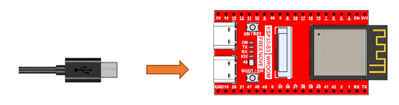

##############################################################################
Chapter 13 LVGL LEDPixel
##############################################################################

In previous chapters, we learned about LEDPixel and LVGL. This chapter will focus on how to integrate and apply these two technologies together.

Project 13.1 LVGL LEDPixel
**************************************

Component List 
===================================

.. table:: 
    :align: center

    +------------------------------------+----------------+
    | Freenove Media Kit for ESP32-S3 x1 | USB cable x1   |
    |                                    |                |
    | |Chapter01_00|                     | |Chapter01_01| |
    +------------------------------------+----------------+

.. |Chapter01_00| image:: ../_static/imgs/Main/1_LEDPixel_Test/Chapter01_00.png
.. |Chapter01_01| image:: ../_static/imgs/Main/1_LEDPixel_Test/Chapter01_01.png

Circuit
===================================

Connect Freenove Media Kit for ESP32-S3 to your computer using the USB cable.

Sketch
=====================================

Sketch_13_LVGL_LedPixel
-------------------------------------

**Before upload the sketch of this chapter, please ensure that the libraries** :ref:`LedPixel <fnk0102/codes/main/1_ledpixel_test:chapter 1 ledpixel test>` **,** :ref:`TFT_eSPI <fnk0102/codes/main/8_tft_clock:chapter 8 tft clock>` **and** :ref:`lvgl <fnk0102/codes/main/12_lvgl:chapter 12 lvgl>` **are already installed.**

The following is the program code:

.. literalinclude:: ../../../freenove_Kit/Sketches/Sketch_13_LVGL_LedPixel/Sketch_13_LVGL_LedPixel.ino
    :linenos:
    :language: c
    :dedent:

Include the required header files.

.. literalinclude:: ../../../freenove_Kit/Sketches/Sketch_13_LVGL_LedPixel/Sketch_13_LVGL_LedPixel.ino
    :linenos:
    :language: c
    :lines: 10-12
    :dedent:

Define TFT screen object

.. literalinclude:: ../../../freenove_Kit/Sketches/Sketch_13_LVGL_LedPixel/Sketch_13_LVGL_LedPixel.ino
    :linenos:
    :language: c
    :lines: 14-14
    :dedent:

TFT screen initialization

.. literalinclude:: ../../../freenove_Kit/Sketches/Sketch_13_LVGL_LedPixel/Sketch_13_LVGL_LedPixel.ino
    :linenos:
    :language: c
    :lines: 21-22
    :dedent:

Load LEDPixel UI

.. literalinclude:: ../../../freenove_Kit/Sketches/Sketch_13_LVGL_LedPixel/Sketch_13_LVGL_LedPixel.ino
    :linenos:
    :language: c
    :lines: 32-33
    :dedent:

To execute all pending LVGL tasks, this function must be called continuously.

.. literalinclude:: ../../../freenove_Kit/Sketches/Sketch_13_LVGL_LedPixel/Sketch_13_LVGL_LedPixel.ino
    :linenos:
    :language: c
    :lines: 43-43
    :dedent:

After the sketch is uploaded, the TFT screen will display the following interface.

Pressing different directions on the 5-way switch triggers corresponding functional events:

Switches 4 and 5 navigate between adjustable parameter fields

Switches 2 and 3 decrease or increase the threshold value of the currently selected parameter field respectively. (**Refer to the figure below for button numbering definition**)

You can change the color and brightness of the LEDPixel by adjusting the parameters.

**If you have any concerns, please feel free to contact us via** support@freenove.com