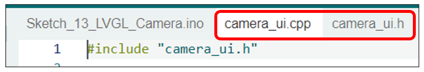
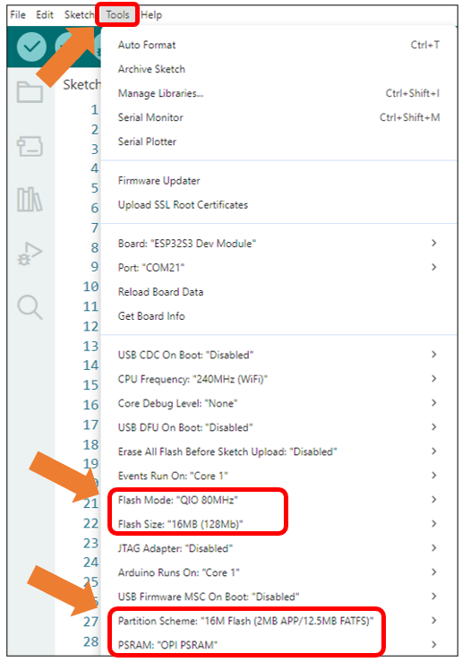
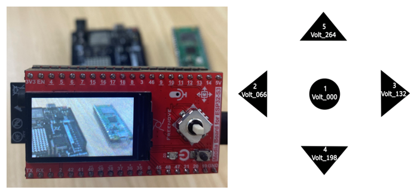
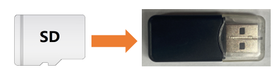
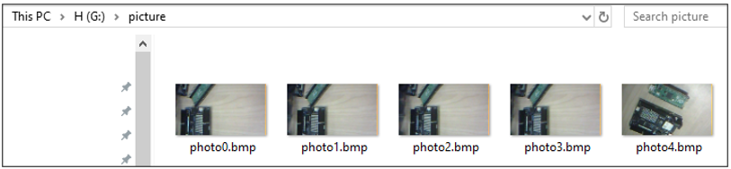
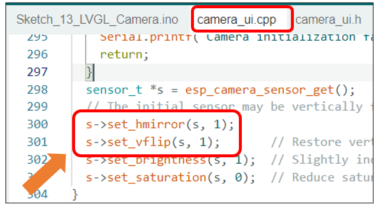

##############################################################################
Chapter 14 LVGL Camera
##############################################################################

In previous chapters, we learned about :ref:`Camera <fnk0102/codes/main/9_camera_tft_test:chapter 9 camera tft test>` and :ref:`LVGL <fnk0102/codes/main/12_lvgl:chapter 12 lvgl>`. This chapter will focus on how to integrate and apply these two technologies together.

Project 14.1 LVGL Camera
************************************

Capture image data using the camera module and display it on the TFT screen.

Component List 
=====================================

:combo:`red font-bolder:As of the time of writing, the Freenove Media Kit for ESP32-S3 comes in two different models with varying screen sizes. However, this tutorial applies to both versions.`

.. table:: 
    :align: center
    :class: table-line
    :width: 80%

    +------------------------------------+----------------+
    | Freenove Media Kit for ESP32-S3 x1 | USB cable x1   |
    |                                    |                |
    | |Chapter10_07|                     | |Chapter10_08| |
    +------------------------------------+----------------+
    | Extension Board x1(1.14 inch/3.5 inch)              |
    |                                                     |
    | |Chapter01_11|                                      |
    +----------------------+------------------------------+
    | SD card x1           | Card reader x1 (random color)|
    |                      |                              |
    | |Chapter10_09|       | |Chapter04_01|               |
    +----------------------+------------------------------+

.. |Chapter10_07| image:: ../_static/imgs/Main/10_Record_Test/Chapter10_07.png
.. |Chapter10_08| image:: ../_static/imgs/Main/10_Record_Test/Chapter10_08.png
.. |Chapter01_11| image:: ../_static/imgs/Main/1_LEDPixel_Test/Chapter01_11.png
.. |Chapter10_09| image:: ../_static/imgs/Main/10_Record_Test/Chapter10_09.png
.. |Chapter04_01| image:: ../_static/imgs/Main/4_SD_Card_Read_&_Write_Test/Chapter04_01.png

Circuit
===================================

Before connecting the USB cable, insert the SD card into the SD card slot on the back of the ESP32-S3.

.. image:: ../_static/imgs/Main/1_LEDPixel_Test/Chapter01_12.png
    :align: center

Connect Freenove ESP32-S3 to the computer using the USB cable. 

.. image:: ../_static/imgs/Main/1_LEDPixel_Test/Chapter01_04.png
    :align: center

Sketch
==================================

Sketch_14_LVGL_Camera
----------------------------------

The following is the program code:

.. literalinclude:: ../../../freenove_Kit/Sketches/Sketch_14_LVGL_Camera/Sketch_14_LVGL_Camera.ino
    :linenos:
    :language: c
    :dedent:

Include the required libraries.

.. literalinclude:: ../../../freenove_Kit/Sketches/Sketch_14_LVGL_Camera/Sketch_14_LVGL_Camera.ino
    :linenos:
    :language: c
    :lines: 10-11
    :dedent:

Define SD card pins.

.. literalinclude:: ../../../freenove_Kit/Sketches/Sketch_14_LVGL_Camera/Sketch_14_LVGL_Camera.ino
    :linenos:
    :language: c
    :lines: 13-15
    :dedent:

Declare TFT screen object.

.. literalinclude:: ../../../freenove_Kit/Sketches/Sketch_14_LVGL_Camera/Sketch_14_LVGL_Camera.ino
    :linenos:
    :language: c
    :lines: 17-17
    :dedent:

Initialize SD card and camera.

.. literalinclude:: ../../../freenove_Kit/Sketches/Sketch_14_LVGL_Camera/Sketch_14_LVGL_Camera.ino
    :linenos:
    :language: c
    :lines: 23-24
    :dedent:

Load the camera interface to the TFT screen.

.. literalinclude:: ../../../freenove_Kit/Sketches/Sketch_14_LVGL_Camera/Sketch_14_LVGL_Camera.ino
    :linenos:
    :language: c
    :lines: 39-40
    :dedent:

To execute all pending LVGL tasks, this function must be called continuously.

.. literalinclude:: ../../../freenove_Kit/Sketches/Sketch_14_LVGL_Camera/Sketch_14_LVGL_Camera.ino
    :linenos:
    :language: c
    :lines: 47-47
    :dedent:

If you are interesting in the implementation of functions, you can check them out here.

It is necessary to change the settings in Arduino IDE before clicking the Uploading button, as shown below.

.. caution::

    :combo:`red font-bolder:Incorrect settings will result in compilation error or uploading failure. To achieve desired result, please configure exactly the same as below.`

After uploading the code, the image from the camera will be displayed on the TFT screen. Pressing the button1 will automatically save the photo to the SD card. 

.. note::
    
    :combo:`red font-bolder:Here, take 1.14 inches as an example; the usage is the same for 3.5 inches.`

After taking photos, please remove the SD card and insert it into a card reader, then connect the reader to your computer.

In the SD card's directory, there is a folder named 'Video' which contains the pictures you just captured.

Notice: Camera display performance may vary across different module models. Some devices may exhibit mirrored imaging. In such cases, adjust the horizontal flip and vertical flip parameters by modifying the following two lines of code in camera_ui.cpp:

**Parameter Description:**

    - 0: Normal display

    - 1: Flip (mirror)

To achieve the desired display, configure the settings according to real-time preview feedback during setup.

**If you have any concerns, please feel free to contact us via** support@freenove.com