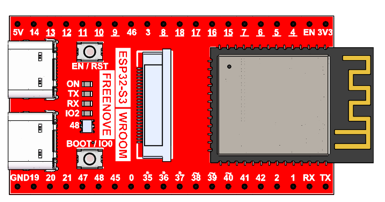
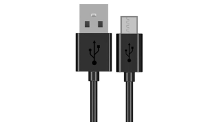

##############################################################################
Chapter 15 LVGL Picture
##############################################################################

In this chapter, you will learn how to read image data from the SD card and display it on the TFT screen.

Project 15.1 LVGL Picture
***************************************

Component List 
=====================================

.. list-table::

    * - Freenove Media Kit for ESP32-S3 x1
      - USB cable x1

    * - |Chapter03_01|
      - |Chapter03_02|

    * - SD card x1
      - Card reader x1 (random color)

    * - |Chapter04_00|
      - |Chapter04_01|

.. |Chapter04_01| image:: ../_static/imgs/Main/4_SD_Card_Read_&_Write_Test/Chapter04_01.png

Circuit
======================================

Connect Freenove Media Kit for ESP32-S3 to your computer using the USB cable.

.. image:: ../_static/imgs/Main/2_Battery_Voltage_Detection/Chapter02_03.png
    :align: center

Before connecting the USB cable, insert the SD card into the SD card slot on the back of the ESP32-S3.

.. image:: ../_static/imgs/Main/7_Video_Web_Server/Chapter07_03.png
    :align: center

Sketch
===================================

Sketch_15_LVGL_Picture
----------------------------------

The following is the program code:

.. literalinclude:: ../../../freenove_Kit/Sketches/Sketch_15_Lvgl_Picture/Sketch_15_Lvgl_Picture.ino
    :linenos:
    :language: c
    :dedent:

Include the required libraries.

.. literalinclude:: ../../../freenove_Kit/Sketches/Sketch_15_Lvgl_Picture/Sketch_15_Lvgl_Picture.ino
    :linenos:
    :language: c
    :lines: 10-11
    :dedent:

Define SD card pins.

.. literalinclude:: ../../../freenove_Kit/Sketches/Sketch_15_Lvgl_Picture/Sketch_15_Lvgl_Picture.ino
    :linenos:
    :language: c
    :lines: 13-15
    :dedent:

Declare TFT screen object.

.. literalinclude:: ../../../freenove_Kit/Sketches/Sketch_15_Lvgl_Picture/Sketch_15_Lvgl_Picture.ino
    :linenos:
    :language: c
    :lines: 17-17
    :dedent:

Initialize the SD card.

.. literalinclude:: ../../../freenove_Kit/Sketches/Sketch_15_Lvgl_Picture/Sketch_15_Lvgl_Picture.ino
    :linenos:
    :language: c
    :lines: 24-24
    :dedent:

TFT screen initialization.

.. literalinclude:: ../../../freenove_Kit/Sketches/Sketch_15_Lvgl_Picture/Sketch_15_Lvgl_Picture.ino
    :linenos:
    :language: c
    :lines: 28-28
    :dedent:

Initialize the UI component for image browsing

.. literalinclude:: ../../../freenove_Kit/Sketches/Sketch_15_Lvgl_Picture/Sketch_15_Lvgl_Picture.ino
    :linenos:
    :language: c
    :lines: 38-39
    :dedent:

If you are interesting in the implementation of functions, you can check them out here.

Before uploading the code, you need to use the sample code in :ref:`Chapter 13 <fnk0102/codes/main/13_lvgl_ledpixel:chapter 13 lvgl ledpixel>` to take a picture and store it in the SD card. Make sure there are image files in the picture folder.

It is necessary to change the settings in Arduino IDE before clicking the Uploading button, as shown below.

:red:`Caution: Incorrect settings will result in compilation error or uploading failure. To achieve desired result, please configure exactly the same as below.`

After uploading the code, the TFT display will show images from the SD card. The 5-way navigation key operates as follows:

Switches 5 (Right) and 4 (Left): Navigate horizontally between selection frames

Button 1 (Center): Confirms selection (Enter key)

Switches 2/3: Invalid in this project

**Refer to the fiigure below (right) for the button numbering.**

**If you have any concerns, please feel free to contact us via** support@freenove.com
