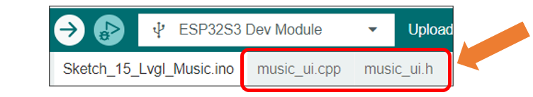
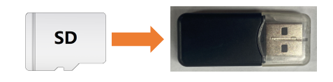
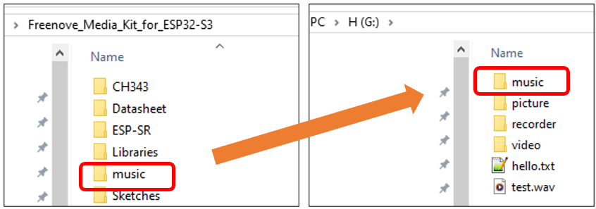
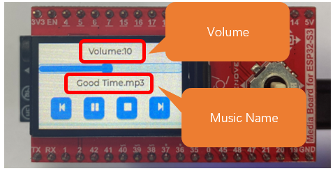
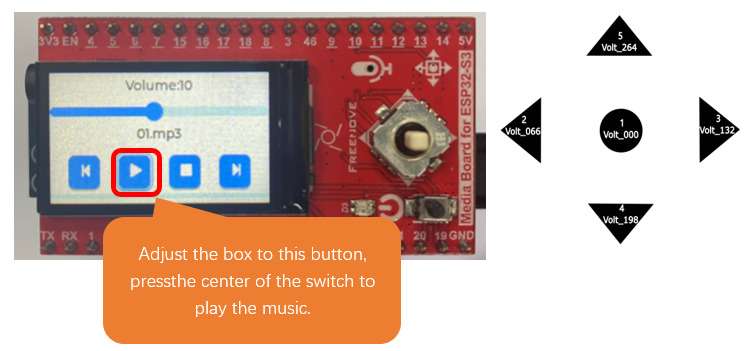

##############################################################################
Chapter 16 LVGL Music
##############################################################################

Project 16.1 LVGL Music
***************************************

Component List 
==================================

.. list-table::

    * - Freenove Media Kit for ESP32-S3 x1
      - USB cable x1

    * - |Chapter03_01|
      - |Chapter03_02|

    * - SD card x1
      - Card reader x1 (random color)

    * - |Chapter04_00|
      - |Chapter04_01|

.. |Chapter03_01| image:: ../_static/imgs/Main/3_5-Way_Navigation_Switch_Test/Chapter03_01.png
.. |Chapter03_02| image:: ../_static/imgs/Main/3_5-Way_Navigation_Switch_Test/Chapter03_02.png
.. |Chapter04_00| image:: ../_static/imgs/Main/4_SD_Card_Read_&_Write_Test/Chapter04_00.png
.. |Chapter04_01| image:: ../_static/imgs/Main/4_SD_Card_Read_&_Write_Test/Chapter04_01.png

Circuit
======================================

Connect Freenove Media Kit for ESP32-S3 to your computer using the USB cable.

.. image:: ../_static/imgs/Main/2_Battery_Voltage_Detection/Chapter02_03.png
    :align: center

Before connecting the USB cable, insert the SD card into the SD card slot on the back of the ESP32-S3.

.. image:: ../_static/imgs/Main/7_Video_Web_Server/Chapter07_03.png
    :align: center

Sketch
===============================

Sketch_16_LVGL_Music
-----------------------------------

The following is the program code:

.. literalinclude:: ../../../freenove_Kit/Sketches/Sketch_16_Lvgl_Music/Sketch_16_Lvgl_Music.ino
    :linenos:
    :language: c
    :dedent:

Include the required libraries.

.. literalinclude:: ../../../freenove_Kit/Sketches/Sketch_16_Lvgl_Music/Sketch_16_Lvgl_Music.ino
    :linenos:
    :language: c
    :lines: 10-10
    :dedent:

Define SD card and I2S pins.

.. literalinclude:: ../../../freenove_Kit/Sketches/Sketch_16_Lvgl_Music/Sketch_16_Lvgl_Music.ino
    :linenos:
    :language: c
    :lines: 12-17
    :dedent:

Declare TFT screen object.

.. literalinclude:: ../../../freenove_Kit/Sketches/Sketch_16_Lvgl_Music/Sketch_16_Lvgl_Music.ino
    :linenos:
    :language: c
    :lines: 19-19
    :dedent:

Initialize SD card.

.. literalinclude:: ../../../freenove_Kit/Sketches/Sketch_16_Lvgl_Music/Sketch_16_Lvgl_Music.ino
    :linenos:
    :language: c
    :lines: 26-27
    :dedent:

Initialize the TFT screen.

.. literalinclude:: ../../../freenove_Kit/Sketches/Sketch_16_Lvgl_Music/Sketch_16_Lvgl_Music.ino
    :linenos:
    :language: c
    :lines: 30-30
    :dedent:

Initialize the UI component for playing music.

.. literalinclude:: ../../../freenove_Kit/Sketches/Sketch_16_Lvgl_Music/Sketch_16_Lvgl_Music.ino
    :linenos:
    :language: c
    :lines: 40-41
    :dedent:

If you are interesting in the implementation of functions, you can check them out here.

Before uploading the sketch, we need to copy the music files to the SD car. Remove the SD card from the ESP32S3 and insert it into a card reader. Connect the card reader to your computer.

Copy the "music" folder from the "Freenove_Media_Kit_for_ESP32-S3" kit to the root directory of your SD card. You may add personal MP3 files to this folder. Ensure that the folder name is "music".

After uploading the code, you can see the screen displaying the following contents.

Operating different directions of the 5-way navigation switch will trigger theirorresponding functional events:

Switches 5 and 4 are used to switch between selection boxes. 

Switches 2 and 3 are only effective within the volume adjustment option box and remain inactive in other cases. 

Button 1 (Center) serves as the confirmation key. 

(**Please refer to the diagram on the right for the numerical definitions of the buttons.**)

**If you have any concerns, please feel free to contact us via** support@freenove.com