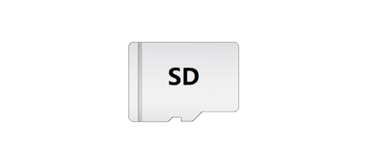
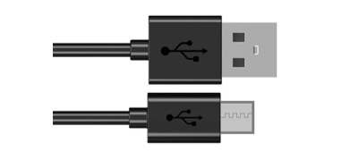
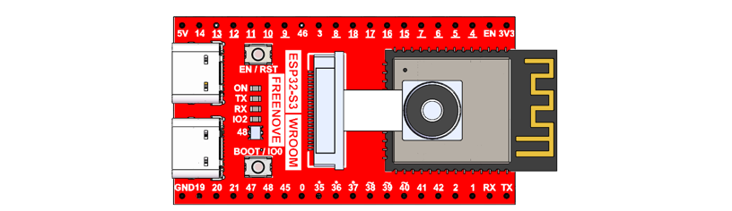
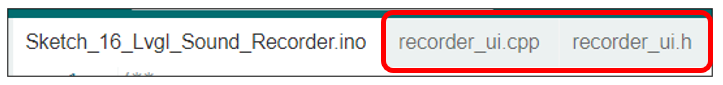
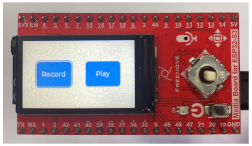
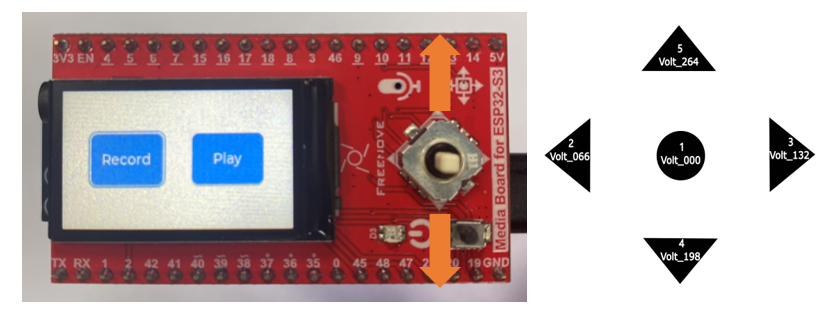

##############################################################################
Chapter 17 LVGL Sound Recorder
##############################################################################

In previous chapters, we learned about the recording functionality on the Freenove Media Kit for ESP32. In this chapter, we will explore how to integrate it with LVGL.

Project 17.1 LVGL Sound Recorder
****************************************

Capture image data using the camera module and display it on the TFT screen.

Component List 
=================================

.. table:: 
    :align:  center

    +-------------------+-------------------+
    | SD card x1        | USB cable x1      |
    |                   |                   |
    | |Chapter07_00|    | |Chapter07_01|    |
    +-------------------+-------------------+
    | Freenove Media Kit for ESP32-S3 x1    |
    |                                       |
    | |Chapter07_02|                        |
    +---------------------------------------+

Circuit
======================================

Connect Freenove Media Kit for ESP32-S3 to your computer using the USB cable.

.. image:: ../_static/imgs/Main/2_Battery_Voltage_Detection/Chapter02_03.png
    :align: center

Before connecting the USB cable, insert the SD card into the SD card slot on the back of the ESP32-S3.

.. image:: ../_static/imgs/Main/7_Video_Web_Server/Chapter07_03.png
    :align: center

Sketch
============================

Sketch_17_LVGL_Sound_Recorder
------------------------------------

The following is the program code:

.. literalinclude:: ../../../freenove_Kit/Sketches/Sketch_17_Lvgl_Sound_Recorder/Sketch_17_Lvgl_Sound_Recorder.ino
    :linenos:
    :language: c
    :dedent:

Include the required libraries.

.. literalinclude:: ../../../freenove_Kit/Sketches/Sketch_17_Lvgl_Sound_Recorder/Sketch_17_Lvgl_Sound_Recorder.ino
    :linenos:
    :language: c
    :lines: 10-10
    :dedent:

Define SD card, I2S and microphone pins.

.. literalinclude:: ../../../freenove_Kit/Sketches/Sketch_17_Lvgl_Sound_Recorder/Sketch_17_Lvgl_Sound_Recorder.ino
    :linenos:
    :language: c
    :lines: 12-20
    :dedent:

Declare TFT screen object.

.. literalinclude:: ../../../freenove_Kit/Sketches/Sketch_17_Lvgl_Sound_Recorder/Sketch_17_Lvgl_Sound_Recorder.ino
    :linenos:
    :language: c
    :lines: 22-22
    :dedent:

Initialize the audio input, audio output and SD card interface, and set the output volume to level 21.

.. literalinclude:: ../../../freenove_Kit/Sketches/Sketch_17_Lvgl_Sound_Recorder/Sketch_17_Lvgl_Sound_Recorder.ino
    :linenos:
    :language: c
    :lines: 31-34
    :dedent:

Initialize TFT screen 

.. literalinclude:: ../../../freenove_Kit/Sketches/Sketch_17_Lvgl_Sound_Recorder/Sketch_17_Lvgl_Sound_Recorder.ino
    :linenos:
    :language: c
    :lines: 40-40
    :dedent:

Initialize and load the UI component for sound recording.

.. literalinclude:: ../../../freenove_Kit/Sketches/Sketch_17_Lvgl_Sound_Recorder/Sketch_17_Lvgl_Sound_Recorder.ino
    :linenos:
    :language: c
    :lines: 50-51
    :dedent:

If you are interesting in the implementation of functions, you can check them out here.

After uploading the sketch, you will see the following interface.

Pressing different directions on the 5-way navigation switch will trigger corresponding functions:

Switches 2 & 3 switch between recording and playback modes.

Button 1 serves as the confirmation key.

Switches 4 & 5 are disabled (no function).

.. note::
    
    :red:`In recording mode, long-press Button 1 to start recording. The recording duration depends on how long Button 1 is held down.`

