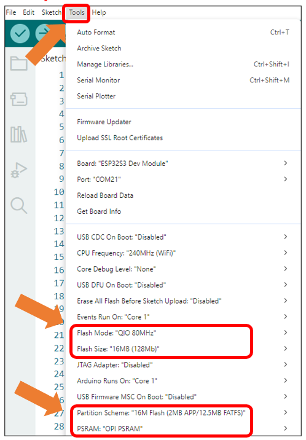
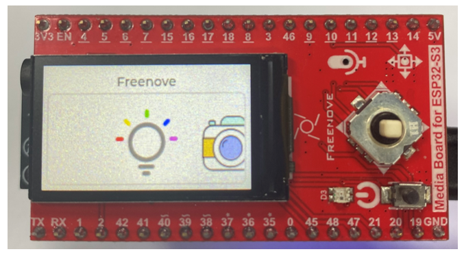
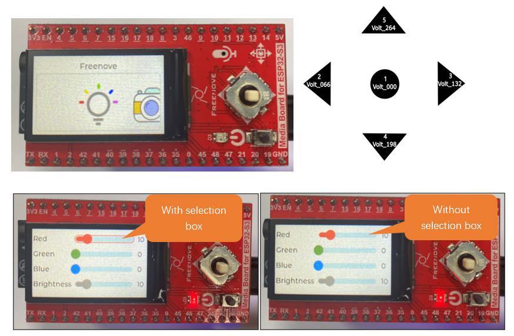

##############################################################################
Chapter 19 LVGL Multifunctionality
##############################################################################

The functionality described in this chapter remains consistent with the previous section, but features a redesigned UI interface.

Project 19.1 LVGL Multifunctionality
************************************************

Component List 
==================================

.. list-table::
    :align: center

    * - Freenove Media Kit for ESP32-S3 x1
      - USB cable x1

    * - |Chapter03_01|
      - |Chapter03_02|

    * - SD card x1
      - Card reader x1 (random color)

    * - |Chapter04_00|
      - |Chapter04_01|

.. |Chapter03_01| image:: ../_static/imgs/Main/3_5-Way_Navigation_Switch_Test/Chapter03_01.png
.. |Chapter03_02| image:: ../_static/imgs/Main/3_5-Way_Navigation_Switch_Test/Chapter03_02.png
.. |Chapter04_00| image:: ../_static/imgs/Main/4_SD_Card_Read_&_Write_Test/Chapter04_00.png
.. |Chapter04_01| image:: ../_static/imgs/Main/4_SD_Card_Read_&_Write_Test/Chapter04_01.png

Circuit
======================================

Connect Freenove Media Kit for ESP32-S3 to your computer using the USB cable.

.. image:: ../_static/imgs/Main/2_Battery_Voltage_Detection/Chapter02_03.png
    :align: center

Before connecting the USB cable, insert the SD card into the SD card slot on the back of the ESP32-S3.

.. image:: ../_static/imgs/Main/7_Video_Web_Server/Chapter07_03.png
    :align: center

Sketch
=====================================

Sketch_19_LVGL_Multifunctionality
-------------------------------------

The following is the program code:

.. literalinclude:: ../../../freenove_Kit/Sketches/Sketch_19_Lvgl_Multifunctionality/Sketch_19_Lvgl_Multifunctionality.ino
    :linenos:
    :language: c
    :dedent:

It is necessary to change the settings in Arduino IDE before clicking the Uploading button, as shown below.

:red:`Caution: Incorrect settings will result in compilation error or uploading failure. To achieve desired result, please configure exactly the same as below.`

After uploading the sketch, you'll see the following interface on the screen.

The 5-way navigation switch triggers different functions based on directional input:

    Switches 2 & 3 - Cycle through available function

    Button 1 - Confirm selection (enters chosen mode)

.. note::
    
    Operational logic within each function remains unchanged from previous implementations.

To exit current function and return to main menu

    Deselect all components (no selection box is visible)

    Switch switches 4 or 5 to return to home interface

(Refer to the figure below for button numbering)

**If you have any concerns, please feel free to contact us via** support@freenove.com