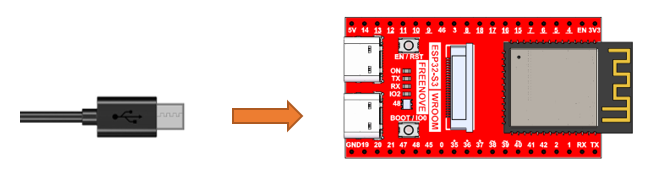
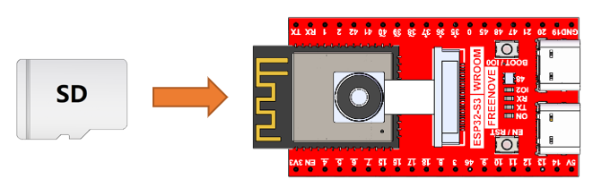
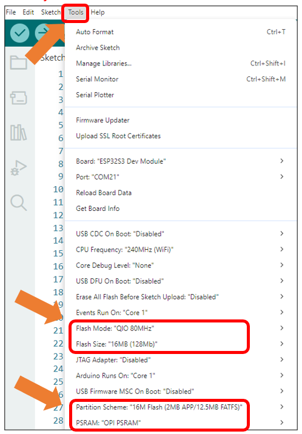
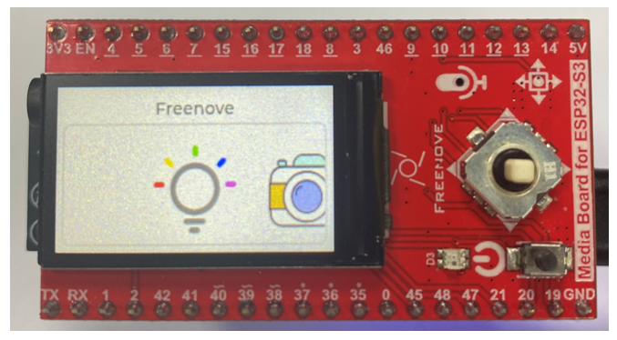
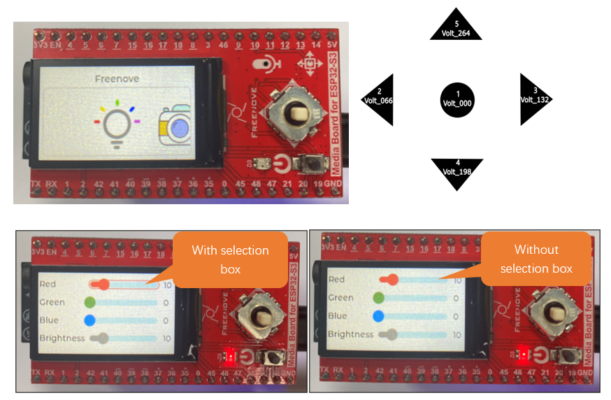

##############################################################################
Chapter 19 LVGL Multifunctionality
##############################################################################

The functionality described in this chapter remains consistent with the previous section, but features a redesigned UI interface.

Project 19.1 LVGL Multifunctionality
************************************************

Component List 
==================================

:combo:`red font-bolder:As of the time of writing, the Freenove Media Kit for ESP32-S3 comes in two different models with varying screen sizes. However, this tutorial applies to both versions.`

.. table:: 
    :align: center
    :class: table-line
    :width: 80%

    +------------------------------------+----------------+
    | Freenove Media Kit for ESP32-S3 x1 | USB cable x1   |
    |                                    |                |
    | |Chapter10_07|                     | |Chapter10_08| |
    +------------------------------------+----------------+
    | Extension Board x1(1.14 inch/3.5 inch)              |
    |                                                     |
    | |Chapter01_11|                                      |
    +----------------------+------------------------------+
    | SD card x1           | Card reader x1 (random color)|
    |                      |                              |
    | |Chapter10_09|       | |Chapter04_01|               |
    +----------------------+------------------------------+

.. |Chapter10_07| image:: ../_static/imgs/Main/10_Record_Test/Chapter10_07.png
.. |Chapter10_08| image:: ../_static/imgs/Main/10_Record_Test/Chapter10_08.png
.. |Chapter01_11| image:: ../_static/imgs/Main/1_LEDPixel_Test/Chapter01_11.png
.. |Chapter10_09| image:: ../_static/imgs/Main/10_Record_Test/Chapter10_09.png
.. |Chapter04_01| image:: ../_static/imgs/Main/4_SD_Card_Read_&_Write_Test/Chapter04_01.png

Circuit
======================================

Connect Freenove Media Kit for ESP32-S3 to your computer using the USB cable.

Before connecting the USB cable, insert the SD card into the SD card slot on the back of the ESP32-S3.

Sketch
=====================================

Sketch_19_LVGL_Multifunctionality
-------------------------------------

The following is the program code:

.. literalinclude:: ../../../freenove_Kit/Sketches/Sketch_19_Lvgl_Multifunctionality/Sketch_19_Lvgl_Multifunctionality.ino
    :linenos:
    :language: c
    :dedent:

It is necessary to change the settings in Arduino IDE before clicking the Uploading button, as shown below.

.. caution::
    
    :combo:`red font-bolder:Incorrect settings will result in compilation error or uploading failure. To achieve desired result, please configure exactly the same as below.`

After uploading the sketch, you'll see the following interface on the screen.

.. note::
    
    :combo:`red font-bolder:Here, take 1.14 inches as an example; the usage is the same for 3.5 inches.`

The 5-way navigation switch triggers different functions based on directional input:

    Switches 2 & 3 - Cycle through available function

    Button 1 - Confirm selection (enters chosen mode)

.. note::
    
    Operational logic within each function remains unchanged from previous implementations.

To exit current function and return to main menu

    Deselect all components (no selection box is visible)

    Switch switches 4 or 5 to return to home interface

(Refer to the figure below for button numbering)

**If you have any concerns, please feel free to contact us via** support@freenove.com