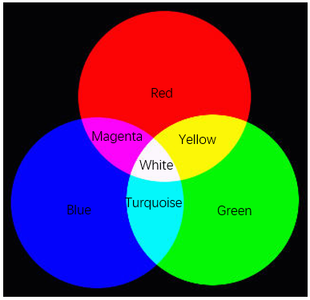
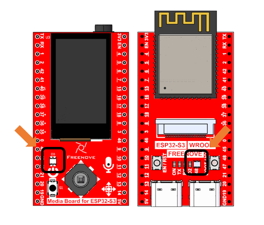
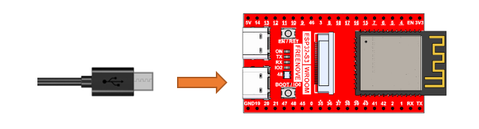
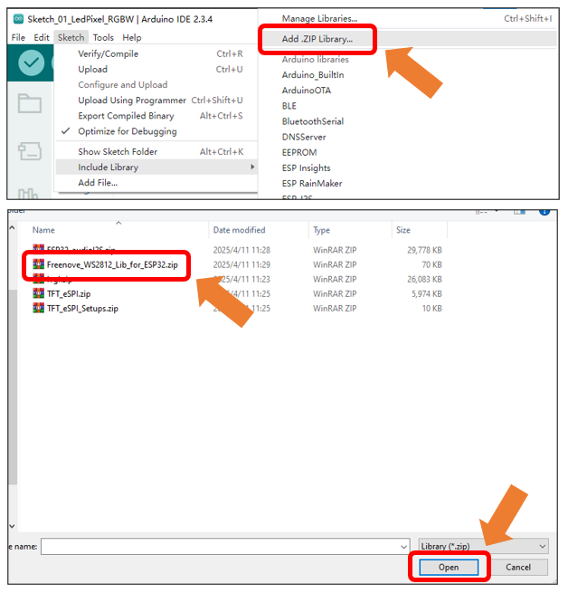
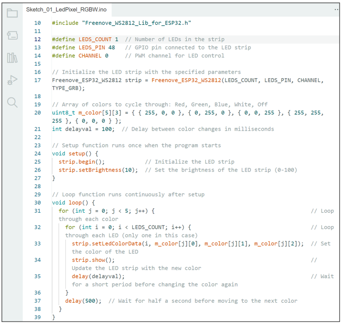
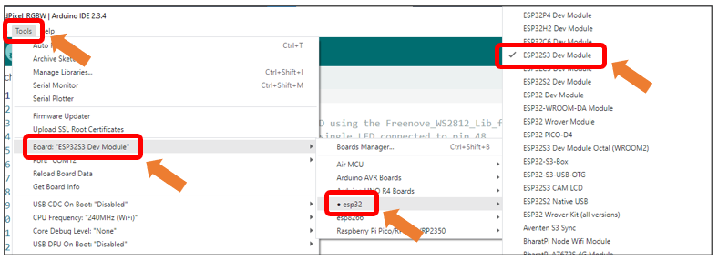
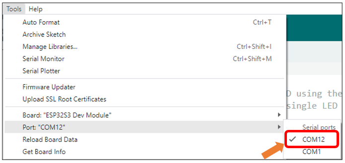
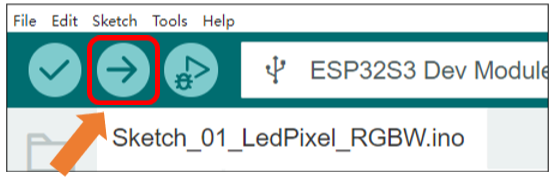
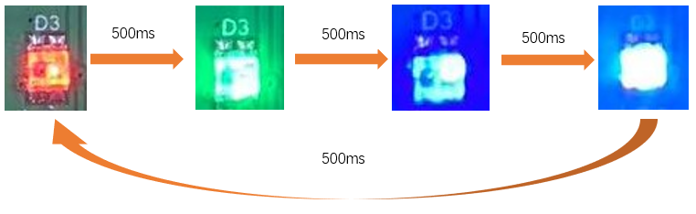

##############################################################################
Chapter 1 LEDPixel Test
##############################################################################

In this chapter, we will learn how to drive an RGB LED by assigning specific pins to control its color output.

Project 1.1 LEDPixel
*****************************************

Learn the basic usage of WS2812 and use it to flash red, green, blue and white.

Note: Both the LED Pixels on the ESP32S3 board and on the extension board are connected to IO48 pin, so they will always maintain perfectly synchronized lighting effects.

Component List 
==========================================

.. table:: 
    :align: center

    +------------------------------------+----------------+
    | Freenove Media Kit for ESP32-S3 x1 | USB cable x1   |
    |                                    |                |
    | |Chapter01_00|                     | |Chapter01_01| |
    +------------------------------------+----------------+

.. |Chapter01_00| image:: ../_static/imgs/Main/1_LEDPixel_Test/Chapter01_00.png
.. |Chapter01_01| image:: ../_static/imgs/Main/1_LEDPixel_Test/Chapter01_01.png

Related Knowledge
===========================================

The three primary colors of light are red, green, and blue. When these colors are combined in different proportions and brightness levels, they can generate almost all colors we can see. 

Circuit
===========================================

Connect Freenove Media Kit for ESP32-S3 to your computer using the USB cable.

Sketch
============================================

This code uses a library named "Freenove_WS2812_Lib_for_ESP32". If you have not yet installed it, please do so first. 

How to install the library

Open Arduino IDE, click **Sketch** -> **Include Library** -> **Add .ZIP Library**. In the pop-up window, find the file named "./Libraries/Freenove_WS2812_Lib_for_ESP32.Zip" which locates in this directory, and click **OPEN**.

Sketch_01_LedPixel_RGBW
---------------------------------------------

The following is the program code:

.. literalinclude:: ../../../freenove_Kit/Sketches/Sketch_01_LedPixel_RGBW/Sketch_01_LedPixel_RGBW.ino
    :linenos:
    :language: c
    :dedent:

To use some libraries, first you need to include their header file.

.. literalinclude:: ../../../freenove_Kit/Sketches/Sketch_01_LedPixel_RGBW/Sketch_01_LedPixel_RGBW.ino
    :linenos:
    :language: c
    :lines: 10-10
    :dedent:

Define the pin connected to the WS2812, the number of WS2812, and RMT channel values.

.. literalinclude:: ../../../freenove_Kit/Sketches/Sketch_01_LedPixel_RGBW/Sketch_01_LedPixel_RGBW.ino
    :linenos:
    :language: c
    :lines: 12-14
    :dedent:

Use the above parameters to create a WS2812 object strip.

.. literalinclude:: ../../../freenove_Kit/Sketches/Sketch_01_LedPixel_RGBW/Sketch_01_LedPixel_RGBW.ino
    :linenos:
    :language: c
    :lines: 17-17
    :dedent:

Define the color values to be used, such as red, green, blue, white, and black.

.. literalinclude:: ../../../freenove_Kit/Sketches/Sketch_01_LedPixel_RGBW/Sketch_01_LedPixel_RGBW.ino
    :linenos:
    :language: c
    :lines: 20-20
    :dedent:

Define a variable to set the time interval for each led to light up. The smaller the value is, the faster it will light up.

.. literalinclude:: ../../../freenove_Kit/Sketches/Sketch_01_LedPixel_RGBW/Sketch_01_LedPixel_RGBW.ino
    :linenos:
    :language: c
    :lines: 21-21
    :dedent:

Initialize strip() in setup() and set the brightness.

.. literalinclude:: ../../../freenove_Kit/Sketches/Sketch_01_LedPixel_RGBW/Sketch_01_LedPixel_RGBW.ino
    :linenos:
    :language: c
    :lines: 25-26
    :dedent:

In the loop(), there are two "for" loops, the internal for loop is to light the LED one by one, and the external one to switch colors. strip.setLedColorData() is used to set the color, but it does not change immediately. Only when strip.show() is called will the color data be sent to the LED to change the color.

.. literalinclude:: ../../../freenove_Kit/Sketches/Sketch_01_LedPixel_RGBW/Sketch_01_LedPixel_RGBW.ino
    :linenos:
    :language: c
    :lines: 31-38
    :dedent:

Select Tools -> Board -> esp32 -> ESP32S3 Dev Module. 

After connecting the Freenove Media Kit for ESP32-S3, the system will assign a serial communication port named in the format 'COMx' (where 'x' is a numeric ID that may vary across computers). You must select the correct port under Tools → Port.

.. note::
    
    COM1 is typically NOT the port used by the Freenove Media Kit for ESP32-S3.

Click upload to upload the sketch to ESP32S3 board.

After successfully uploading the code, you will observe the WS2812 LEDs cycling through predefined colors (red → green → blue → white → red) in sequence. The color transitions occur at 500ms intervals, creating a smooth color-changing loop effect.

If you have any concerns, please feel free to contact us via support@freenove.com

Reference
----------------------------

.. py:function:: Freenove_ESP32_WS2812(u16 n = 8, u8 pin_gpio = 2, u8 chn = 0, LED_TYPE t = TYPE_GRB)

    Constructor to create a ws2812 object.

    Before each use of the constructor, please add "#include "Freenove_WS2812_Lib_for_ESP32.h"

    **Parameters**

    **n:** The number of led.

    **pin_gpio:** The pin connected to the LED.

    **Chn:** RMT channel, which has eight channels, 0-7, and uses channel 0 by default. This means that you can use eight ws2812 modules for the display at the same time, and these modules do not interfere with each other. 

    **t:** Types of LED.

        :red:`TYPE_RGB:` The sequence of ws2812 module loading color is red, green and blue.

        :red:`TYPE_RBG:` The sequence of ws2812 module loading color is red, blue and green.

        :red:`TYPE_GRB:` The sequence of ws2812 module loading color is green, red and blue.

        :red:`TYPE_GBR:` The sequence of ws2812 module loading color is green, blue and red.

        :red:`TYPE_BRG:` The sequence of ws2812 module loading color is blue, red and green. 

        :red:`TYPE_BGR:` The sequence of ws2812 module loading color is blue, green and red. 

.. py:function:: void begin(void);
    
    Initialize the LEDPixel object
    
.. py:function:: void setLedColorData (u8 index, u8 r, u8 g, u8 b);
.. py:function:: void setLedColorData (u8 index, u32 rgb);
.. py:function:: void setLedColor (u8 index, u8 r, u8 g, u8 b);
.. py:function:: void setLedColor (u8 index, u32 rgb);
    
    Set the color of led with order number n.
    
.. py:function:: void show(void);
    
    Send the color data to the led and display the set color immediately.
    
.. py:function:: void setBrightness(uint8_t);
    
    Set the brightness of the LED.
    
To learn more about the library, you may visit the following website: 

https://github.com/Freenove/Freenove_WS2812_Lib_for_ESP32