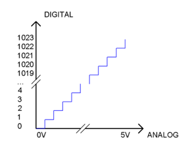
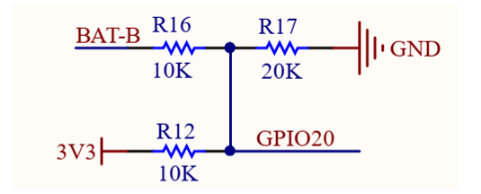
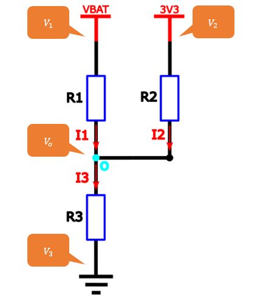
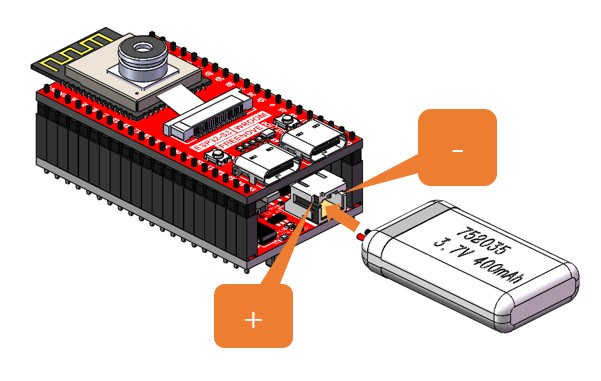
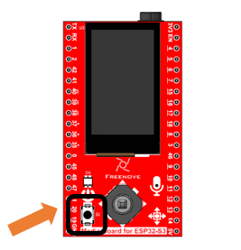
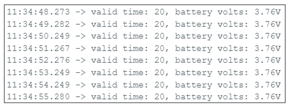
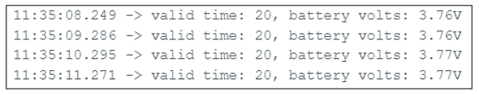
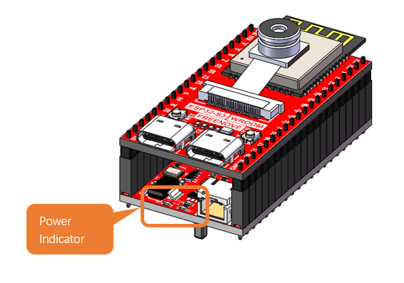

##############################################################################
Chapter 2 Battery Voltage Detection
##############################################################################

ADC is used to convert analog signals into digital signals. Control chip on the control board has integrated this function. Now let us try to use this function to convert analog signals into digital signals

For battery precautions and selection guidelines, please refer to :ref:`Battery <fnk0102/codes/main/preface:battery (optional)>`.

Project 2.1 Battery Voltage Value
*******************************************

Related Knowledge
========================================

ADC
------------------------------

An ADC is an electronic integrated circuit used to convert analog signals such as voltages to digital or binary form consisting of 1s and 0s.The onboard ADC module is set to 10 bits by default, which means the resolution is 2^10=1024, so its range (at 5V) will be evenly divided into 1024 parts. By default, the resolution of the onboard ADC is set to 10 bits, which can be updated to 12 bits (0-4096) and 14 bits (0-16383) resolution to improve the accuracy of the analog readings. Any analog value can be mapped to one digital value using the resolution of the converter. So the more bits the ADC has, the denser the partition of analog will be and the greater the precision of the resulting conversion.

Subsection 1: the analog in rang of 0V-5/1024V corresponds to digital 0;

Subsection 2: the analog in rang of 5 /1024V-2*5/1024V corresponds to digital 1;

The following analog signal will be divided accordingly.

The conversion formula is as follows:

.. :math::
    
    ADC Value=(Analog Voltage)/3.3*1023

Kirchhoff's Laws
-----------------------------

Kirchhoff's Laws are the two fundamental principles of circuit analysis, formulated by German physicist Gustav Kirchhoff in 1845. Consisting of Kirchhoff’s Current Law (KCL) and Voltage Law (KVL), they are applicable to all lumped-parameter circuits — regardless of whether they are linear or nonlinear, time-varying or time-invariant. These laws represent one of the key manifestations of the conservation of energy in electrical circuits.

Kirchhoff's Current Law (KCL) states:

At any given node in a lumped-parameter circuit, the algebraic sum of all currents entering (or leaving) the node at any instant is always zero.

Mathematically, this is expressed as:

.. math::

   \boldsymbol{\sum_{k=1}^n I_k = 0}

Kirchhoff's Voltage Law (KVL) states:

In any closed loop of a circuit, the algebraic sum of all voltage drops is always equal to zero.

Mathematically, this is expressed as:

.. math::

   \boldsymbol{\sum_{k=1}^n U_k = 0}

Ohm's Law
---------------------------------

Ohm's Law, formulated by the German physicist Georg Simon Ohm in 1827, is one of the most fundamental laws in circuit theory. It defines the basic relationship between voltage and current in a linear resistive element:

**Under constant temperature conditions, the current (I) flowing through a conductor is directly proportional to the voltage (U) across it and inversely proportional to the conductor's resistance (R).**

Mathematically, it is expressed as:

.. math::

   \boldsymbol{U = I \times R}

Where:

- U represents Voltage(Unit: Volt,V)

- I refer to current(Unit: Ampere, A)

- R denotes resistance(Unit: Ohm, Ω)

Based on the above, the following relationships can be derived from the formula:

.. math::

    \begin{align}
   \boldsymbol{I} &\boldsymbol{=} \boldsymbol{\frac{U}{R}} & 
   \boldsymbol{R} &\boldsymbol{=} \boldsymbol{\frac{U}{I}}
   \end{align}

Battery Voltage Detection
-------------------------------------

The maximum input voltage for the GPIO pins of the Freenove Media Kit for ESP32-S3 is 3.3V. Exceeding this limit may cause permanent damage to the device. Since the full charge voltage of a 3.7V lithium battery can theoretically reach 4.2V, it is strictly prohibited to directly connect the lithium battery to the GPIO pins of the Freenove Media Kit for ESP32-S3. The input voltage must be regulated within the safe range through circuit design (as shown in the figure below).

The schematic above can be simplified as the following equivalent circuit for easier understanding.

Based on Kirchhoff's Current Law (KCL), we can derive that:

.. math::

    \boldsymbol{I_1 + I_2 + I_3 = 0}

Accoding to the following formula of Ohm's Law

.. math::

   \boldsymbol{I = \frac U R}

It can be further deduced that:

.. math::

   \boldsymbol{\frac{U_1}{R_1}} \boldsymbol{+} \boldsymbol{\frac{U_2}{R_2}} \boldsymbol{+} \boldsymbol{\frac{U_3}{R_3}} \boldsymbol{=} \boldsymbol{0}

Since voltage is the difference in potential, it can be converted into:

.. math::

   \boldsymbol{\frac{(V_1 - V_o)}{R_1}} \boldsymbol{+} \boldsymbol{\frac{(V_2 - V_o)}{R_2}} \boldsymbol{+} \boldsymbol{\frac{(V_3 - V_o)}{R_3}} \boldsymbol{=} \boldsymbol{0}

By simplifying it, we can get:

.. math::
   
   \boldsymbol{V_1} \boldsymbol{=} \boldsymbol{V_o} \left( \boldsymbol{1} \boldsymbol{+} \boldsymbol{\frac{R_1}{R_2}} \boldsymbol{+} \boldsymbol{\frac{R_1}{R_3}} \right) \boldsymbol{-} \boldsymbol{V_2} \boldsymbol{\times} \boldsymbol{\frac{R_1}{R_2}} \boldsymbol{-} \boldsymbol{V_3} \boldsymbol{\times} \boldsymbol{\frac{R_1}{R_3}}

Substituting the actual resistance value, we can finally get

.. math::

   \boldsymbol{V_1} \boldsymbol{=} \boldsymbol{V_o} \boldsymbol{\times} \boldsymbol{2.5} \boldsymbol{-} \boldsymbol{3300}

Where:

:math:`R_1 = 10\ \mathrm{kΩ}`, :math:`R_2 = 10\ \mathrm{kΩ}`, :math:`R_3 = 20\ \mathrm{kΩ}`, The unit of V_1 is millivolt(mV).

Circuit
==============================

Connect Freenove Media Kit for ESP32-S3 to your computer using the USB cable. 

.. image:: ../_static/imgs/Main/2_Battery_Voltage_Detection/Chapter02_03.png
    :align: center

Connect the battery to Freenove Media Kit for ESP32-S3.

For battery precautions and selection guidelines, please refer to :ref:`Battery <fnk0102/codes/main/preface:battery (optional)>`. 

Sketch
==============================

.. literalinclude:: ../../../freenove_Kit/Sketches/Sketch_02_1_Battery_Volts/Sketch_02_1_Battery_Volts.ino
    :linenos:
    :language: c
    :dedent:

Define the maximum and minimum voltage range

.. literalinclude:: ../../../freenove_Kit/Sketches/Sketch_02_1_Battery_Volts/Sketch_02_1_Battery_Volts.ino
    :linenos:
    :language: c
    :lines: 1-2
    :dedent:

Define battery voltage detection pin.

.. literalinclude:: ../../../freenove_Kit/Sketches/Sketch_02_1_Battery_Volts/Sketch_02_1_Battery_Volts.ino
    :linenos:
    :language: c
    :lines: 4-4
    :dedent:

Set the serial baud rate to 115200.

.. literalinclude:: ../../../freenove_Kit/Sketches/Sketch_02_1_Battery_Volts/Sketch_02_1_Battery_Volts.ino
    :linenos:
    :language: c
    :lines: 8-8
    :dedent:

Set the ADC resolution to 12-bit, providing a measurement range of 0 to 4095 (2¹² - 1).

.. literalinclude:: ../../../freenove_Kit/Sketches/Sketch_02_1_Battery_Volts/Sketch_02_1_Battery_Volts.ino
    :linenos:
    :language: c
    :lines: 10-10
    :dedent:

Set the ADC attenuation factor to 11db

.. literalinclude:: ../../../freenove_Kit/Sketches/Sketch_02_1_Battery_Volts/Sketch_02_1_Battery_Volts.ino
    :linenos:
    :language: c
    :lines: 11-11
    :dedent:

Perform cyclic sampling of battery voltage 20 times and apply filtering processing.

.. literalinclude:: ../../../freenove_Kit/Sketches/Sketch_02_1_Battery_Volts/Sketch_02_1_Battery_Volts.ino
    :linenos:
    :language: c
    :lines: 22-33
    :dedent:

Calculate the average effective battery voltage

.. literalinclude:: ../../../freenove_Kit/Sketches/Sketch_02_1_Battery_Volts/Sketch_02_1_Battery_Volts.ino
    :linenos:
    :language: c
    :lines: 34-36
    :dedent:

Output battery voltage value and sampling times.

.. literalinclude:: ../../../freenove_Kit/Sketches/Sketch_02_1_Battery_Volts/Sketch_02_1_Battery_Volts.ino
    :linenos:
    :language: c
    :lines: 38-39
    :dedent:

Upload the code to the board and press ON the power button.

The current battery voltage value will be printed on the serial monitor.

When both the battery and USB are connected, the Freenove Media Kit for ESP32-S3 will be powered by USB and the battery will charge slowly

**If you have any concerns, please feel free to contact us via** support@freenove.com

**Charging & Power Indicators:**

**When using the USB port on the board to charge the battery:**

**While charging, the blue LED will blink.**

**When charging is complete, the blue LED will stay lit.**

**If no battery is connected, the blue LED will keep blinking.**

**When the device is not connected to USB, it runs on battery power, and the green LED remains steadily lit.**

Reference
--------------------------------

.. py:function:: analogReadResolution(uint8_t bits)	
    
    This function is used to configure the ADC's conversion resolution and measurement range.

    **Parameters**
    
    **bits:** The resolution in bits. Higher bit values result in greater measurement precision.
    
    ADC sampling range: 0 to (2^bits - 1).
    
.. py:function:: analogSetAttenuation(adc_attenuation_t attenuation)	
    
    This function configures the input signal attenuation factor for the ADC.

    **Parameters**
    
    **attenuation:** Attenuation multiple
    
    :red:`ADC_0dB:` Voltage measurement range: 0mV ~ 950mV.
    
    :red:`ADC_2_5dB:` Voltage measurement range: 0mV ~ 1250mV.
    
    :red:`ADC_6dB:` Voltage measurement range: 0mV ~ 1750mV.
    
    :red:`ADC_11dB:` Voltage measurement range: 0mV ~ 3100mV.
    
.. py:function:: analogReadMilliVolts(uint8_t pin)	
    
    This function reads the voltage value (in millivolts, mV) from an analog pin.

    **Parameters**
    
    **pin:** Pin number.