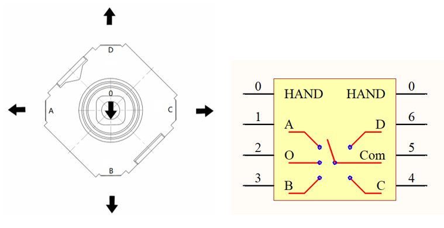
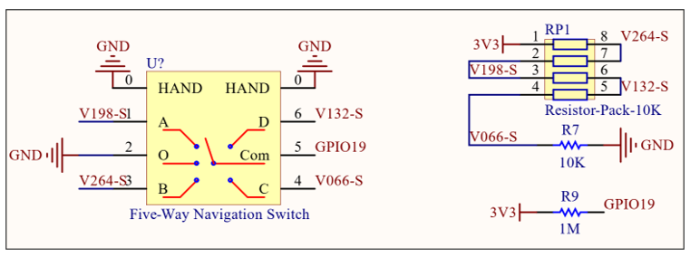
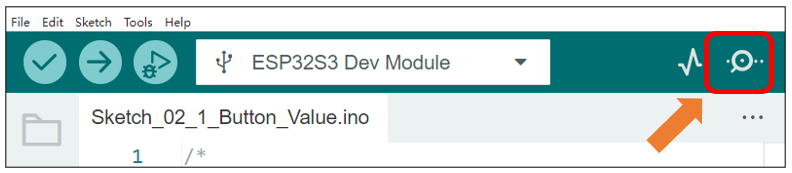
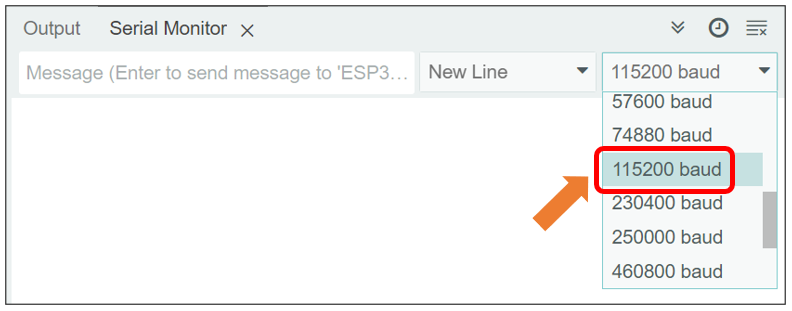
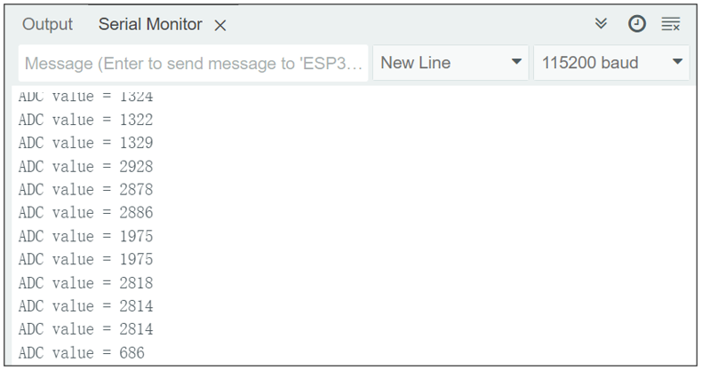
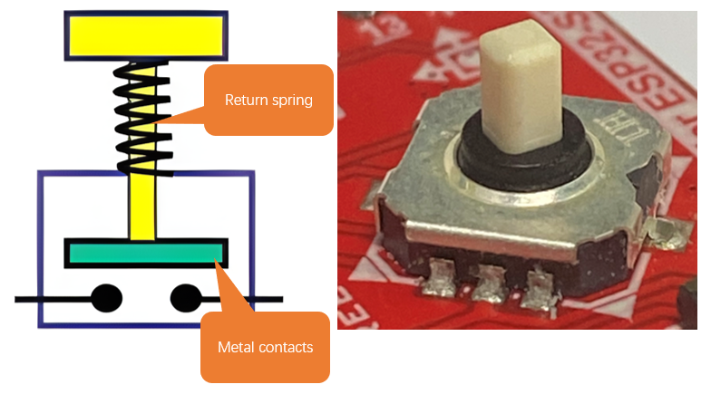
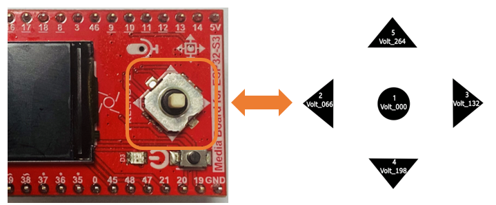

##############################################################################
Chapter 3 5-Way Navigation Switch Test
##############################################################################

In the previous section, we covered ADC concepts. This section will discuss the working principles and operation of a 5-way navigation switch, as there is some relevance between the two topics.

Project 3.1 Button Value
******************************************

Component Knowledge
=====================================

5-way Navigation Switch
-------------------------------------

The 5-way navigation switch is a digital switch that supports actuation in five directions: up, down, left, right, and center (press).

Its operation is as follows:

No press: All terminals (A, B, C, D, O, Com) remain open (non-conducting).

Center press: O and Com make contact (conduct).

Upward push: D and Com make contact.

Downward push: B and Com make contact.

Leftward push: A and Com make contact.

Rightward push: C and Com make contact.

This switch is widely used in applications requiring directional input, such as game controllers, remote controls, and navigation interfaces.

Component List 
==================================

.. list-table::
    :header-rows: 1
    :align: center

    * - Freenove Media Kit for ESP32-S3 x1
      - USB cable x1

    * - |Chapter03_01|
      - |Chapter03_02|

.. |Chapter03_01| image:: ../_static/imgs/Main/3_5-Way_Navigation_Switch_Test/Chapter03_01.png
.. |Chapter03_02| image:: ../_static/imgs/Main/3_5-Way_Navigation_Switch_Test/Chapter03_02.png

Circuit
==================================

Connect Freenove Media Kit for ESP32-S3 to your computer using the USB cable. 

.. image:: ../_static/imgs/Main/3_5-Way_Navigation_Switch_Test/Chapter03_03.png
    :align: center

Schematic
=================================

We use the ADC function of GPIO19 to read the voltage value of Com and determine which direction of the 5-way button is pressed based on different voltage values.

The circuit schematic is as follows.

Typically, we read the ADC value from GPIO19 and treat any value within the range of [(ADC - 50), (ADC + 50)] as a valid button press. Please refer to the code in Sketch_02_1_Button_Value and Sketch_02_2_Button to better understand this logic.

Sketch
================================

Sketch_03_1_Button_Value
---------------------------------

The following is the program code:

.. literalinclude:: ../../../freenove_Kit/Sketches/Sketch_03_1_Button_Value/Sketch_03_1_Button_Value.ino
    :linenos:
    :language: c
    :dedent:

Define the pin connected to the 5-way navigation button.

.. literalinclude:: ../../../freenove_Kit/Sketches/Sketch_03_1_Button_Value/Sketch_03_1_Button_Value.ino
    :linenos:
    :language: c
    :lines: 10-10
    :dedent:

Set the serial baud rate to 115200.

.. literalinclude:: ../../../freenove_Kit/Sketches/Sketch_03_1_Button_Value/Sketch_03_1_Button_Value.ino
    :linenos:
    :language: c
    :lines: 14-14
    :dedent:

Set the ADC resolution to 12-bit, providing a measurement range of 0 to 4095 (2¹² - 1).

.. literalinclude:: ../../../freenove_Kit/Sketches/Sketch_03_1_Button_Value/Sketch_03_1_Button_Value.ino
    :linenos:
    :language: c
    :lines: 17-17
    :dedent:

Set the ADC input attenuation level to define the measurable voltage range

.. literalinclude:: ../../../freenove_Kit/Sketches/Sketch_03_1_Button_Value/Sketch_03_1_Button_Value.ino
    :linenos:
    :language: c
    :lines: 17-17
    :dedent:

Read the voltage value from GPIO19 in millivolts (mV).

.. literalinclude:: ../../../freenove_Kit/Sketches/Sketch_03_1_Button_Value/Sketch_03_1_Button_Value.ino
    :linenos:
    :language: c
    :lines: 24-24
    :dedent:

Print the GPIO19 voltage reading to the serial monitor.

.. literalinclude:: ../../../freenove_Kit/Sketches/Sketch_03_1_Button_Value/Sketch_03_1_Button_Value.ino
    :linenos:
    :language: c
    :lines: 26-26
    :dedent:

Open the serial monitor upon the code upload completes.

Select the correct baud rate (115200).

The serial monitor will display the ADC sampling values of the GPIO19 pin in real time. When operating the 5-way switch, the corresponding ADC values will dynamically update according to the switch state.

**If you have any concerns, please feel free to contact us via** support@freenove.com

Project 3.2 Button
***************************************

In the previous section, we learned how to read the ADC values of the 5-way navigation button. In this section, we will learn how to accurately determine the specific direction that the button moves based on these ADC values.

Component List 
==========================

.. list-table::
    :header-rows: 1
    :align: center

    * - Freenove Media Kit for ESP32-S3 x1
      - USB cable x1

    * - |Chapter03_01|
      - |Chapter03_02|

Circuit
==========================

Connect Freenove Media Kit for ESP32-S3 to your computer using the USB cable. 

.. image:: ../_static/imgs/Main/3_5-Way_Navigation_Switch_Test/Chapter03_03.png
    :align: center

Component Knowledge
==========================

Button Bouncing 
--------------------------

Push buttons, as common mechanical input devices, utilize metal contacts and a return spring in their internal structure. However, due to the inherent physical properties of mechanical contacts, instantaneous stable conduction or disconnection cannot be achieved upon pressing or releasing. Instead, rapid mechanical bouncing occurs, generating a series of unstable on-off signals during the transition. This phenomenon, known as contact bounce, is also observed in 5-way navigation switches.

To ensure signal accuracy and reliability, effective debounce strategies must be incorporated into the system design. These measures mitigate the effects of mechanical bounce, providing clean and consistent input signals for downstream processing.

Sketch
==========================

Sketch_03_2_Button
---------------------------

The following is the program code:

.. literalinclude:: ../../../freenove_Kit/Sketches/Sketch_03_2_Button/Sketch_03_2_Button.ino
    :linenos:
    :language: c
    :dedent:

Define the pin connecting to the switch.

.. literalinclude:: ../../../freenove_Kit/Sketches/Sketch_03_2_Button/Sketch_03_2_Button.ino
    :linenos:
    :language: c
    :lines: 12-12
    :dedent:

Define the object of the switch.

.. literalinclude:: ../../../freenove_Kit/Sketches/Sketch_03_2_Button/Sketch_03_2_Button.ino
    :linenos:
    :language: c
    :lines: 13-13
    :dedent:

Set the baud rate to 115200.

.. literalinclude:: ../../../freenove_Kit/Sketches/Sketch_03_2_Button/Sketch_03_2_Button.ino
    :linenos:
    :language: c
    :lines: 17-17
    :dedent:

Initialize the switch.

.. literalinclude:: ../../../freenove_Kit/Sketches/Sketch_03_2_Button/Sketch_03_2_Button.ino
    :linenos:
    :language: c
    :lines: 19-19
    :dedent:

Scan the state of the button periodically.

.. literalinclude:: ../../../freenove_Kit/Sketches/Sketch_03_2_Button/Sketch_03_2_Button.ino
    :linenos:
    :language: c
    :lines: 24-24
    :dedent:

Handle button events.

.. literalinclude:: ../../../freenove_Kit/Sketches/Sketch_03_2_Button/Sketch_03_2_Button.ino
    :linenos:
    :language: c
    :lines: 26-26
    :dedent:

Reference
----------------------------------

.. py:function:: Button:init();

    This function is used to initialize the button.

.. py:function:: Button:key_scan();

    The function is used to scan the state of the switch and needs to be placed in the loop() function for periodic scanning.

.. py:function:: Button:get_button_state();	

    This function is used to read the state of the 5-way navigation switch.

    Switch states:

    :red:`KEY_STATE_IDLE:` The switch is inactive (no trigger detected).
    
    :red:`KEY_STATE_PRESSED_BOUNCE_TIME:` Button press detected, debouncing in progress (filtering contact bounce).
    
    :red:`KEY_STATE_PRESSED:` Button press confirmed (debounce complete, valid press event).
    
    :red:`KEY_STATE_RELEASE_BOUNCE_TIME:` Button release detected, debouncing in progress (filtering release bounce).
    
    :red:`KEY_STATE_RELEASED:` Button y release confirmed (debounce complete, valid release event).

.. py:function:: Button:get_button_key_value();

    The function is used to obtain the key values of a 5-way button. 

    The key values are as follows:

    :red:`Volt_330:` Not pressed (0)
    
    :red:`Volt_000:` Center (1)
    
    :red:`Volt_264:` Forward (5)
    
    :red:`Volt_198:` Backward (4)
    
    :red:`Volt_066:` Left (2)
    
    :red:`Volt_132:` Right (3)

**If you have any concerns, please feel free to contact us via** support@freenove.com