##############################################################################
Chapter 4 SD Card Read & Write Test
##############################################################################

An SD card slot is integrated on the back of the ESP32-S3 WROOM. In this chapter, we learn how to use ESP32-S3 to read and write SDcard.

Project 4.1 SDMMC Test
******************************************

Component List 
=========================================

.. list-table::
    :align: center

    * - Freenove Media Kit for ESP32-S3 x1
      - USB cable x1

    * - |Chapter03_01|
      - |Chapter03_02|

    * - SD card x1
      - Card reader x1 (random color)

    * - |Chapter04_00|
      - |Chapter04_01|

.. |Chapter03_01| image:: ../_static/imgs/Main/3_5-Way_Navigation_Switch_Test/Chapter03_01.png
.. |Chapter03_02| image:: ../_static/imgs/Main/3_5-Way_Navigation_Switch_Test/Chapter03_02.png
.. |Chapter04_00| image:: ../_static/imgs/Main/4_SD_Card_Read_&_Write_Test/Chapter04_00.png
.. |Chapter04_01| image:: ../_static/imgs/Main/4_SD_Card_Read_&_Write_Test/Chapter04_01.png

Component knowledge
==========================================

SD card read and write method
------------------------------------------

The ESP32-S3 provides two primary interfaces for SD card communication: SPI and SDMMC. Each interface offers distinct advantages in terms of pin usage and performance:

**SPI Interface:**

Requires 4 I/O pins

Delivers the slowest performance (approximately 50% of SDMMC 4-bit mode speed)

**SDMMC Interface:**

Offers two operational modes:

1-bit bus mode: Uses only 3 I/O pins while maintaining about 80% of the 4-bit mode's performance

4-bit bus mode: Requires 6 I/O pins but delivers maximum throughput

For most applications, we recommend the SDMMC 1-bit bus mode as it provides an optimal balance between pin efficiency and performance. This configuration minimizes I/O usage while still delivering satisfactory speed for typical use cases. 

Format SD card
============================

To initiate the project, you'll first need to prepare a blank SD card and a compatible card reader. The initial setup involves assigning a drive letter to the SD card and formatting it properly. Below you'll find system-specific instructions to complete these preparatory steps. Please follow the guide corresponding to your operating system.

Windows
----------------------------

Insert the SD card into the card reader, and then insert the card reader into the computer.

In the Windows search box, enter "Disk Management" and select "Create and format hard disk partitions".

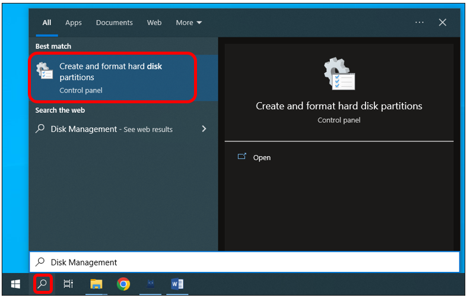

In the newly opened window, locate an unallocated volume with a size close to 1GB.

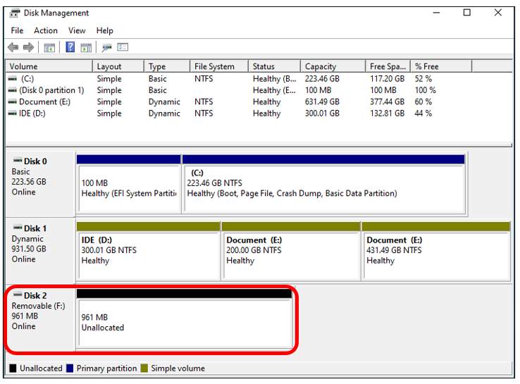

Click to select the volume, right-click and select "New Simple Volume".

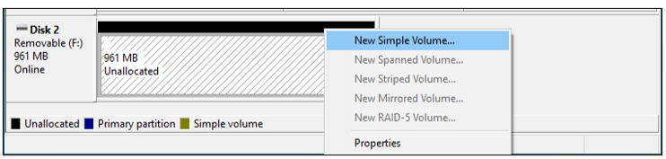

Click Next.

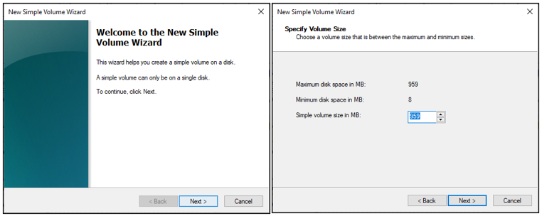

On the right-hand side, you can select a preferred drive letter for the SD card or simply proceed with the default setting by clicking on the "Next" button.

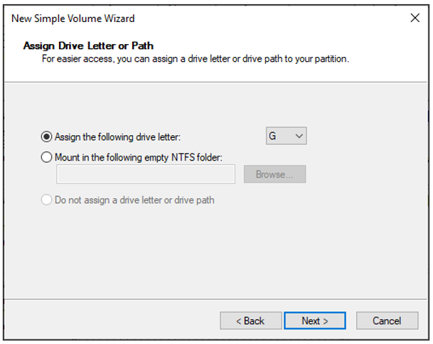

When formatting the SD card, select the file system as FAT (or FAT32) and set the allocation unit size to 16K. You can set the volume label to any name of your choice. Once you have made these selections, click on the "Next" button to proceed.

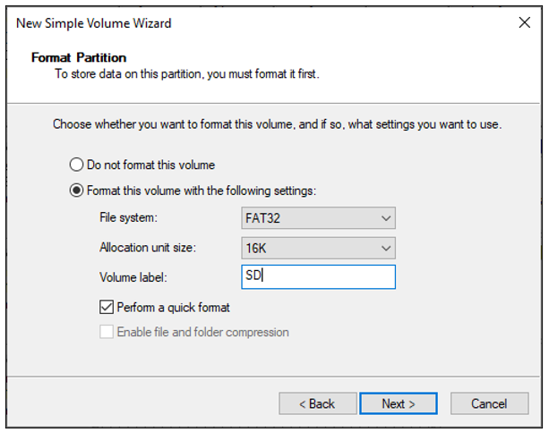

Click Finish. Wait for the SD card initialization to complete.

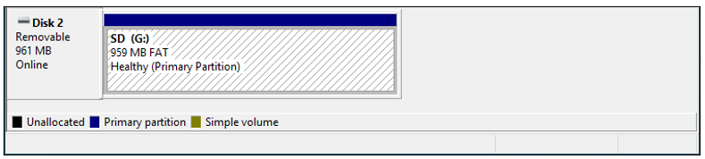

After completing the formatting process, you should be able to see the SD card in the "This PC" section of your computer.

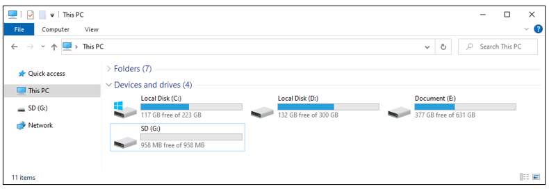

MAC
---------------------------

Insert the SD card into the card reader and then insert the card reader into your computer. Some computers may display a prompt with the following message. In this case, please click on the "Ignore" option to proceed.

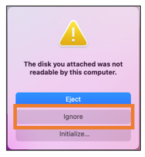

Find "Disk Utility" in the MAC system and click to open it.

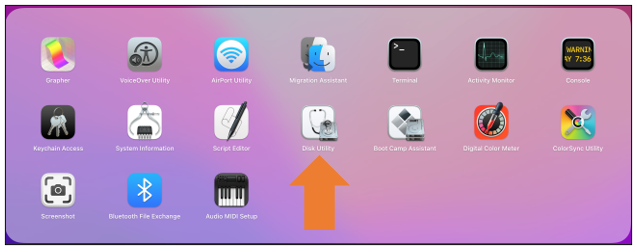

Select "Generic MassStorageClass Media", note that its size is about 1G. It is important to select the correct item to avoid accidentally erasing other device. Once you have verified that you have selected the correct device, click on the "Erase" button to proceed with erasing the SD card.

Select the configuration as shown in the figure below, and then click "Erase".

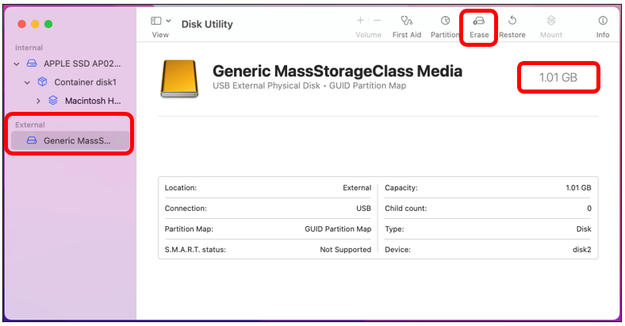

Please wait for the formatting process to complete. Once it is finished, the interface should resemble the image below. You should now be able to see a new disk named "SD" on your desktop.

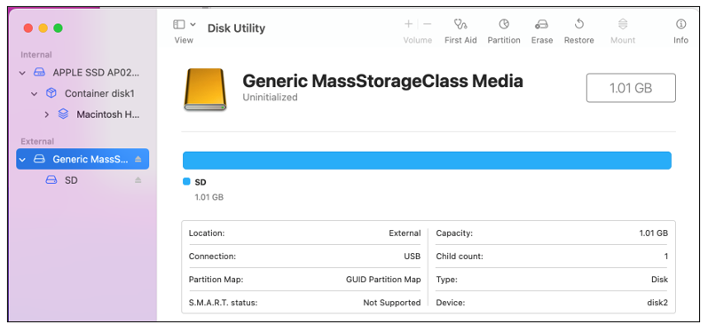

Circuit
==========================

Before connecting the USB cable, insert the SD card into the SD card slot on the back of the ESP32-S3.

.. image:: ../_static/imgs/Main/4_SD_Card_Read_&_Write_Test/Chapter04_14.png
    :align: center

Connect Freenove ESP32-S3 to the computer using the USB cable. 

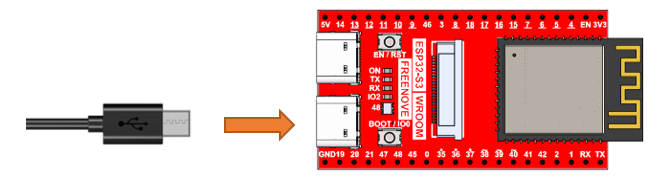

**If you have any concerns, please feel free to contact us via** support@freenove.com

Sketch
==========================

The following is the program code:

.. literalinclude:: ../../../freenove_Kit/Sketches/Sketch_04_SDMMC_Test/Sketch_04_SDMMC_Test.ino
    :linenos:
    :language: c
    :dedent:

Add the SD card drive header file.

.. literalinclude:: ../../../freenove_Kit/Sketches/Sketch_04_SDMMC_Test/Sketch_04_SDMMC_Test.ino
    :linenos:
    :language: c
    :lines: 11-11
    :dedent:

The drive pins of the SD card are pre-defined and should not be modified as they are fixed. Altering the pins may result in errors or malfunctions while accessing the SD card.

.. literalinclude:: ../../../freenove_Kit/Sketches/Sketch_04_SDMMC_Test/Sketch_04_SDMMC_Test.ino
    :linenos:
    :language: c
    :lines: 13-15
    :dedent:

Initialize the serial port function. Sets the drive pin for SDMMC one-bit bus mode.

.. literalinclude:: ../../../freenove_Kit/Sketches/Sketch_04_SDMMC_Test/Sketch_04_SDMMC_Test.ino
    :linenos:
    :language: c
    :lines: 19-21
    :dedent:

Call the listDir() function to read the folder and file names in the SD card, and print them out through the serial port. This function can be found in " driver_sdmmc.cpp".

.. literalinclude:: ../../../freenove_Kit/Sketches/Sketch_04_SDMMC_Test/Sketch_04_SDMMC_Test.ino
    :linenos:
    :language: c
    :lines: 29-29
    :dedent:

Call create_dir () to create a folder, and call remove_dir () to delete a folder.

.. literalinclude:: ../../../freenove_Kit/Sketches/Sketch_04_SDMMC_Test/Sketch_04_SDMMC_Test.ino
    :linenos:
    :language: c
    :lines: 28, 33
    :dedent:

Call write_file () to write any content to the txt file. If there is no such file, create this file first.

Call append_file () to append any content to txt.

Call read_file () to read the content in txt and print it via the serial port.

.. literalinclude:: ../../../freenove_Kit/Sketches/Sketch_04_SDMMC_Test/Sketch_04_SDMMC_Test.ino
    :linenos:
    :language: c
    :lines: 39, 43, 47
    :dedent:

Call renameFile() to copy a file and rename it.

.. literalinclude:: ../../../freenove_Kit/Sketches/Sketch_04_SDMMC_Test/Sketch_04_SDMMC_Test.ino
    :linenos:
    :language: c
    :lines: 51-51
    :dedent:

Print the total size and used size of the SD card via the serial port.

.. literalinclude:: ../../../freenove_Kit/Sketches/Sketch_04_SDMMC_Test/Sketch_04_SDMMC_Test.ino
    :linenos:
    :language: c
    :lines: 57-58
    :dedent:

If you are interesting in the implementation of functions, you can check them out here.

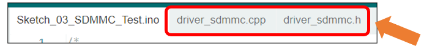