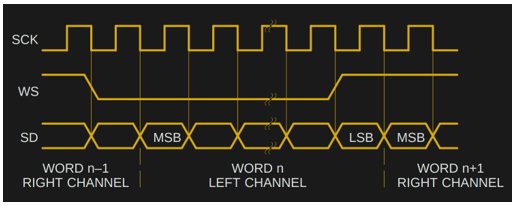
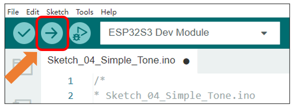

##############################################################################
Chapter 5 Simple Tone Test
##############################################################################

This chapter will explain how to use the ESP_I2S library to implement I2S audio output and achieve looped playback of a sequence of musical notes.

Project 5.1 Simple Tone
**************************************

I2S (Inter-IC Sound) is a standardized synchronous serial interface dedicated to digital audio data transfer. Since the microcontroller on the board includes built-in I2S support, we will leverage this capability to produce simple tones.

Component List 
==============================

.. list-table::
    :header-rows: 1

    * - Freenove Media Kit for ESP32-S3 x1
      - USB cable x1

    * - |Chapter03_01|
      - |Chapter03_02|

.. |Chapter03_01| image:: ../_static/imgs/Main/3_5-Way_Navigation_Switch_Test/Chapter03_01.png
.. |Chapter03_02| image:: ../_static/imgs/Main/3_5-Way_Navigation_Switch_Test/Chapter03_02.png

Circuit Knowledge
==============================

I2S
------------------------------

I2S achieves high-efficiency data transmission through three signal lines:

    -	SCK (Serial Clock): Provides synchronization timing, with each bit of audio data corresponding to one SCK pulse.

    -	WS (Word Select): Distinguishes between left and right audio channels. A high WS level indicates left-channel data transmission, while a low WS level represents right-channel transmission.

    -	SD (Serial Data): Carries the actual audio data. The Most Significant Bit (MSB) is transmitted first and always appears at the second SCK pulse after a frame begins (following a WS transition).

The I2S protocol is widely used in audio devices such as DACs, ADCs, and digital microphones, offering low latency and high-fidelity performance.

Circuit
===============================

Connect Freenove Media Kit for ESP32-S3 to your computer using the USB cable.

.. image:: ../_static/imgs/Main/3_5-Way_Navigation_Switch_Test/Chapter03_03.png
    :align: center

Sketch
===============================

Sketch_05_Simple_Tone
-------------------------------

The following is the program code:

.. literalinclude:: ../../../freenove_Kit/Sketches/Sketch_05_Simple_Tone/Sketch_05_Simple_Tone.ino
    :linenos:
    :language: c
    :dedent:

Include the header file for the I2S library.

.. literalinclude:: ../../../freenove_Kit/Sketches/Sketch_05_Simple_Tone/Sketch_05_Simple_Tone.ino
    :linenos:
    :language: c
    :lines: 16-19
    :dedent:

Configure I2S parameters.

.. literalinclude:: ../../../freenove_Kit/Sketches/Sketch_05_Simple_Tone/Sketch_05_Simple_Tone.ino
    :linenos:
    :language: c
    :lines: 21-24
    :dedent:

Set I2S pins.

.. literalinclude:: ../../../freenove_Kit/Sketches/Sketch_05_Simple_Tone/Sketch_05_Simple_Tone.ino
    :linenos:
    :language: c
    :lines: 37-37
    :dedent:

The I2S initialization function.

.. code-block:: C
    :linenos:

    i2s.begin(mode, sampleRate, bps, slot)

Output left and right channel audio samples through I2S interface

.. literalinclude:: ../../../freenove_Kit/Sketches/Sketch_05_Simple_Tone/Sketch_05_Simple_Tone.ino
    :linenos:
    :language: c
    :lines: 56-58
    :dedent:

Calculate the half wavelength corresponding to the frequency based on the frequency and sampling rate of the current note, 

.. literalinclude:: ../../../freenove_Kit/Sketches/Sketch_05_Simple_Tone/Sketch_05_Simple_Tone.ino
    :linenos:
    :language: c
    :lines: 47-47
    :dedent:

Click the Upload button to upload the sketch.

Once the code is uploaded, the speaker will play the Do-Re-Mi-Fa-Sol-La-Si-Do scale sequence

Reference
----------------------------------

.. py:function:: I2SClass:setPins (int8_t bclk, int8_t ws, int8_t dout, int8_t din = -1, int8_t mclk = -1); 	
    
    This function configures the I2S interface pins
    
    **Parameters:**
    
    bclk: Bit clock pin 
    
    ws: Word select (channel selection) pin 
    
    dout: Data output pin 
    
    din: Data input pin (optional)
    
    mclk: Master clock pin (optional)

.. py:function:: I2SClass:begin (i2s_mode_t mode, uint32_t rate, i2s_data_bit_width_t bits_cfg, i2s_slot_mode_t ch, int8_t slot_mask = -1);	
    
    I2SThis function initialize I2S.
    
    Paramters:
    
    Mode: I2S working mode
    
    Rate: sampling rate
    
    bits_cfg: data bit width
    
       :red:`I2S_DATA_BIT_WIDTH_8BIT  = 8,     /*!< I2S channel data bit-width: 8 \*/`
    
       :red:`I2S_DATA_BIT_WIDTH_16BIT = 16,    /*!< I2S channel data bit-width: 16 \*/`
    
       :red:`I2S_DATA_BIT_WIDTH_24BIT = 24,    /*!< I2S channel data bit-width: 24 \*/`
    
       :red:`I2S_DATA_BIT_WIDTH_32BIT = 32,    /*!< I2S channel data bit-width: 32 \*/`
    
    Ch: channel modes
    
       :red:`I2S_SLOT_MODE_MONO = 1,`
    
       :red:`I2S_SLOT_MODE_STEREO = 2,`
    
    slot_mask: slot mask (optional)
    
If you have any concerns, please feel free to contact us via support@freenove.com