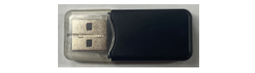

##############################################################################
Chapter 6 Play MP3 Test
##############################################################################

In the previous study, we have learned how to use the SD card. Now we are going to learn to play the music in the SD card.

Project 6.1 Play MP3
**********************************

In this project, we will read files in mp3 format from SD card, decode them through ESP32-S3, and use Audio Converter & Amplifier module to transcode into stereo output.

.. list-table::
    :align: center

    * - Freenove Media Kit for ESP32-S3 x1
      - USB cable x1

    * - |Chapter03_01|
      - |Chapter03_02|

    * - SD card x1
      - Card reader x1 (random color)

    * - |Chapter04_00|
      - |Chapter04_01|

.. |Chapter03_01| image:: ../_static/imgs/Main/3_5-Way_Navigation_Switch_Test/Chapter03_01.png
.. |Chapter03_02| image:: ../_static/imgs/Main/3_5-Way_Navigation_Switch_Test/Chapter03_02.png
.. |Chapter04_00| image:: ../_static/imgs/Main/4_SD_Card_Read_&_Write_Test/Chapter04_00.png

Circuit
===============================

Before compling code, we should copy music to SD card first, as illustrated below.

We have placed a folder called "music" in:

**Freenove_Media_Kit_for_ESP32-S3\\Sketch\\Sketch_05_I2S_Audio,**

please copy this folder to the SD card.

.. image:: ../_static/imgs/Main/6_Play_MP3_Test/Chapter06_00.png
    :align: center

Before connecting the USB cable, insert the SD card into the SD card slot on the back of the ESP32-S3.

Sketch
===============================

How to install the library
--------------------------------

In this project, we will use the ESP32-audioI2S.zip library to decode the audio files in the SD card, and then output the audio signal through IIS. If you have not installed this library, please follow the steps below to install it.

Open **Arduino IDE** -> **Sketch** -> **Include library** -> **Add .ZIP Library.**

In the newly opened window, select **"Freenove_Media_Kit_for_ESP32-S3\\Libraries\\ESP32-audioI2S.zip"** and click "Open".

**If you have any concerns, please feel free to contact us via** support@freenove.com

Sketch_06_Play_MP3
----------------------------------

The following is the program code:

.. literalinclude:: ../../../freenove_Kit/Sketches/Sketch_06_Play_MP3/Sketch_06_Play_MP3.ino
    :linenos:
    :language: c
    :dedent:

Include the required header files.

.. literalinclude:: ../../../freenove_Kit/Sketches/Sketch_06_Play_MP3/Sketch_06_Play_MP3.ino
    :linenos:
    :language: c
    :lines: 10-13
    :dedent:

Macro definitions for SD Card pin configuration

.. literalinclude:: ../../../freenove_Kit/Sketches/Sketch_06_Play_MP3/Sketch_06_Play_MP3.ino
    :linenos:
    :language: c
    :lines: 15-17
    :dedent:

Macro definitions for I2S pin configuration

.. literalinclude:: ../../../freenove_Kit/Sketches/Sketch_06_Play_MP3/Sketch_06_Play_MP3.ino
    :linenos:
    :language: c
    :lines: 19-21
    :dedent:

SD card initialization

.. literalinclude:: ../../../freenove_Kit/Sketches/Sketch_06_Play_MP3/Sketch_06_Play_MP3.ino
    :linenos:
    :language: c
    :lines: 28-32
    :dedent:

Declare an audio decoding object, associate it with the pin, set the volume, and set the decoding object.

.. code-block:: C
    :linenos:

    Audio audio;
    ...
    audio.setPinout(I2S_BCLK, I2S_LRC, I2S_DOUT);
    audio.setVolume(2);  // 0...21

    audio.connecttoFS(SD_MMC, "/music/Jingle Bells.mp3");

Continuously play music until the current track finishes. Upon receiving data through the serial port, remove any leading or trailing spaces and use the audio object to decode the data.

.. literalinclude:: ../../../freenove_Kit/Sketches/Sketch_06_Play_MP3/Sketch_06_Play_MP3.ino
    :linenos:
    :language: c
    :lines: 57-64
    :dedent:

It is necessary to change the settings in Arduino IDE before clicking the Uploading button, as shown below.

:red:`Caution: Incorrect settings will result in compilation error or uploading failure. To achieve desired result, please configure exactly the same as below.`

If you want to switch the music in the SD card, you can directly input the song through the serial port.

To adjust the volume, you can modify the parameter in the code, as shown below. 

:red:`The range of the volume is between 0 to 21.`

These functions are used to print information about audio decoding. If you don't want to see this information in the serial port, you can simply comment out these functions."

.. code-block:: C
    :linenos:

    void audio_info(const char *info); 
    void audio_id3data(const char *info); 
    void audio_eof_mp3(const char *info); 
    void audio_showstation(const char *info);
    void audio_showstreamtitle(const char *info);
    void audio_bitrate(const char *info);
    void audio_commercial(const char *info);
    void audio_icyurl(const char *info);
    void audio_lasthost(const char *info);