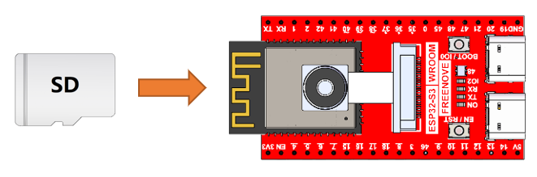

##############################################################################
Chapter 7 Video Web Server
##############################################################################

In this section, we take ESP32-S3's video function as an example to study.

Project 7.1 Camera Web Server
*****************************************

Connect the ESP32-S3 to your computer with the USB cable. Check its IP address through the serial monitor upon the code upload completes. Access the IP address via a browser to view the video and image data.

Component List 
=========================================

.. table:: 
    :align:  center

    +-------------------+-------------------+
    | SD card x1        | USB cable x1      |
    |                   |                   |
    | |Chapter07_00|    | |Chapter07_01|    |
    +-------------------+-------------------+
    | Freenove Media Kit for ESP32-S3 x1    |
    |                                       |
    | |Chapter07_02|                        |
    +---------------------------------------+

.. |Chapter07_00| image:: ../_static/imgs/Main/7_Video_Web_Server/Chapter07_00.png
.. |Chapter07_01| image:: ../_static/imgs/Main/7_Video_Web_Server/Chapter07_01.png
.. |Chapter07_02| image:: ../_static/imgs/Main/7_Video_Web_Server/Chapter07_02.png

Circuit
========================================

Before connecting the USB cable, insert the SD card into the SD card slot on the back of the ESP32-S3.

Sketch	
=========================================

Sketch_07_Video_Web_Server
---------------------------------------

The following is the program code:

.. literalinclude:: ../../../freenove_Kit/Sketches/Sketch_07_Video_Web_Server/Sketch_07_Video_Web_Server.ino
    :linenos:
    :language: c
    :dedent:

Add procedure files and API interface files related to ESP32-S3 camera.

.. literalinclude:: ../../../freenove_Kit/Sketches/Sketch_07_Video_Web_Server/Sketch_07_Video_Web_Server.ino
    :linenos:
    :language: c
    :lines: 54-60
    :dedent:

Enter the name and password of your router. 

.. literalinclude:: ../../../freenove_Kit/Sketches/Sketch_07_Video_Web_Server/Sketch_07_Video_Web_Server.ino
    :linenos:
    :language: c
    :lines: 18-19
    :dedent:

Initialize serial port, set baud rate to 115200; open the debug and output function of the serial.

.. literalinclude:: ../../../freenove_Kit/Sketches/Sketch_07_Video_Web_Server/Sketch_07_Video_Web_Server.ino
    :linenos:
    :language: c
    :lines: 29-33
    :dedent:

ESP32-S3 connects to the router and prints a successful connection prompt. If it does not connect succssfully, press the reset key on the ESP32-S3 WROOM.

.. literalinclude:: ../../../freenove_Kit/Sketches/Sketch_07_Video_Web_Server/Sketch_07_Video_Web_Server.ino
    :linenos:
    :language: c
    :lines: 43-52
    :dedent:

Start the camera web server and print its IP address via serial port.

.. literalinclude:: ../../../freenove_Kit/Sketches/Sketch_07_Video_Web_Server/Sketch_07_Video_Web_Server.ino
    :linenos:
    :language: c
    :lines: 54-60
    :dedent:

Configure parameters including interface pins of the camera. Note: Changing the pins is not recommended.

.. literalinclude:: ../../../freenove_Kit/Sketches/Sketch_07_Video_Web_Server/Sketch_07_Video_Web_Server.ino
    :linenos:
    :language: c
    :lines: 69-94
    :dedent:

Configure the display image information of the camera.

The set_vflip() function sets whether the image is flipped 180°, with 0 for no flip and 1 for flip 180°.

The set_brightness() function sets the brightness of the image, with values ranging from -2 to 2.

The set_saturation() function sets the color saturation of the image, with values ranging from -2 to 2.

.. literalinclude:: ../../../freenove_Kit/Sketches/Sketch_07_Video_Web_Server/Sketch_07_Video_Web_Server.ino
    :linenos:
    :language: c
    :lines: 114-118
    :dedent:

Modify the resolution and sharpness of the images captured by the camera. The sharpness ranges from 10 to 63, and the smaller the number, the sharper the picture. The larger the number, the blurrier the picture. Please refer to the table below.

.. literalinclude:: ../../../freenove_Kit/Sketches/Sketch_07_Video_Web_Server/Sketch_07_Video_Web_Server.ino
    :linenos:
    :language: c
    :lines: 89, 93
    :dedent:

It is necessary to change the settings in Arduino IDE before clicking the Uploading button, as shown below.

:red:`Caution: Incorrect settings will result in compilation error or uploading failure. To achieve desired result, please configure exactly the same as below.`

After uploading the code, an IP address will be printed in the Serial Monitor. The IP address is automatically assigned by the system (the specific IP address may vary depending on the network environment). 

Open the IP address on a browser and you will see the video streaming.

.. note::
    
    Display performance may differ across camera models, with some devices showing a flipped image. If this occurs, configure the horizontal/vertical mirroring settings.

.. code-block:: C
    :linenos:

    s->set_hmirror(s, 1);     // Mirror the image horizontally
    s->set_vflip(s, 0);       // Restore vertical orientation

**Parameter Description:**

    - 0: Normal display

    - 1: Flip (mirror)

To achieve the desired display, configure the settings according to real-time preview feedback during setup.

Reference
-----------------------

.. table::
    :class: freenove-ow

    +-----------------------+-------------+--------------------+---------------+
    |   Image resolution    |  Sharpness  |  Image resolution  |   Sharpness   |
    +=======================+=============+====================+===============+
    | **FRAMESIZE_96X96**   | **96x96**   | **FRAMESIZE_HVGA** | **480x320**   |
    +-----------------------+-------------+--------------------+---------------+
    | **FRAMESIZE_QQVGA**   | **160x120** | **FRAMESIZE_VGA**  | **640x480**   |
    +-----------------------+-------------+--------------------+---------------+
    | **FRAMESIZE_QCIF**    | **176x144** | **FRAMESIZE_SVGA** | **800x600**   |
    +-----------------------+-------------+--------------------+---------------+
    | **FRAMESIZE_HQVGA**   | **240x176** | **FRAMESIZE_XGA**  | **1024x768**  |
    +-----------------------+-------------+--------------------+---------------+
    | **FRAMESIZE_240X240** | **240x240** | **FRAMESIZE_HD**   | **1280x720**  |
    +-----------------------+-------------+--------------------+---------------+
    | **FRAMESIZE_QVGA**    | **320x240** | **FRAMESIZE_SXGA** | **1280x1024** |
    +-----------------------+-------------+--------------------+---------------+
    | **FRAMESIZE_CIF**     | **400x296** | **FRAMESIZE_UXGA** | **1600x1200** |
    +-----------------------+-------------+--------------------+---------------+

**If you have any concerns, please feel free to contact us via** support@freenove.com