##############################################################################
Chapter 8 TFT Clock
##############################################################################

In this section, we will learn how to use the TFT display.

Project 8.1 TFT Clock
**********************************

Component List 
=================================

.. list-table::
    :header-rows: 1

    * - Freenove Media Kit for ESP32-S3 x1
      - USB cable x1

    * - |Chapter03_01|
      - |Chapter03_02|

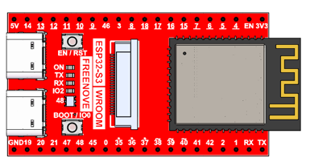
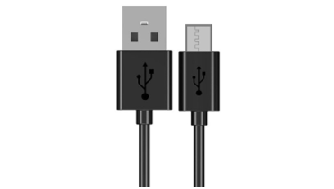

Circuit
=================================

Connect Freenove Media Kit for ESP32-S3 to your computer using the USB cable.

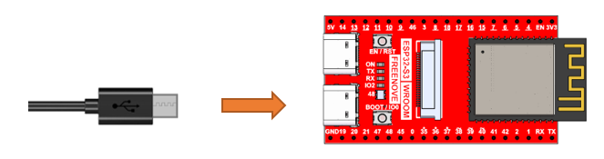

Sketch
=================================

Before uploading the code, you need to isntall the TFT_eSPI library and make some configuration.

How to install the library
---------------------------------

Open Arduino IDE, click Sketch -> Include Library -> Add .ZIP Library. In the pop-up window, find the file named **"Freenove_Media_Kit_for_ESP32-S3\\Libraries\\TFT_eSPI.Zip"**, which locates in this directory, and click OPEN.

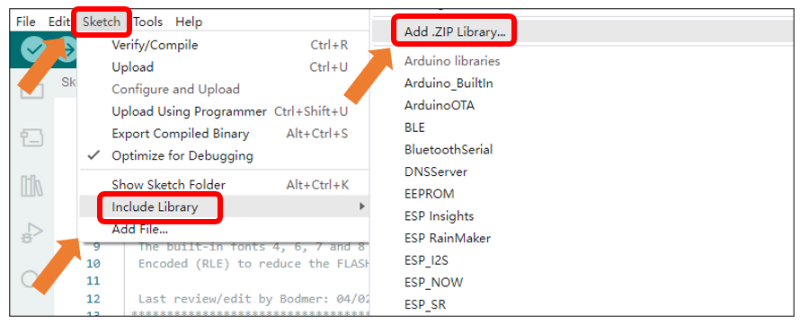

Select TFT_eSPI.Zip and click Open.

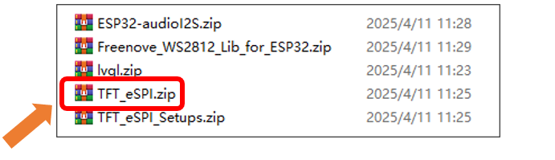

Install the TFT_eSPI_Setups library with the same approach. Select TFT_eSPI_Setups.zip that locates in this directory, and click OPEN.

.. note::
    
    :red:`TFT_eSPI_Setups.Zip and TFT_eSPI.Zip are different and both are needed.`

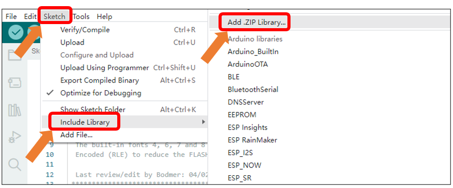

Select TFT_eSPI_Setups.Zip and click Open.

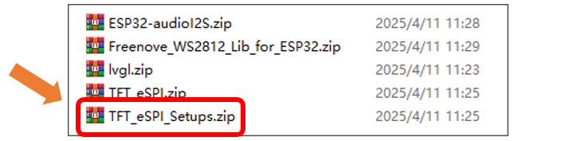

How to configure (Important)

Open This PC, input **%USERPROFILE%\\Documents\\Arduino\\libraries\\TFT_eSPI** and press the **Enter** key.

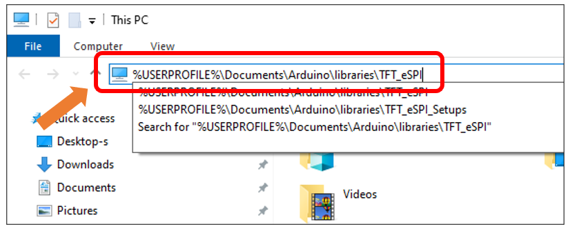

Right click User_Setup_Select.h, click Edit.

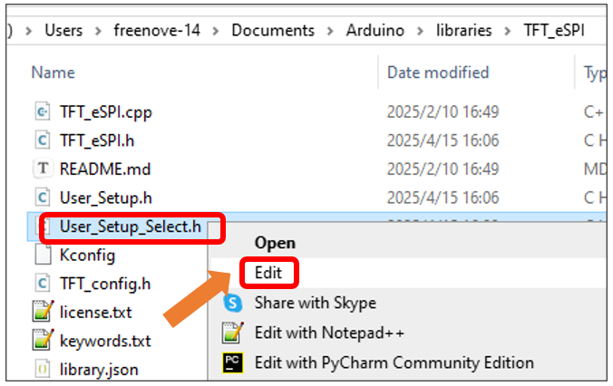

Add the following contents to Line 28 of the file.

.. code-block:: c
    :linenos:

    #include <../TFT_eSPI_Setups/Freenove_1.14_135x240_ST7789.h>

Save the change and exit the file.

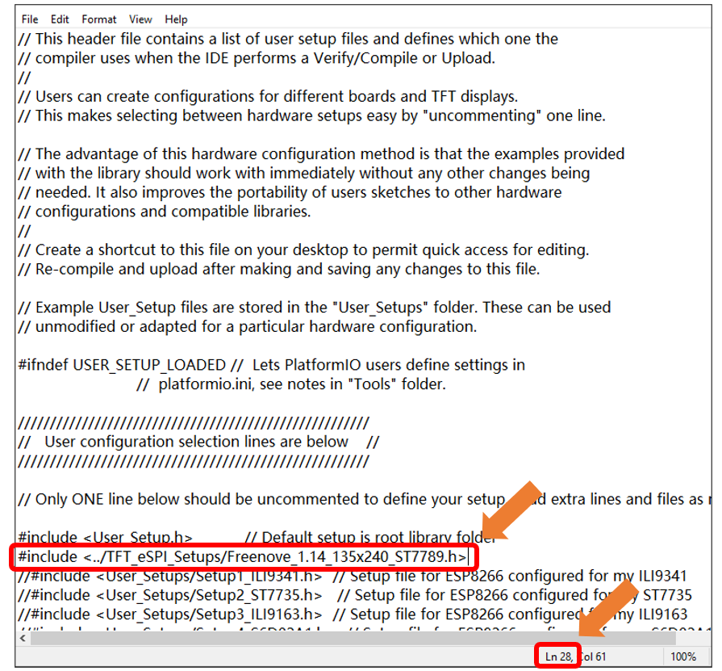

.. warning::
    
    If the following updating message shows up, click LATER. Updating the TFT_eSPI library will reset all related configurations. If you click INSTALL, follow the aforementioned steps to re-add the header file to ensure proper project operation.

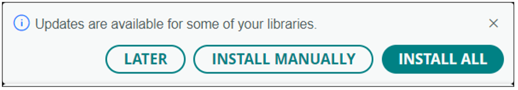

Sketch_09_TFT_Clock
--------------------------------

The following is the program code:

.. literalinclude:: ../../../freenove_Kit/Sketches/Sketch_08_TFT_Clock/Sketch_08_TFT_Clock.ino
    :linenos:
    :language: c
    :dedent:

After uploading the code, the TFT screen will display a real-time clock along with the text "Freenove", as shown in the image below:

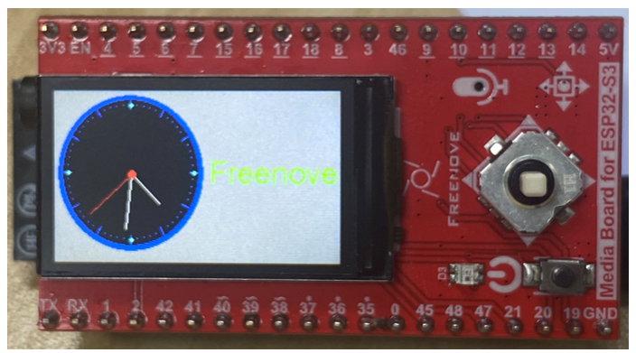

For a more in-depth understanding of how the SPI protocol drives the TFT screen, please refer to `TFT_eSPI <https://github.com/Bodmer/TFT_eSPI>`_.

**If you have any concerns, please feel free to contact us via** support@freenove.com