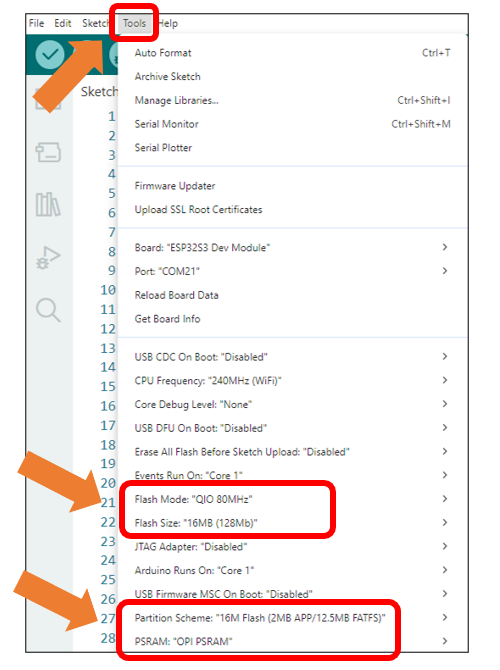
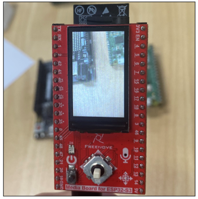
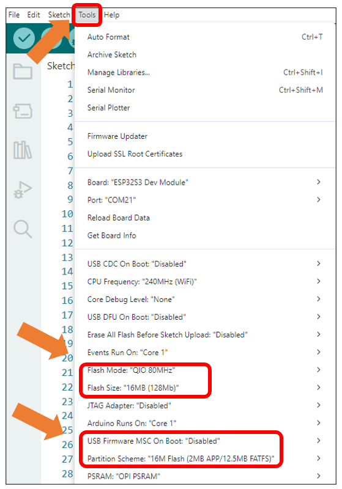
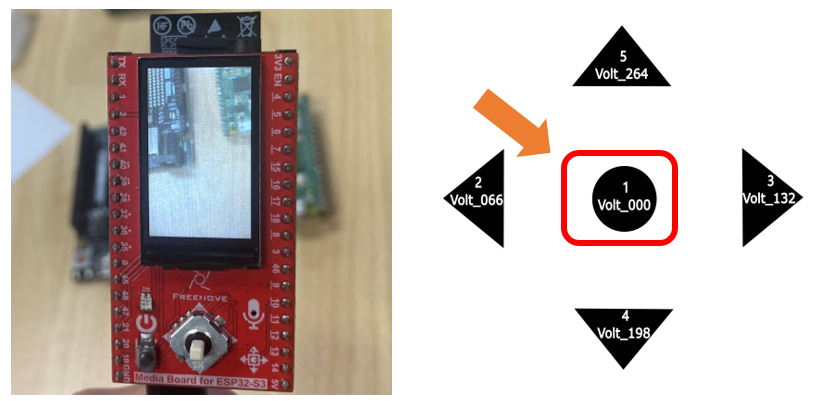
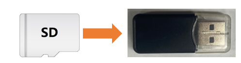
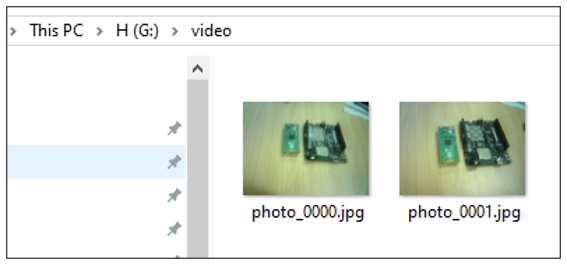

##############################################################################
Chapter 9 Camera TFT Test
##############################################################################

In the previous two chapters, we covered the basic usage of both the camera module and TFT display separately. This chapter will focus on integrating these two components for combined applications.

Project 9.1 Camera TFT Show
*************************************

Capture image data using the camera module and display it on the TFT screen.

Component List 
=================================

.. table:: 
    :align:  center

    +-------------------+-------------------+
    | SD card x1        | USB cable x1      |
    |                   |                   |
    | |Chapter07_00|    | |Chapter07_01|    |
    +-------------------+-------------------+
    | Freenove Media Kit for ESP32-S3 x1    |
    |                                       |
    | |Chapter07_02|                        |
    +---------------------------------------+

.. |Chapter07_00| image:: ../_static/imgs/Main/7_Video_Web_Server/Chapter07_00.png
.. |Chapter07_01| image:: ../_static/imgs/Main/7_Video_Web_Server/Chapter07_01.png
.. |Chapter07_02| image:: ../_static/imgs/Main/7_Video_Web_Server/Chapter07_02.png

Circuit
=================================

Connect Freenove Media Kit for ESP32-S3 to your computer using the USB cable.

.. image:: ../_static/imgs/Main/3_5-Way_Navigation_Switch_Test/Chapter03_03.png
    :align: center

Before connecting the USB cable, insert the SD card into the SD card slot on the back of the ESP32-S3.

.. image:: ../_static/imgs/Main/7_Video_Web_Server/Chapter07_03.png
    :align: center

Sketch
=================================

Sketch_09_1_Camera_TFT_Show
----------------------------------

The following is the program code:

.. literalinclude:: ../../../freenove_Kit/Sketches/Sketch_09_1_Camera_TFT_Show/Sketch_09_1_Camera_TFT_Show.ino
    :linenos:
    :language: c
    :dedent:

Include header files and definition.

.. literalinclude:: ../../../freenove_Kit/Sketches/Sketch_09_1_Camera_TFT_Show/Sketch_09_1_Camera_TFT_Show.ino
    :linenos:
    :language: c
    :lines: 10-13
    :dedent:

Define screen rotation orientation (0-3 correspond to 0°, 90°, 180°, and 270° respectively)

.. literalinclude:: ../../../freenove_Kit/Sketches/Sketch_09_1_Camera_TFT_Show/Sketch_09_1_Camera_TFT_Show.ino
    :linenos:
    :language: c
    :lines: 16-16
    :dedent:

Initialize TFT screen and camera configuration.

.. code-block:: c
    :linenos:

    TFT_eSPI tft = TFT_eSPI();
    ...
    tft.init();                      // Initialize the TFT display
    tft.setRotation(TFT_DIRECTION);  // Set the rotation of the TFT display
    camera_init();                   // Initialize the camera

Capture camera data and store it in the pointer fb.

.. literalinclude:: ../../../freenove_Kit/Sketches/Sketch_09_1_Camera_TFT_Show/Sketch_09_1_Camera_TFT_Show.ino
    :linenos:
    :language: c
    :lines: 39-44
    :dedent:

Crop the image according to the camera's resolution.

.. literalinclude:: ../../../freenove_Kit/Sketches/Sketch_09_1_Camera_TFT_Show/Sketch_09_1_Camera_TFT_Show.ino
    :linenos:
    :language: c
    :lines: 46-73
    :dedent:

Initialize camera configuration and adjust image parameters.

.. literalinclude:: ../../../freenove_Kit/Sketches/Sketch_09_1_Camera_TFT_Show/Sketch_09_1_Camera_TFT_Show.ino
    :linenos:
    :language: c
    :lines: 121-133
    :dedent:

It is necessary to change the settings in Arduino IDE before clicking the Uploading button, as shown below.

:red:`Caution: Incorrect settings will result in compilation error or uploading failure. To achieve desired result, please configure exactly the same as below.`

After uploading the code, the TFT screen will display the camera's captured images in real-time, as shown in the following illustration:

.. note::
    
    Display performance may differ across camera models, with some devices showing a flipped image. If this occurs, configure the horizontal/vertical mirroring settings.

.. code-block:: c
    :linenos:

    s->set_hmirror(s, 1);     // Mirror the image horizontally
    s->set_vflip(s, 0);       // Restore vertical orientation

**Parameter Description:**

    - 0: Normal display
    
    - 1: Flip (mirror)

To achieve the desired display, configure the settings according to real-time preview feedback during setup.

Project 9.2
****************************

In the previous section, we learned how to capture camera images and display them on a TFT screen. This section will explain how to save the images captured by the camera to an SD card.

Component List 
============================

.. list-table::
    :align: center

    * - Freenove Media Kit for ESP32-S3 x1
      - USB cable x1

    * - |Chapter03_01|
      - |Chapter03_02|

    * - SD card x1
      - Card reader x1 (random color)

    * - |Chapter04_00|
      - |Chapter04_01|

.. |Chapter03_01| image:: ../_static/imgs/Main/3_5-Way_Navigation_Switch_Test/Chapter03_01.png
.. |Chapter03_02| image:: ../_static/imgs/Main/3_5-Way_Navigation_Switch_Test/Chapter03_02.png
.. |Chapter04_00| image:: ../_static/imgs/Main/4_SD_Card_Read_&_Write_Test/Chapter04_00.png
.. |Chapter04_01| image:: ../_static/imgs/Main/4_SD_Card_Read_&_Write_Test/Chapter04_01.png

Circuit
=================================

Connect Freenove Media Kit for ESP32-S3 to your computer using the USB cable.

.. image:: ../_static/imgs/Main/3_5-Way_Navigation_Switch_Test/Chapter03_03.png
    :align: center

Before connecting the USB cable, insert the SD card into the SD card slot on the back of the ESP32-S3.

.. image:: ../_static/imgs/Main/7_Video_Web_Server/Chapter07_03.png
    :align: center

Sketch
===========================

Sketch_09_2_Take_A_Photo
-------------------------------

The following is the program code:

.. literalinclude:: ../../../freenove_Kit/Sketches/Sketch_09_2_Take_A_Photo/Sketch_09_2_Take_A_Photo.ino
    :linenos:
    :language: c
    :dedent:

Include the needed hearder files and definition.

.. literalinclude:: ../../../freenove_Kit/Sketches/Sketch_09_2_Take_A_Photo/Sketch_09_2_Take_A_Photo.ino
    :linenos:
    :language: c
    :lines: 10-14
    :dedent:

Define screen rotation orientation (0-3 correspond to 0°, 90°, 180°, and 270° respectively)

.. literalinclude:: ../../../freenove_Kit/Sketches/Sketch_09_2_Take_A_Photo/Sketch_09_2_Take_A_Photo.ino
    :linenos:
    :language: c
    :lines: 16-19
    :dedent:

Initialize TFT screen and camera configuration.

.. code-block:: c
    :linenos:

    TFT_eSPI tft = TFT_eSPI();
    ...
    tft.init();                      // Initialize the TFT display
    tft.setRotation(TFT_DIRECTION);  // Set the rotation of the TFT display
    camera_init();                   // Initialize the camera

Obtain the frame buffer from the camera

.. literalinclude:: ../../../freenove_Kit/Sketches/Sketch_09_2_Take_A_Photo/Sketch_09_2_Take_A_Photo.ino
    :linenos:
    :language: c
    :lines: 107-112
    :dedent:

Crop the image captured from the camera

.. literalinclude:: ../../../freenove_Kit/Sketches/Sketch_09_2_Take_A_Photo/Sketch_09_2_Take_A_Photo.ino
    :linenos:
    :language: c
    :lines: 114-141
    :dedent:

It is necessary to change the settings in Arduino IDE before clicking the Uploading button, as shown below.

:red:`Caution: Incorrect settings will result in compilation error or uploading failure. To achieve desired result, please configure exactly the same as below.`

After uploading the code, the image from the camera will be displayed on the TFT screen. Pressing the button down (center) will automatically save the photo to the SD card

After taking photos, please remove the SD card and insert it into a card reader, then connect the reader to your computer.

In the SD card's directory, there is a folder named 'Video' which contains the pictures you just captured.

.. note::
    
    Display performance may differ across camera models, with some devices showing a flipped image. If this occurs, configure the horizontal/vertical mirroring settings.

.. code-block:: c
    :linenos:

    s->set_hmirror(s, 1);     // Mirror the image horizontally
    s->set_vflip(s, 0);       // Restore vertical orientation

**Parameter Description:**

    - 0: Normal display
    
    - 1: Flip (mirror)

To achieve the desired display, configure the settings according to real-time preview feedback during setup.

**If you have any concerns, please feel free to contact us via** support@freenove.com