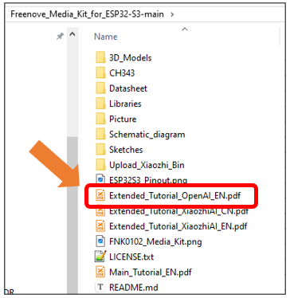

##############################################################################
AI Voice Assistant Based on OpenAI Realtime Model
##############################################################################

This project applies the Media Kit to develop an AI voice assistant for conversations with OpenAI. It requires basic programming skills and some familiarity with OpenAI.

About the Project
*******************************

This voice assistant project (https://github.com/Freenove/openai-realtime-embedded) is based on OpenAI's open-source project openai-realtime-embedded (https://github.com/openai/openai-realtime-embedded). It enables embedded devices to call OpenAI's Realtime Model APIs, such as GPT-4o Realtime and GPT-4o Mini Realtime, allowing you to build your own AI voice assistant.

Freenove has adapted this project for its Media Kit product. This article will guide you on how to run it on the Media Kit.

Cautions
*******************************

- Project Copyright: The original author of this project is OpenAI. Freenove forked and adapted it for Media Kit, and the project is licensed under the MIT License.

- Supported Countries/Regions: This project uses OpenAI's GPT-4o RealTime API, which is not available in all countries/regions. Please check OpenAI's supported countries list:

https://platform.openai.com/docs/supported-countries. 

If you cannot access this link, OpenAI's services are likely unavailable in your location.

- Supported Languages: OpenAI supports many languages but has no official list. For reference, see:

https://platform.openai.com/docs/api-reference/realtime-sessions/create

https://en.wikipedia.org/wiki/List_of_ISO_639_language_codes

- Pricing: The GPT-4o RealTime API is a paid service, and you must purchase credits from OpenAI to use it.

- Seeking Help: If you have followed the tutorial but still encounter issues, contact us at support@freenove.com 

.. note::
    
    Since both the project and API are provided by OpenAI, if OpenAI discontinues them, we will also remove related documentation, tutorials, and code.

About OpenAI
*******************************

OpenAI is a leading artificial intelligence research and deployment company committed to ensuring that artificial general intelligence (AGI) benefits all of humanity. Guided by principles of openness, collaboration, and safety, the organization drives the development and practical application of cutting-edge models. These include the renowned GPT series of language models, the DALL·E image generation model, as well as speech recognition and synthesis tools like Whisper.

OpenAI not only provides powerful AI models but also offers API services that enable developers to easily integrate these models into their own products. Recently, OpenAI launched its new Realtime API, which significantly enhances conversational naturalness through direct streaming of audio input and output, with automatic interruption handling capabilities.

However, it's important to note that:

- 1.	OpenAI currently does not offer free services

- 2.	The Realtime API currently only supports: 

GPT-4o and GPT-4o mini models

The latest transcription models: GPT-4o Transcribe and GPT-4o mini Transcribe

For more information about Realtime API, please refer to Realtime API - OpenAI API

OpenAI-Realtime-Embedded Disclaimer

This implementation is an adaptation of the open-source project available at 

https://github.com/openai/openai-realtime-embedded, provided for third-party learning and AI functionality testing purposes, without any promotion or support for commercial applications. This tutorial is intended solely for personal learning and development by technology enthusiasts.

.. note::

    1.	As this is a third-party open-source project, if you encounter issues during your learning process, please submit an issue to the original repository https://github.com/openai/openai-realtime-embedded/issues

    2.	The OpenAI API is a paid service. You must subscribe and enable billing to access any API functionality. Without an active paid account, all OpenAI API features will be unavailable.

    3.	To use OpenAI services, you must apply for your own API key directly from OpenAI. We do not provide or share any API key information.

For details about OpenAI API access, please visit:

https://platform.openai.com/docs/api-reference/introduction

Please see the following flowchart. 

  - The ESP32-S3 executes the openai-realtime-embedded source code, establishes a WiFi connection, and streams audio data to OpenAI's servers.

  - Upon receiving the audio stream, OpenAI's servers process the data, generate text responses, and synthesize corresponding audio, which is then transmitted back to the ESP32-S3 via WiFi.

  - In this project, the ESP32-S3 communicates with OpenAI's servers using the WebSocket protocol.

.. image:: ../_static/imgs/Openai/AI_Voice_Assistant_Based_on_OpenAI_Realtime_model/Chapter01_00.png
    :align: center

We have provided the tutorial for using the OpenAI on Freenove Media Kit for ESP32-S3, you can click here to download. The location of the tutorial is as shown below.

**If you have any concerns, please feel free to contact us via** support@freenove.com