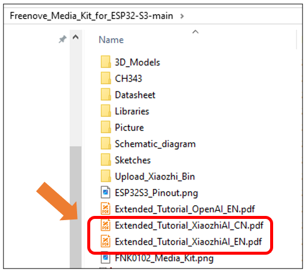

##############################################################################
AI Voice Assistant Based on XiaoZhi AI
##############################################################################

This project applies the Media Kit to implement an AI voice assistant, which requires a certain level of programming proficiency as well as familiarity with ESP-IDF and open-source large models.

About the Project
*****************************************

This voice assistant project (https://github.com/Freenove/xiaozhi-esp32) is derived from the open-source project (https://github.com/78/xiaozhi-esp32 ). It enables the invocation of most mainstream large language models (LLMs) on embedded devices and achieves voice conversation functionality through multiple services, including Voice Activity Detection (VAD), Automatic Speech Recognition (ASR), Speech-to-Text (STT), Text-to-Speech (TTS), Memory Storage, and Intent Recognition. Freenove has adapted this project for its Media Kit product. This article will explain how to run the project on the Media Kit.

There are two ways to run this project - online or offline.

1.	**Online:** Connected to the xiaozhi.me server, currently available for free trial to individual users.

2.	**Offline:** All the aforementioned services (VAD, ASR, STT, TTS, Memory, Intent Recognition, etc.) must be deployed locally on a personal computer. The user experience depends entirely on the selected models and the performance of the local machine. The local server project (https://github.com/Freenove/xiaozhi-esp32-server) is derived from the open-source project (https://github.com/xinnan-tech/xiaozhi-esp32-server).

For users who prefer AI assistants, we recommend using the online version.  

For developer-oriented users, you can try deploying the offline version to gain a deeper understanding of the various services required for an AI assistant. However, it's important to note that personal computers may struggle to run all these services simultaneously—especially the core LLM (Large Language Model) service—which could result in a poor AI assistant experience. Therefore, the offline version is primarily valuable for learning and research purposes.

Cautions
*****************************************

- Project Copyright:

  - Voice Assistant Project: Originally developed by "Xiage", this project was forked and adapted by Freenove for the Media Kit, released under MIT License.

  - Local Server Project: Originally created by "xinnan-tech", this project was similarly forked and adapted by Freenove for Media Kit integration, licensed under MIT License.

- Supprted Countries and Regions:

  - Online Version: 
    
    Service availability is determined by xiaozhi.me server coverage, which may exclude certain regions. For current supported areas, please refer to: https://xiaozhi.me/login?redirect=/console/agents; 
    
    User experience is directly affected by server connectivity quality. Poor network conditions to xiaozhi.me servers may degrade performance.
  
  - Offline Version: 
    
    Fully location-independent, with deployment possible in all countries and regions without geographical restrictions.

- Supported Languages:

  - Online Version: Currently supports Mandarin Chinese, Cantonese, English, Japanese, Korean, and others. If you do not speak these languages, you may not be able to communicate effectively with XiaoZhi AI.

  - Offline Version: Depending on the ASR model you deploy. The default FunASR model only supports Mandarin Chinese, Cantonese Chinese, English, Japanese and Korean.

- Pricing:

  - Online Version: Currently, xiaozhi.me provides free services, but we cannot guarantee that the online server will remain free indefinitely.

  - Offline Version: Among the sub-services mentioned, some are paid while others are free—your choice determines the cost.

- Seeking Help:

  - If you have followed the tutorial and still encounter issues, please contact us at support@freenove.com
    
.. note::
    
    Since the online service is provided by xiaozhi.me, if xiaozhi.me discontinues its service, we will also remove related documentation, tutorials, and code.

Disclaimer
*****************************************

This implementation is an adaptation of the open-source project available at https://github.com/78/xiaozhi-esp32, provided for third-party learning and AI functionality testing purposes, without any promotion or support for commercial applications. This tutorial is intended solely for personal learning and development by technology enthusiasts.

.. note::

    1.	As this is a third-party open-source project, if you encounter issues during your learning process, please submit an issue to the original repository: https://github.com/78/xiaozhi-esp32/issues

    2.	Currently, XiaoZhi AI only supports Mandarin Chinese, Cantonese, English, Korean, and Japanese for speech recognition. Other languages are not yet supported.

    3.	The XiaoZhi server interface currently supports English, Chinese, and Japanese only. Additionally, mobile registration is only available for users in the following countries (see the table below). Users from other countries cannot register yet.

In this project, the ESP32-S3 communicates with XiaoZhi AI server through WebSocket protocol for data exchange.

.. image:: ../_static/imgs/xiaozhi/XiaoZhi_AI_User_Guide_(Based_on_FNK0102)/Chapter01_83.png
    :align: center

We have provided the tutorial for using the :ref:`XiaoZhi AI <fnk0102/codes/xiaozhi:xiaozhi>` on Freenove Media Kit for ESP32-S3, you can click here to download. The location of the tutorial is as shown below.

For your convenience, XiaoZhi AI's tutorial is available in both Chinese and English versions. You can choose to read either based on your preference:

Files with "EN" suffix -> English version

Files with "CN" suffix -> Chinese version

**If you have any concerns, please feel free to contact us via** support@freenove.com