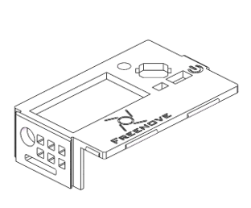

##############################################################################
List
##############################################################################

If you have any concerns, please feel free to contact us via support@freenove.com

.. table:: 
    :align: center

    +----------------------------------+----------------------------------+
    | Top of the Extension Board x1    | Bottom of the Extension Board x1 |
    |                                  |                                  |
    | |List00|                         | |List01|                         |
    +----------------------------------+----------------------------------+
    | Top of ESP32-S3 N16R8 x1         | Bottom of ESP32-S3 N16R8 x1      |
    |                                  |                                  |
    | |List02|                         | |List03|                         |
    +----------------------------------+----------------------------------+
    | Housing Base (3D Printed) x1     | Housing Cover (3D Printed) x1    |
    |                                  |                                  |
    | |List04|                         | |List05|                         |
    +----------------------------------+----------------------------------+
    | SD card reader x1 (random color) | SDcard x1                        |
    |                                  |                                  |
    | |List06|                         | |List07|                         |
    |                                  |                                  |
    | :red:`(Not a USB flash drive.)`  |                                  |
    +----------------------------------+----------------------------------+

.. |List00| image:: ../_static/imgs/Main/List/List00.png

Important Notes:

1.	Surface Finish: The housing is 3D-printed using FDM technology with a layer resolution of 0.1-0.2 mm. As a result, minor surface roughness and visible layer lines are normal.

2.	Color Change: The white PLA material may gradually develop a beige/yellowish tint over time due to environmental exposure. This is an inherent characteristic of the material.

3.	Handling Care: PLA is less impact-resistant than conventional plastics. Please handle the housing gently and avoid excessive force during assembly.

Replacement Options:

1.	3D model files are available in Freenove_Media_Kit_for_ESP32-S3\\3D_Models for self-printing if needed.

2.	If you don't have a 3D printer, you can order a replacement by uploading the STL file at JLCPCB (https://jlc3dp.com/?href=easyeda-home).