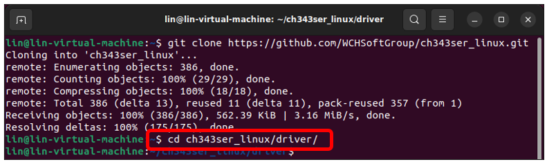
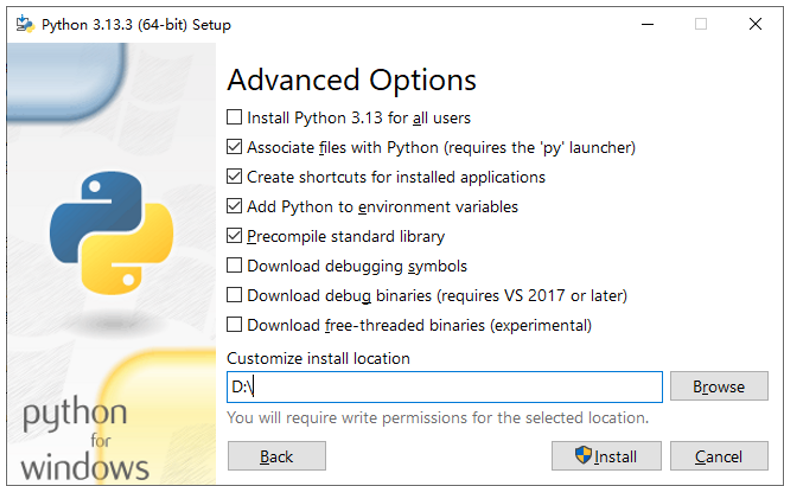
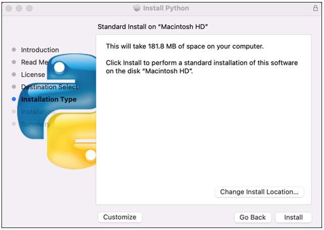
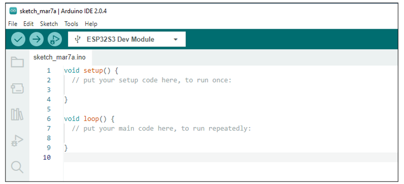

##############################################################################
Preface
##############################################################################

ESP32-S3 WROOM
******************************

The ESP32-S3-WROOM-1 offers two antenna options: the PCB on-board antenna and the IPEX antenna.

- The PCB on-board antenna is an integrated antenna within the chip module itself, making it compact and convenient for both portability and design.

- The IPEX antenna is an external metal antenna connected to the module's integrated antenna, providing enhanced signal performance.

.. list-table::
   :header-rows: 1
   :align: center

   * - PCB on-board antenna
     - IPEX antenna

   * - |Preface00|
     - |Preface01|

The ESP32-S3 WROOM of this product is based on the ESP32-S3-WROOM-1 module with built-in PCB on-board antenna.

.. list-table::
   :header-rows: 1
   :align: center

   * - ESP32-S3 WROOM
   * - |Preface02|

The hardware interfaces of ESP32-S3 WROOM are distributed as follows:

Compare the left and right images. We've boxed off the resources on the ESP32-S3 WROOM in different colors to facilitate your understanding of the board.

.. list-table::
   :header-rows: 1
   :align: center

   * - Box color 
     - Corresponding resources introduction

   * - |Preface04|
     - GPIO pins

   * - |Preface05|
     - LED indicators

   * - |Preface06|
     - Camera interface

   * - |Preface07|
     - Reset button, Boot mode selection button 

   * - |Preface08|
     - USB ports

For more information, please visit: https://www.espressif.com.cn/sites/default/files/documentation/esp32-s3-wroom-1_wroom-1u_datasheet_en.pdf. 

**GPIO pins of ESP32-S3 WROOM can be used to interface with external devices and control peripheral circuits.**

Freenove Media Kit for ESP32-S3
*******************************************

Freenove Media Kit for ESP32-S3 is an expansion board designed for the Freenove ESP32-S3 WROOM Board. Its key features are illustrated below.

Power Button
==========================================

The power button on the Freenove Media Kit for ESP32-S3, as shown in the diagram below, only works when powered by a battery (used to control battery connection/disconnection). It has no effect when powered via USB.

Schematic
------------------------------------

The schematic of the power button is as shown below:

Battery (Optional)
------------------------------------

This product does not include a lithium battery. Please purchase one separately.

The device supports both USB direct power supply and lithium battery power supply.

We strongly recommend using USB power whenever possible, as lithium batteries can be hazardous and require careful handling. Avoid using a battery unless absolutely necessary.

The recommended size of lithium batteries for this product is: 7.5mmx20mmx35mm. Search for "702035 battery" on any shopping platform.

This product uses a PH2.0mm 2P connector for power supply. You may purchase lithium batteries of any capacity, but please note that the rated input voltage range must be 3.7V–4.2V.

Commercially available batteries may have two different wiring polarities (positive/negative reversed). You must verify that the purchased battery’s pinout matches the product’s requirements (as shown in the diagram below). Incorrect polarity may cause device damage or safety hazards.

**The red wire is Positive (+) and black wire Negative (-)**

We recommend using the dedicated charger designed for your lithium battery.

Since lithium batteries vary in specifications and quality, using the correct charger helps ensure optimal performance, safety, and longevity.

While our product also supports USB charging as a backup option, please note that this method does not support fast charging and provides only a slow, standard charge.

Charging & Power Indicators:

When using the USB port on the board to charge the battery:

While charging, the blue LED will blink.

When charging is complete, the blue LED will stay lit.

If no battery is connected, the blue LED will keep blinking.

When the device is not connected to USB, it runs on battery power, and the green LED remains steadily lit.

Speaker and Headphone Connector
==========================================

The Freenove Media Kit for ESP32-S3 is equipped with a speaker that supports high-quality audio output, capable of meeting the playback requirements for various sound effects and music. You can learn how to generate simple tones in Chapter 5: Simple Tone Test, and how to play music in Chapter 6: Play MP3 Test.

The following table shows the specifications of the speaker.

.. table::
    :class: freenove-ow
    :align: center

    +----------------------+----------------------------------------+---------------+
    | Specifications       | Description                            | Typical value |
    +======================+========================================+===============+
    | Rated Impedance      | The resistance of the speaker to AC    | 8Ω            |
    |                      |                                        |               |
    |                      | current, affecting amplifier matching. |               |
    +----------------------+----------------------------------------+---------------+
    | Rated Power          | The maximum continuous power the       | 1W            |
    |                      |                                        |               |
    |                      | speaker can handle.                    |               |
    +----------------------+----------------------------------------+---------------+
    | Frequency Range      | The effective operating frequency      | 550~20kHz     |
    |                      |                                        |               |
    |                      | range of the speaker.                  |               |
    +----------------------+----------------------------------------+---------------+
    | Maximum Sound        | The highest sound intensity the        | 96±3dB        |
    |                      |                                        |               |
    | Pressure Level (SPL) | speaker can produce under specific     |               |
    |                      |                                        |               |
    |                      | conditions.                            |               |
    +----------------------+----------------------------------------+---------------+
    | Dimensions           | The length and width of the speaker.   | 18mm * 18mm   |
    +----------------------+----------------------------------------+---------------+

1.	Resistor R15 is not soldered by default (as shown in the figure below).
    
    - When R15 is not soldered: Inserting a headphone plug disconnects the speaker.
    
    - When R15 is soldered: Inserting a headphone plug allows both the speaker and headphone jack to output audio simultaneously.

2.	Resistor R1 is soldered by default, while R3 is not soldered by default.
    
    - When only R1 is soldered: The right channel is active.
    
    - When only R3 is soldered: The left channel is active.

The onboard speaker can be used to play any audio, but the volume may be relatively low. If you wish to use external speakers, you can connect them via the headphone jack.

This product features a 3.5mm TRS headphone socket. If you intend to connect your own speakers using an audio cable, please ensure you purchase a compatible 3.5mm TRS plug.

Common 3.5mm male plugs include TRS Jack and TRRS Jack, which are easily distinguishable:

TRS Jack has two metal rings (Tip, Ring, Sleeve).

TRRS Jack has three metal rings (Tip, Ring, Ring, Sleeve). (See figure below.) 

The TRS Jack (2-ring) headphone plug is compatible with the 3.5mm female socket on the Freenove Media Kit for ESP32-S3.

TRRS Jacks (3-ring) come in two common standards: OMTP and CTIA, differing in the wiring of Microphone (MIC) and Ground (GND) on the Ring2 and Sleeve contacts (see figure below).

.. table::
    :align: center

    +------------------+-------------+--------+---------------+
    | |Preface20|                    | Tip    | Left channel  |
    +                                +--------+---------------+
    |                                | Ring   | Right channel |
    +                                +--------+---------------+
    |                                | Sleeve | GND           |
    +------------------+-------------+--------+---------------+
    | :xx-large:`OMTP` | |Preface21| | Tip    | Left channel  |
    +                  +             +--------+---------------+
    |                  |             | Ring1  | Right channel |
    +                  +             +--------+---------------+
    |                  |             | Ring2  | Microphone    |
    +                  +             +--------+---------------+
    |                  |             | Sleeve | GND           |
    +------------------+-------------+--------+---------------+
    | :xx-large:`CTIA` | |Preface21| | Tip    | Left channel  |
    +                  +             +--------+---------------+
    |                  |             | Ring1  | Right channel |
    +                  +             +--------+---------------+
    |                  |             | Ring2  | GND           |
    +                  +             +--------+---------------+
    |                  |             | Sleeve | Microphone    |
    +------------------+-------------+--------+---------------+

:red:`Important Notes:`

:red:`1. If you connect headphones to the 3.5mm female socket, set the volume to 5 or lower (max volume = 21) in your code. Excessive volume may damage your headphones. The Freenove Media Kit for ESP32-S3 is fully compatible with CTIA-standard (modern) headphones, but only partially supports OMTP-standard (older) headphones. Please verify compatibility before use.`

:red:`2. If you connect a speaker to the 3.5mm socket, refer to the wiring diagram below for proper connection.`

- :red:`Maximum Supported Speaker Power: The built-in audio output supports up to 2.5W speakers. For higher-power speakers, an external amplifier is required.`

SD Card
===================================

Freenove Media Kit for ESP32-S3 comes with a 1GB SD card and a SD card reader (see the figure below).

The SD card uses SDMMC communication protocol, providing faster speeds and better performance compared to SPI proocol.

:red:`Please note that the included card reader cannot be used as a USB flash driver. It is specifically designed for SD card access only.`

.. table::
    :align: center

    +-------------+-------------------------------+
    | SD card x1  | Card reader x1 (random color) |
    |             |                               |
    | |Preface23| | |Preface24|                   |
    +-------------+-------------------------------+

.. |Preface24| image:: ../_static/imgs/Main/Preface/Preface24.png

For more information and instuctions for using the SD card, please refer to Chapter 4.

The following table shows the pin definition of the SD card.

.. table::
    :class: freenove-ow

    +---------+--------+------------+
    |  Item   |  Pins  | Definition |
    +=========+========+============+
    | SD Card | GPIO38 | SD_CMD     |
    |         +--------+------------+
    |         | GPIO39 | SD_CLK     |
    |         +--------+------------+
    |         | GPIO40 | SD_D0      |
    +---------+--------+------------+

TFT Display
===================================

Freenove Media Kit for ESP32-S3 features a **1.14-inch** TFT display. With each pixel is individually controlled by a tiny transistor, TFT (Thin-Film Transistor) displays, a common type of LCD screen, offer high responsiveness, brightness, and contrast.

Specifications of the TFT Display
-----------------------------------

.. table::
    :class: freenove-ow

    +----------------+-----------------+
    | Specifications |   Description   |
    +================+=================+
    | Dimensions     | 1.14 inch       |
    +----------------+-----------------+
    | Resolution     | 135x240 pixel   |
    +----------------+-----------------+
    | Drvier         | ST7789          |
    +----------------+-----------------+
    | Display Area   | 14.9mm * 24.9mm |
    +----------------+-----------------+
    | Rated Voltage  | 3.3V            |
    +----------------+-----------------+
    | Communication  | SPI             |
    +----------------+-----------------+

The 1.14-inch screen size specification refers to the diagonal measurement of the display's active viewing area, which equals approximately 2.6 centimeters (1.14 inches).

Schematic of the TFT Display
------------------------------------

.. note::
    
    During display reset operations, GPIO20 must be configured in output mode. 

**The reset sequence requires:**

**First output a low level and maintain it for a delay period**

**Then switch to high level to complete the reset timing**

The following table shows the pin definition of the TFT display.

.. table::
    :class: freenove-ow

    +-------------+--------+------------+
    |    Item     |  Pins  | Definition |
    +=============+========+============+
    | TFT display | GPIO21 | LCD_SDA    |
    |             +--------+------------+
    |             | GPIO47 | LCD_SCK    |
    |             +--------+------------+
    |             | GPIO45 | LCD_D/C    |
    |             +--------+------------+
    |             | GPIO20 | LCD_RST    |
    +-------------+--------+------------+

Microphone
=======================

The Freenove Media Kit for ESP32-S3 includes a MEMS microphone (Micro-Electro-Mechanical Systems microphone), which offers several advantages over traditional ECM (Electret Condenser Microphones) including smaller size, higher sensitivity and signal-to-noise ratio (SNR), and superior noise immunity, making them ideal for **compact embedded applications.**

For further details on MEMS microphone technology, refer to Chapter 10

.. list-table::
    :header-rows: 1
    :align: center

    * - Top
      - Bottom

    * - |Preface27|
      - |Preface28|

Shematic
-----------------------

The following table shows the pin definition of the microphone

.. table::
    :class: freenove-ow

    +------+--------+------------+
    | Item |  Pins  | Definition |
    +======+========+============+
    | Mic  | GPIO14 | MIC_WS     |
    |      +--------+------------+
    |      | GPIO3  | MIC_SCK    |
    |      +--------+------------+
    |      | GPIO46 | MIC_SD     |
    +------+--------+------------+

5-way Navigation Switch
==============================

Freenove Media Kit for ESP32-S3 utilizes a 5-way navigation button for human-machine interaction. For more details about the 5-way button, please refer to Chapter 3.

.. table::
    :class: freenove-ow

    +--------------+--------+-----------------+
    |     Item     |  Pin   |   Definition    |
    +==============+========+=================+
    | Power Button | GPIO19 | PowerButton_COM |
    +--------------+--------+-----------------+

Camera
===============================

Freenove Media Kit for ESP32-S3 integrates a camera module.

The following table shows the pin definition of the camera.

.. table::
    :class: freenove-ow

    +--------+--------+------------+
    |  Item  |  Pins  | Definition |
    +========+========+============+
    | Camera | GPIO4  | SIOD       |
    |        +--------+------------+
    |        | GPIO5  | SIOC       |
    |        +--------+------------+
    |        | GPIO6  | CSI_VYSNC  |
    |        +--------+------------+
    |        | GPIO7  | CSI_HREF   |
    |        +--------+------------+
    |        | GPIO16 | CSI_Y9     |
    |        +--------+------------+
    |        | GPIO15 | XCLK       |
    |        +--------+------------+
    |        | GPIO17 | CSI_Y8     |
    |        +--------+------------+
    |        | GPIO18 | CSI_Y7     |
    |        +--------+------------+
    |        | GPIO13 | CSI_PCLK   |
    |        +--------+------------+
    |        | GPIO12 | CSI_Y6     |
    |        +--------+------------+
    |        | GPIO11 | CSI_Y2     |
    |        +--------+------------+
    |        | GPIO10 | CSI_Y5     |
    |        +--------+------------+
    |        | GPIO9  | CSI_Y3     |
    |        +--------+------------+
    |        | GPIO8  | CSI_Y4     |
    +--------+--------+------------+

Notes for GPIO
**********************************

GPIO Pinout Table
================================
To learn what each GPIO corresponds to, please refer to the following table.

The functions of the pins are allocated as follows:

.. table::
    :align: center

    +----------------+-----------------+-------------------------+
    | ESP32-S3 N16R8 |    Funtions     |       Description       |
    +================+=================+=========================+
    | GPIO48         | WS2812_DIN      | WS2812                  |
    +----------------+-----------------+-------------------------+
    | GPIO21         | LCD_SDA         | TFT_LCD                 |
    +----------------+-----------------+                         |
    | GPIO47         | LCD_SCK         |                         |
    +----------------+-----------------+                         |
    | GPIO45         | LCD_D/C         |                         |
    +----------------+-----------------+                         |
    | GPIO20         | LCD_RST         |                         |
    +----------------+-----------------+-------------------------+
    | GPIO14         | MIC_WS          | Mic                     |
    +----------------+-----------------+                         |
    | GPIO3          | MIC_SCK         |                         |
    +----------------+-----------------+                         |
    | GPIO46         | MIC_SD          |                         |
    +----------------+-----------------+-------------------------+
    | GPIO19         | PowerButton_COM | Power Button            |
    +----------------+-----------------+-------------------------+
    | GPIO41         | NS4168_LRCLK    | Digital Power Amplifier |
    +----------------+-----------------+                         |
    | GPIO42         | NS4168_BCLK     |                         |
    +----------------+-----------------+                         |
    | GPIO1          | NS4168_SDATA    |                         |
    +----------------+-----------------+-------------------------+
    | GPIO4          | SIOD            | Camera                  |
    +----------------+-----------------+                         |
    | GPIO5          | SIOC            |                         |
    +----------------+-----------------+                         |
    | GPIO6          | CSI_VYSNC       |                         |
    +----------------+-----------------+                         |
    | GPIO7          | CSI_HREF        |                         |
    +----------------+-----------------+                         |
    | GPIO16         | CSI_Y9          |                         |
    +----------------+-----------------+                         |
    | GPIO15         | XCLK            |                         |
    +----------------+-----------------+                         |
    | GPIO17         | CSI_Y8          |                         |
    +----------------+-----------------+                         |
    | GPIO18         | CSI_Y7          |                         |
    +----------------+-----------------+                         |
    | GPIO13         | CSI_PCLK        |                         |
    +----------------+-----------------+                         |
    | GPIO12         | CSI_Y6          |                         |
    +----------------+-----------------+                         |
    | GPIO11         | CSI_Y2          |                         |
    +----------------+-----------------+                         |
    | GPIO10         | CSI_Y5          |                         |
    +----------------+-----------------+                         |
    | GPIO9          | CSI_Y3          |                         |
    +----------------+-----------------+                         |
    | GPIO8          | CSI_Y4          |                         |
    +----------------+-----------------+-------------------------+
    | GPIO38         | SD_CMD          | SD Card                 |
    +----------------+-----------------+                         |
    | GPIO39         | SD_CLK          |                         |
    +----------------+-----------------+                         |
    | GPIO40         | SD_D0           |                         |
    +----------------+-----------------+-------------------------+

For more information, refer to the schematic.

**If you have any concerns, please feel free to contact us via** support@freenove.com

PSRAM Pin
================================

The module on the ESP32-S3-WROOM board utilizes the ESP32-S3R16 chip, which comes with 8MB of external Flash. When using the OPI PSRAM, it should be noted that GPIO35-GPIO37 on the ESP32-S3-WROOM board will not be available for other purposes. However, when OPI PSRAM is not used, GPIO35-GPIO37 on the board can be used as normal GPIO.

.. table::
    :class: freenove-ow

    +------------------------+------------------------------------+
    | ESP32-S3R8/ESP32-S3R8V | In-package PSRAM (8 MB, Octal SPl) |
    +========================+====================================+
    | SPICLK                 | CLK                                |
    +------------------------+------------------------------------+
    | SPICS1                 | CE#                                |
    +------------------------+------------------------------------+
    | SPID                   | DQ0                                |
    +------------------------+------------------------------------+
    | SPIQ                   | DQ1                                |
    +------------------------+------------------------------------+
    | SPIWP                  | DQ2                                |
    +------------------------+------------------------------------+
    | SPIHD                  | DQ3                                |
    +------------------------+------------------------------------+
    | GPIO33                 | DQ4                                |
    +------------------------+------------------------------------+
    | GPIO34                 | DQ5                                |
    +------------------------+------------------------------------+
    | GPI035                 | DQ6                                |
    +------------------------+------------------------------------+
    | GPI036                 | DQ7                                |
    +------------------------+------------------------------------+
    | GPIO37                 | DQS/DM                             |
    +------------------------+------------------------------------+

SDcard Pin
================================

An SDcard slot is integrated on the back of the ESP32-S3-WROOM board, and we can use GPIO38-GPIO40 of ESP32-S3-WROOM to drive SD card.

The SDcard of ESP32-S3-WROOM uses SDMMC, a 1-bit bus driving method, which is integrated in the Arduino IDE, and we can call the "SD_MMC.h" library to drive it. For more details, please refer to the SDcard chapter in this tutorial.

USB Pin
================================

Please note that in this product, GPIO20 is used for both battery voltage sampling (ADC) and LCD reset signal (RST). Therefore, it must not be configured for USB functions to avoid signal interference.

Cam Pin
================================

When using the camera on our ESP32-S3-WROOM, please check its pin assignments. Pins marked with underlined numbers are dedicated to the camera function. If you intend to use additional functions alongside the camera, avoid using these pins to prevent conflicts.

If you have any questions regarding GPIO information, you can click :ref:`here <fnk0102/codes/main/preface:esp32-s3 wroom>` to navigate back to the ESP32-S3 WROOM and view specific GPIO details.

Or check: https://www.espressif.com/sites/default/files/documentation/esp32-s3_datasheet_en.pdf.

CH343 (Required)
*********************************

ESP32-S3 WROOM uses CH343 to download code. Therefore, before using the device, it is necessary to install the CH343 driver on your computer.

Windows
=================================

Check whether CH343 has been installed

1. Connect your computer and ESP32-S3 WROOM with a USB cable.

2. Turn to the main interface of your computer, select "This PC" and right-click to select "Manage".

3.	Click "Device Manager". If your computer has installed CH343, you can see"USB-Enhances-SERIAL CH343 (COMx)". And you can click here to move to the next step.

Installing CH343
-----------------------------------

1. First, download CH343 driver, click http://www.wch-ic.com/search?t=all&q=ch343 to download the appropriate one based on your operating system.

If you would not like to download the installation package, you can open "Freenove_Media_Kit_for_ESP32-S3/CH343", we have prepared the installation package.

2. Open the folder "Freenove_Media_Kit_for_ESP32-S3/CH343/Windows/"

3. Double click "CH343SER.EXE".

4. Click "INSTALL" and wait for the installation to complete.

5. Install successfully. Close all interfaces.

6. When ESP32-S3 WROOM is connected to computer, select "This PC", right-click to select "Manage" and click "Device Manager" in the newly pop-up dialog box, and you can see the following interface.

7. So far, CH343 has been installed successfully. Close all dialog boxes. 

MAC
=================================

First, download CH343 driver. Click http://www.wch-ic.com/search?t=all&q=ch343 to download the appropriate one based on your operating system.

If you would not like to download the installation package, you can open "Freenove_Media_Kit_for_ESP32-S3/CH343". We have prepared the installation package.

Second, open the folder "Freenove_Media_Kit_for_ESP32-S3/CH343/MAC/"

Third, click Continue.

Fourth, click Install.

Then, waiting Finsh.

Finally, restart your PC.

If it fails to be installed with the above steps, you can refer to readme.pdf to install it. 

Linux
===========================

Here we take Ubuntu system as an example. Open the Terminal.

Run "lsusb" to check the port.

.. code-block:: console
    
    lsusb
    ls /dev/tty*

CH343 is fully compliant to the Communications Device Class (CDC) standard, they will work with a standard CDC-ACM driver (CDC - Abstract Control Model). Linux operating systems supply a default CDC-ACM driver that can be used with these USB UART devices. In Linux, this driver file name is cdc-acm. 

If your computer does not recognise the ESP32S3's port, you can do as follows to install the ch343 driver.

Install the CH343 driver with the following command.

.. code-block:: console
    
    git clone https://github.com/WCHSoftGroup/ch343ser_linux.git

Enter the folder.

.. code-block:: console
    
    cd ch343ser_linux/driver/

Compile and generate the ch343.ko file.

.. code-block:: console
    
    make

Load the generated file to the system.

.. code-block:: console
    
    sudo make load
    sudo make install

Connect the ESP32S3 to your computer, check the port with the following command and you should see the port.

.. code-block:: console
    
    ls /dev/tty*

Accessing "ttyACM0" in Ubuntu requires higher privileges, so permission escalation via command is mandatory.

.. code-block:: console
    
    sudo usermod -a -G dialout $USER
    sudo reboot

Please note that the configure takes effect after rebooting.

Installing Python (Required)
***************************************

Windows
================================

Download and install Python3 package.

https://www.python.org/downloads/windows/

Click Download Python 3.13.3

**Please note that "Add Python 3.13 to PATH" MUST be check.**

Check all the options and then click "Next".

Here you can select the installation path of Python. We install it at D drive. If you are a novice, you can select the default path.

Wait for it to finish installing.

Now the installation is finished.

MAC
=============================

Download installation package, link: https://www.python.org/downloads/

Click Download Python 3.13.3

Run the downloaded installation package. Click Continue

Click Continue

Click Continue

Click Install. If your computer has a password, enter the password and Install Software.

Now the installation succeeds.

Linux
================================

Check whether Python3 is installed in the system.

.. code-block:: console
    
    python -version
    python3 -version

If it has not been installed, do it by running the following command. This will install the latest version by default.

.. code-block:: console
    
    sudo apt install python3

Link python to python3.

.. code-block:: console
    
    sudo rm /usr/bin/python
    sudo ln -s /usr/bin/python3 /usr/bin/python

Install python3.13-venv virtual environment.

.. code-block:: console
    
    sudo apt install python3-venv

Install python3-pip.

.. code-block:: console
    
    sudo apt install python3-pip

Programming Software
****************************************

Arduino Software (IDE) is used to write and upload the code for Arduino Board.

First, install Arduino Software (IDE): visit https://www.arduino.cc/en/software/, Select and download corresponding installer according to your operating system. If you are a Windows user, please select the "Windows" to download and install it correctly.

After the download completes, run the installer. For Windows users, there may pop up an installation dialog box of driver during the installation process. When it popes up, please allow the installation.

After installation completes, an Arduino Software shortcut will be generated in the desktop. Run the Arduino Software.

.. image:: ../_static/imgs/Main/Preface/Preface75.png
    :align: center

The interface of Arduino Software is as follows:

Programs written with Arduino Software (IDE) are called sketches. These sketches are written in the text editor and saved with the file extension.ino. The editor features text cutting/pasting and searching/replacing. The message area gives feedback while saving and exporting and also displays errors. The console displays text output by the Arduino Software (IDE), including complete error messages and other information. The bottom right-hand corner of the window displays the configured board and serial port. The toolbar buttons allow you to verify and upload programs, create, open, and save sketches, and open the serial monitor.

.. list-table::
    :align: center
    
    * - |Preface77|
      - Verify 
        
        Check your code for compile errors.

    * - |Preface78|
      - Upload 

        Compile your code and upload them to the configured board. 

    * - |Preface79|
      - Debug

        Debug code running on the board. 
        
        (Some development boards do not support this function)

    * - |Preface80|
      - Development board selection

        Configure the support package and upload 
        
        port of the development board.

    * - |Preface81|
      - Serial Plotter

        Receive serial port data and plot it in a discounted graph.

    * - |Preface82|
      - Serial Monitor 

        Open the serial monitor. 

Additional commands are found within the five menus: File, Edit, Sketch, Tools, Help. The menus are context sensitive, which means only those items relevant to the work currently being carried out are available.

Environment Configuration
*************************************

First, open the software platform arduino, and then click File in Menus and select Preferences.

.. image:: ../_static/imgs/Main/Preface/Preface83.png
    :align: center

Second, click on the symbol behind "Additional Boards Manager URLs" 

Third, fill in https://raw.githubusercontent.com/espressif/arduino-esp32/gh-pages/package_esp32_index.json in the new window, click OK, and click OK on the Preferences window again.

Note: if you copy and paste the URL directly, you may lose the "-". Please check carefully to make sure the link is correct.

Fourth, click "Boards Manager". Enter "esp32" in Boards manager, select 3.2.0, and  click "INSTALL".

.. note::
    
    :red:`Currently only version 3.0.7 is supported. Higer versions may lead to code running failure.`

 
Arduino will download these files automatically. Wait for the installation to complete. 

When finishing installation, click Tools in the Menus again and select Board: "ESP32S3 Dev Module", and then you can see information of ESP32-S3. 

Library Installation
****************************************

Before starting the learning process, it is necessary to install some libraries in advance to enable the code to be compiled properly. For convenience, we have already packaged these libraries and placed them in the Freenove_Media_Kit_for_ESP32-S3/Libraries folder. Please refer to the following steps to install these libraries into the Arduino IDE.

1. Open Arduino IDE.

2. Select Sketch->Include Library->Add .ZIP library….

3. On the newly pop-up window, select the files from the Freenove_Media_Kit_for_ESP32-S3/Libraries. Click Open to install the library.

4. Repeat the above steps until all the six libraries are installed to Arduino. So far, all libraries have been installed.

.. note::

    :red:`Some libraries are not the latest version. Please do not update them even if it prompts every time you open the IDE. Just click LATER. Otherwise, it may lead to compilation failure.`

