##############################################################################
AI Voice Assistant Based on OpenAI Realtime model
##############################################################################

This project applies the Media Kit to develop an AI voice assistant for conversations with OpenAI. It requires basic programming skills and some familiarity with OpenAI.

About the Project
*******************************

This voice assistant project (https://github.com/Freenove/openai-realtime-embedded) is based on OpenAI's open-source project openai-realtime-embedded (https://github.com/openai/openai-realtime-embedded). It enables embedded devices to call OpenAI's Realtime Model APIs, such as GPT-4o Realtime and GPT-4o Mini Realtime, allowing you to build your own AI voice assistant.

Freenove has adapted this project for its Media Kit product. This article will guide you on how to run it on the Media Kit.

Cautions
*******************************

- Project Copyright: The original author of this project is OpenAI. Freenove forked and adapted it for Media Kit, and the project is licensed under the MIT License.

- Supported Countries/Regions: This project uses OpenAI's GPT-4o RealTime API, which is not available in all countries/regions. Please check OpenAI's supported countries list:

https://platform.openai.com/docs/supported-countries. 

If you cannot access this link, OpenAI's services are likely unavailable in your location.

- Supported Languages: OpenAI supports many languages but has no official list. For reference, see:

https://platform.openai.com/docs/api-reference/realtime-sessions/create

https://en.wikipedia.org/wiki/List_of_ISO_639_language_codes

- Pricing: The GPT-4o RealTime API is a paid service, and you must purchase credits from OpenAI to use it.

- Seeking Help: If you have followed the tutorial but still encounter issues, contact us at support@freenove.com 

.. note::
    
    Since both the project and API are provided by OpenAI, if OpenAI discontinues them, we will also remove related documentation, tutorials, and code.

About OpenAI
*******************************

OpenAI is a leading artificial intelligence research and deployment company committed to ensuring that artificial general intelligence (AGI) benefits all of humanity. Guided by principles of openness, collaboration, and safety, the organization drives the development and practical application of cutting-edge models. These include the renowned GPT series of language models, the DALL·E image generation model, as well as speech recognition and synthesis tools like Whisper.

OpenAI not only provides powerful AI models but also offers API services that enable developers to easily integrate these models into their own products. Recently, OpenAI launched its new Realtime API, which significantly enhances conversational naturalness through direct streaming of audio input and output, with automatic interruption handling capabilities.

However, it's important to note that:

- 1.	OpenAI currently does not offer free services

- 2.	The Realtime API currently only supports: 

GPT-4o and GPT-4o mini models

The latest transcription models: GPT-4o Transcribe and GPT-4o mini Transcribe

For more information about Realtime API, please refer to Realtime API - OpenAI API

OpenAI-Realtime-Embedded Disclaimer

This implementation is an adaptation of the open-source project available at 

https://github.com/openai/openai-realtime-embedded, provided for third-party learning and AI functionality testing purposes, without any promotion or support for commercial applications. This tutorial is intended solely for personal learning and development by technology enthusiasts.

.. note::

    1.	As this is a third-party open-source project, if you encounter issues during your learning process, please submit an issue to the original repository https://github.com/openai/openai-realtime-embedded/issues

    2.	The OpenAI API is a paid service. You must subscribe and enable billing to access any API functionality. Without an active paid account, all OpenAI API features will be unavailable.

    3.	To use OpenAI services, you must apply for your own API key directly from OpenAI. We do not provide or share any API key information.

For details about OpenAI API access, please visit:

https://platform.openai.com/docs/api-reference/introduction

Please see the following flowchart. 

  - The ESP32-S3 executes the openai-realtime-embedded source code, establishes a WiFi connection, and streams audio data to OpenAI's servers.

  - Upon receiving the audio stream, OpenAI's servers process the data, generate text responses, and synthesize corresponding audio, which is then transmitted back to the ESP32-S3 via WiFi.

  - In this project, the ESP32-S3 communicates with OpenAI's servers using the WebSocket protocol.

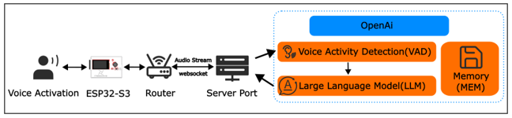

ESP32 S3 Hardware Specifications 
********************************************

Freenove ESP32-S3 WROOM Board
===========================================

We use the Freenove ESP32-S3 Board as the main control board, which integrates 16Mb Flash and 8Mb PSRAM.

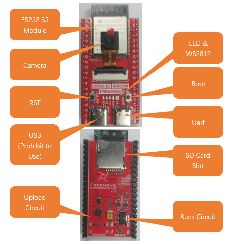

For more information about Freenove ESP32-S3 Board, please refer to https://github.com/Freenove/Freenove_Ultimate_Starter_Kit_for_ESP32_S3

Audio Circuit
===========================================

The audio circuit board integrates multiple functional hardware modules, including a 1.14-inch TFT display, a microphone, a battery charging circuit, an audio processing circuit, a headphone jack, and an integrated speaker, as illustrated in the figures below.

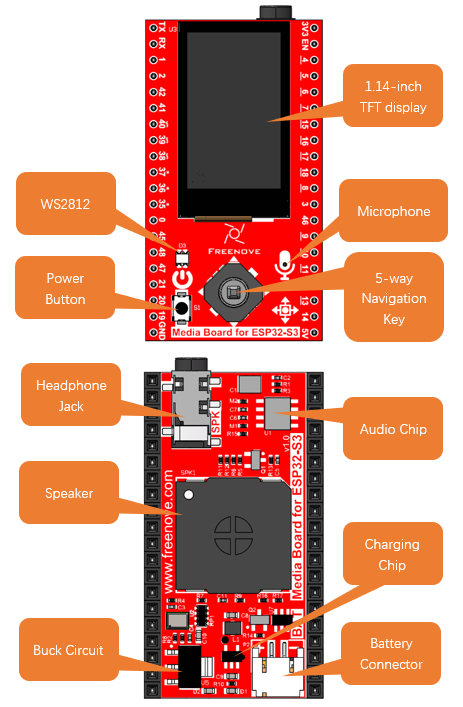

Install CH343 Driver (Required)
********************************************

ESP32-S3 WROOM uses CH343 to download codes. So before using it, we need to install CH343 driver in our computers.

Windows
===========================================

1.	First, download CH343 driver, click https://www.wch-ic.com/products/CH343.html? to download the appropriate one based on your operating system.

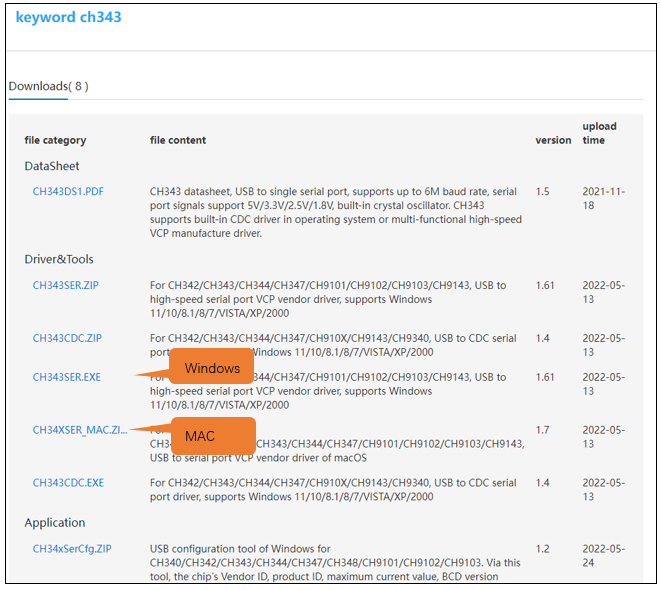

If you would not like to download the installation package, you can open "Freenove_Media_Kit_for_ESP32-S3/CH343", we have prepared the installation package.

2.	Open the folder "Freenove_Media_Kit_for_ESP32-S3/CH343/Windows/"

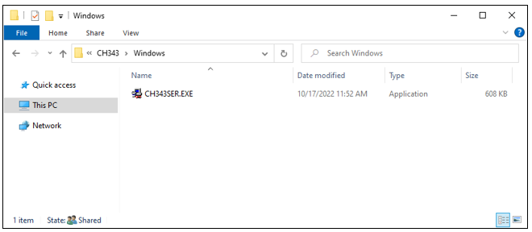

3.	Double click "CH343SER.EXE".

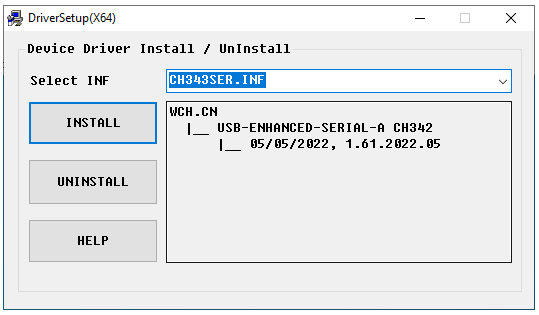

4.	Click "INSTALL" and wait for the installation to complete.

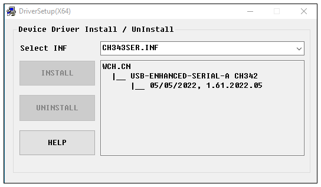

5.	If the driver is successfully installed, you should see the following prompt.

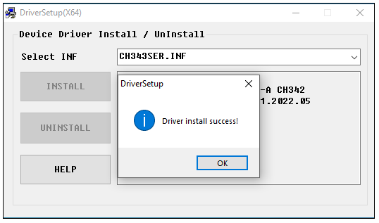

.. note::
    
    If you see "The drive is successfully Pre-installed in advance", it indicates the installation fails. 

Please make sure you use the USB data cable, not a charging cable.

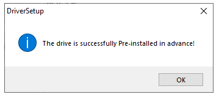

6.	When ESP32-S3 WROOM is connected to computer, select "This PC", right-click to select "Manage" and click "Device Manager" in the newly pop-up dialog box, and you can see the following interface.

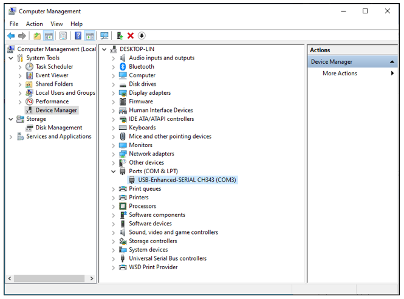

7.	So far, CH343 has been installed successfully. Close all dialog boxes. 

MAC
===========================================

First, download CH343 driver, click http://www.wch-ic.com/search?t=all&q=ch343 to download the appropriate one based on your operating system.

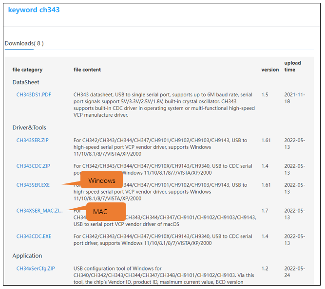

If you would not like to download the installation package, you can open "Freenove_Media_Kit_for_ESP32-S3/CH343", we have prepared the installation package.

Second, open the folder **"Freenove_Media_Kit_for_ESP32-S3/CH343/MAC/"**

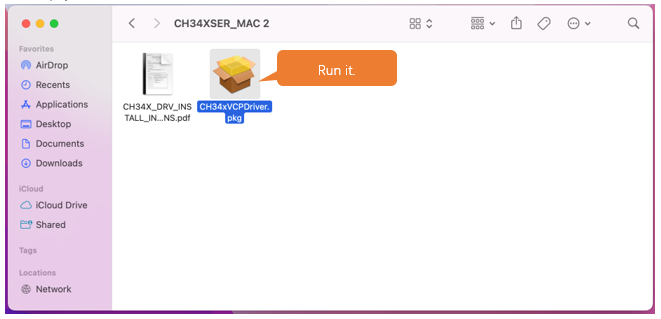

Third, click Continue.

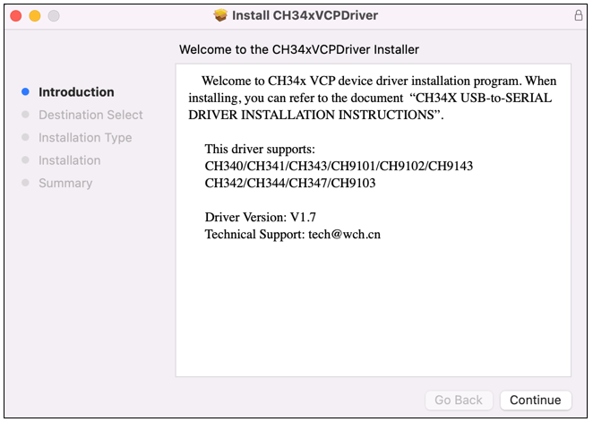

Fourth, click Install.

Then, waiting Finish.

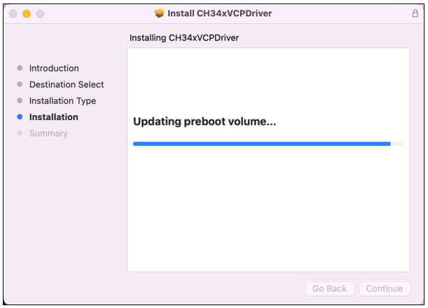

Finally, restart your PC.

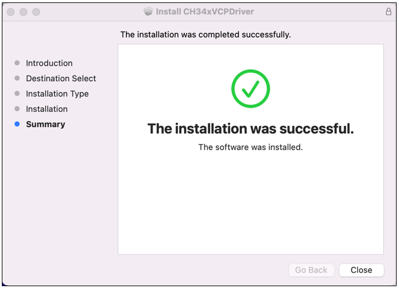

If you still haven't installed the CH340 by following the steps above, you can view readme.pdf to install it. 

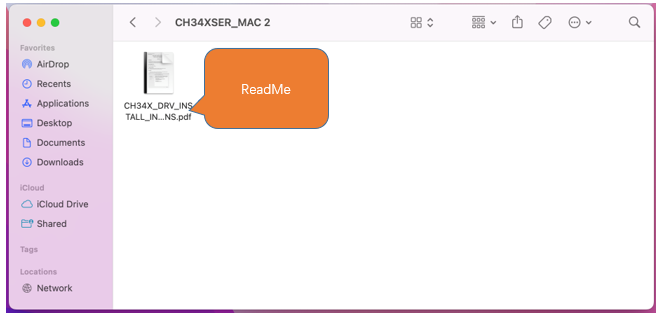

Linux
=========================================

Here we take Ubuntu as an example. Open the terminal in Linux system.

Check the port with the command "lsusb".

.. code-block:: console
    
    lsusb
    ls /dev/tty*

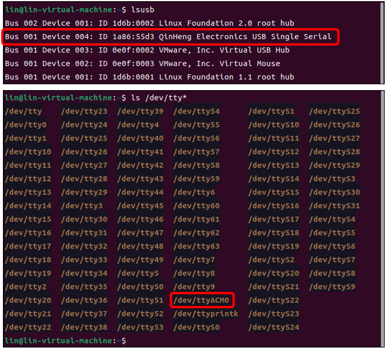

Generally, the CH34x driver is included in modern Linux kernels, so it should work automatically when the device is connected

If your computer does not have the CH343 driver, you can follow the steps below to install it. If your computer recognizes the CH343 driver, you may skip the following steps.

Run the following command to download the driver.

.. code-block:: console
    
    git clone https://github.com/WCHSoftGroup/ch343ser_linux.git

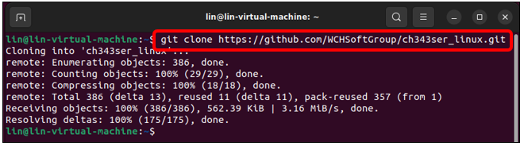

Enter the folder where the driver locates.

.. code-block:: console
    
    cd ch343ser_linux/driver/

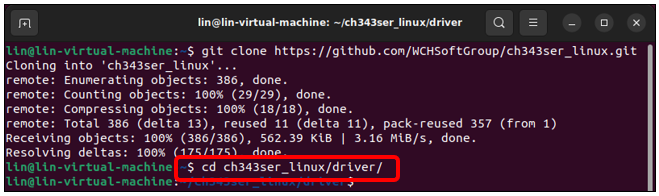

Compile to generate a ch343.ko file.

.. code-block:: console
    
    make

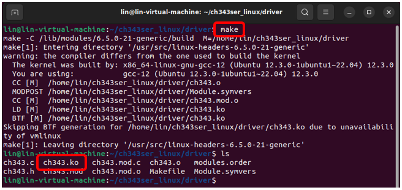

Install the ch343 chip driver.

.. code-block:: console
    
    sudo make load
    sudo make install

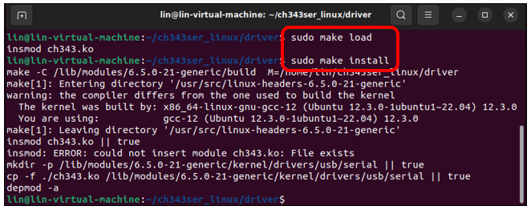

Connect the ESP32S3 to your computer, run the following command and you should see the port.

.. code-block:: console
    
    ls /dev/tty*

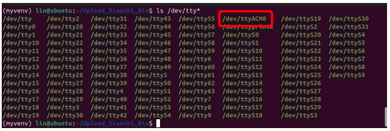

In Linux, higher permissions are required to access "ttyACM0," so privilege escalation commands must be used.

.. code-block:: console
    
    sudo usermod -a -G dialout $USER
    sudo reboot

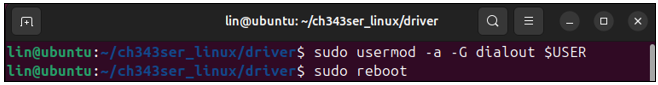

Reboot the system to have the configuration take effect.