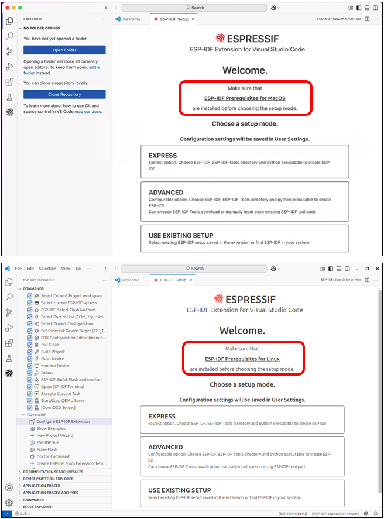
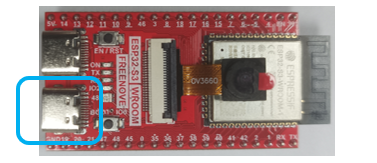
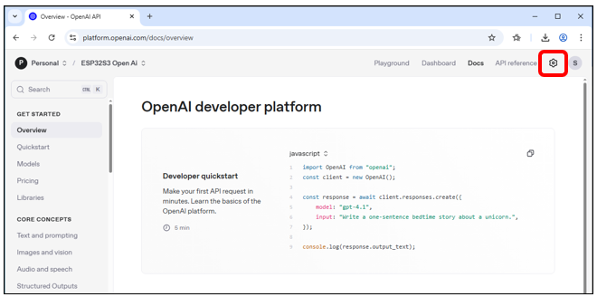

##############################################################################
OpenAI Code
##############################################################################

Visual Studio Code
******************************************

As we use Visual Studio Code to compile and upload code, we need to install the software before proceeding.

Windows
==========================================

First, download Visual Studio Code by visiting https://code.visualstudio.com/Download. Choose the appropriate version for your operating system, then download and install it

Double-click the downloaded .exe file to run it.

Check the box for "I accept the agreement."

Then click Next.

The installation location can be left as the default or changed to a desired path. After that, proceed by clicking Next repeatedly.

On this screen, verify that "Add to PATH" is selected. If unchecked, enable it. Proceed by clicking Next repeatedly to finish the installation.

The installation is now complete, as shown in the image below.

.. image:: ../_static/imgs/Openai/OpenAI_Code/Chapter02_04.png
    :align: center

Mac
======================================

Typically, MacOS comes with Visual Studio Code pre-installed. If your computer does not have it, please install it first.

Visit https://code.visualstudio.com and click "Download for macOS" .

Double click to run the program.

Linux
======================================

If your computer does not have Visual Studio Code, please install it first.

Visit https://code.visualstudio.com and click ".deb" .

Open the downloaded"code_xxx.deb" file.

Click "Install" to install Visual Studio Code.

Wait for the installation to complete. Once finished, it should look like the image below.

Click Show Apps and you can see the Visual Studio Code is in the system.

.. image:: ../_static/imgs/Openai/OpenAI_Code/Chapter02_11.png
    :align: center

ESP-IDF V5.4.1
********************************

Visual Studio Code is a versatile code editor. To program with the ESP-IDF SDK, we need to install the ESP-IDF extension for it.

Open Visual Studio Code.

Click on the menu bar: File -> Preferences -> Extensions.

Mac OS: Click "Code"->"Preferences"->"Extensions" on the menu bar.

Search for "ESP-IDF" in the extension bar, select the correct result from the list, then click the Install button to proceed.

The ESP-IDF extension icon will now appear in the left sidebar - click it to continue.

Scroll down with your mouse, locate and click on the "Advanced" option.

Click the first option: "Configure ESP-IDF Extension".

Select "EXPRESS" on the right.

.. note::
    
    If you're using macOS or Ubuntu, please complete the necessary preparations as prompted before proceeding with installation.

1.	Check the box for "Show all ESP-IDF tags"

2.	Select "v5.4.1 (release version)" from the dropdown

3.	Choose your desired installation path for the ESP-IDF environment

4.	Click "Install" to begin the setup

The installation path varies among computer systems, please remember it.

The process will complete automatically.

If it failed, locate your chosen ESP-IDF directory, remove the failed installation folder and install it again.

:red:`This step may take a while, so please ensure you have a stable and fast internet connection.`

If the installation continues to fail, check the relevant link for your operating system below:

Window: https://docs.espressif.com/projects/esp-idf/en/latest/esp32/get-started/windows-setup.html 

Mac & Linux: https://docs.espressif.com/projects/esp-idf/en/latest/esp32/get-started/linux-macos-setup.html 

The complete installation is as shown below.

For more about ESP-IDF, please refer to

https://docs.espressif.com/projects/vscode-esp-idf-extension/en/latest/installation.html 

OpenAI Code
****************************

This project is derived from the open-source repository: https://github.com/openai/openai-realtime-embedded, licensed under MIT License. We have only adapted it for third-party learning and AI functionality trials, without any commercial promotion or application. This tutorial is intended solely for enthusiasts to supplement their learning.

Code Downloading
===========================

Windows
---------------------------

Use the shortcut "Win+R", enter "CMD" in the pop-up window, and open the CMD interface.

In the Terminal, install the code with git command.

.. code-block:: console
    
    git clone --recurse-submodules https://github.com/Freenove/openai-realtime-embedded

The installation is completed as shown below.

If you do not have the git tool on your computer, please download and install it by visiting https://git-scm.com/downloads

MAC & Linux
---------------------------

Open the Terminal, run the following command, and wait for the installation to finish.

.. code-block:: 
    
    git clone --recurse-submodules https://github.com/Freenove/openai-realtime-embedded

The installation completes as shown below.

Configuring Code Environment
======================================

On Visual Studio Code, click "File" -> "Open Folder…"

**Select the openai-realtime-embedded older.** Here, the interface of the Windows system is taken as an example. The operation on the mac and Linux system is similar.

Check the box "Trust the authors of all files in the parent folder "Downloads" and select "Yes, I trust the authors".

Please note: A pop-up notification 'Generate comple_commands.json' will appear in the lower-right corner. 

**Please disregard it. DO NOT click it.**

Find "**privateConfig.common.json**" on the left, right click it and click copy.

Click on a blank area in the left project panel, then right-click and click Paste.

Rename it as "privateConfig.json" to protect your personal information.

Connect the ESP32S3 WROOM board to your computer with the USB cable (do not use the wrong connector).

Click on 'COMx' in the bottom-left corner to display all available COM ports on your computer. Locate and select the entry labeled 'ESP32-S3'.

Click the 'ESP32' button in the bottom-left corner to display all available ESP32 models, then select 'ESP32S3' from the list."

From the new selection menu, choose 'ESP32-S3 Chip (via ESP-PROG) - ESP32-S3 debugging via ESP-PROG Board...'

Wait until it shows "Target ESP32S3 Set Successfully" at the bottom right.

It if fails as shown in the figure below,

the most possible cause is that you do not copy privateConfig.common.json and rename it as privateConfig.json. Please operate this step again.

If it still fails, please delete the build folder, restart the software, and Set Espressif DeviceTarget again.

If it continues to fail, it indicates that the ESP-IDF is not successfully installed. Please install it again :ref:`ESP-IDF V5.4.1 <fnk0102/codes/openai/openai_code:esp-idf v5.4.1>`

Registering Open API Keys
====================================

Click "**privateConfig.json**". On the right side, enter your router name, password, and OpenAI API key. If you don't have an OpenAI API key, you'll need to `register and purchase one <https://platform.openai.com/>`_. Currently, OpenAI does not offer free services.

If you don't have an OpenAI API key yet, please visit https://platform.openai.com/docs/overview to sign up and purchase one.

You'll need to create an account. Click "Sign up" in the top-right corner.

.. image:: ../_static/imgs/Openai/OpenAI_Code/Chapter02_43.png
    :align: center

Create the account in any way you prefer.

Here we take Email address as an example. Input the email address and password, and click Continue.

OpenAI Platform will send a verification code to your email address. Input the code to the bar, click Continue.

Complete your personal information.

You can either fill the Organization Name or not, then click Create organization.

You can click "I'll invite my team later".

Name it whatever you like, and then click "Generate API Key".

:red:`Click Copy and paste your "My test key" somewhere to save it.` If you click "Continue", you will no longer be able to view the key again!

We recommend creating a separate document to store your key securely and prevent loss.

OpenAI operates on a paid service model. You need to purchase for credits to ensure uninterrupted access to its features.

After completion, the interface will appear as shown below. Click the settings icon in the upper right corner.

You can click "API Keys" to manage your OpenAI keys.

Click "Billing" to check your available balance, or click "Add Payment Details" to top up funds.

Now you have your own working OpenAI API keys. Feel free to explore more features on the website.

Next, let's return to the code. Enter your router name, password, and OpenAI API key in their respective fields, then save the file.

.. image:: ../_static/imgs/Openai/OpenAI_Code/Chapter02_56.png
    :align: center

Code Compilation and Uploading
===========================================

After ensuring everything is properly configured, let's start compiling the code.

Click "Full Clean" below to clear all previous compilation data.

Click "ESP-IDF: Build, Flash and Monitor" below. It will compile the code, upload it to the ESP32-S3, and open the serial monitor.

**The first compilation may take longer—please ensure a stable internet connection and wait patiently.**

If you encounter the following error during compilation, it's typically caused by issues with the ESP-IDF toolchain. This often occurs due to network problems that prevented some toolchain components from installing properly. Please reinstall ESP-IDF. You can refer to :ref:`ESP-IDF V5.4.1 <fnk0102/codes/openai/openai_code:esp-idf v5.4.1>`.

When the code compilation is complete and you upload it for the first time, you will see the prompt below. Please select "UART".

After the upload completes, the serial monitor will automatically open and establish an internet connection to access OpenAI. You can now start chatting via the ESP32-S3.

