##############################################################################
XiaoZhi AI User Guide (Based on FNK0102)
##############################################################################

Disclaimer 
*************************************

This project is derived from the open-source repository: https://github.com/78/xiaozhi-esp32, licensed under MIT License. The XiaoZhi AI firmware operates on servers provided by Xiage’s company. We have only adapted it for third-party learning and AI functionality trials, without any commercial promotion or application. This tutorial is intended solely for enthusiasts to supplement their learning. 

ESP32 S3 Hardware Specifications 
***************************************

Freenove ESP32-S3 WROOM Board 
========================================

We use the Freenove ESP32-S3 Board as the main control board, which integrates 16Mb Flash and 8Mb PSRAM.

.. image:: ../_static/imgs/XiaoZhi_AI_User_Guide_(Based_on_FNK0102)/Chapter01_00.png
    :align: center

For more information about Freenove ESP32-S3 Board, please refer to 

https://github.com/Freenove/Freenove_Ultimate_Starter_Kit_for_ESP32_S3

Audio Circuit
========================================

The audio circuit board integrates multiple functional hardware modules, including a 1.14-inch TFT display, a microphone, a battery charging circuit, an audio processing circuit, a headphone jack, and an integrated speaker, as illustrated in the figures below.

.. image:: ../_static/imgs/XiaoZhi_AI_User_Guide_(Based_on_FNK0102)/Chapter01_01.png
    :align: center

Install CH343 Driver (Required)
************************************

The ESP32-S3 WROOM uses the CH343 chip for code downloading. Before using it, you need to install the CH343 driver on your computer.

First of all, connect the ESP32S3-Wroom board to your computer.

Windows
==================================

1.	First, download CH343 driver, visit https://www.wch-ic.com/products/CH343.html? and download the appropriate one based on your operating system.

.. image:: ../_static/imgs/XiaoZhi_AI_User_Guide_(Based_on_FNK0102)/Chapter01_02.png
    :align: center

If you would not like to download the installation package, you can open “ **Freenove_Basic_Starter_Kit_for_ESP32_S3/CH343** ” to install. We have included the driver in our material.

2.	Open the folder “ **Freenove_Basic_Starter_Kit_for_ESP32_S3/CH343/Windows/** ”

.. image:: ../_static/imgs/XiaoZhi_AI_User_Guide_(Based_on_FNK0102)/Chapter01_04.png
    :align: center

3.	Double click “ **CH343SER.EXE** ”.

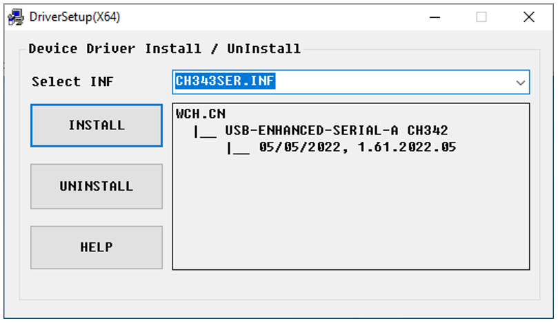

4.	Click “INSTALL” and wait for the installation to complete.

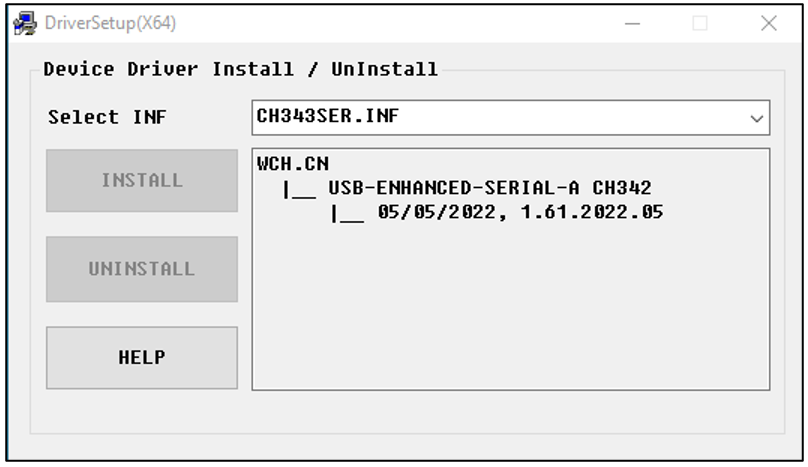

5.	If the driver is successfully installed, you should see the following prompt.

.. image:: ../_static/imgs/XiaoZhi_AI_User_Guide_(Based_on_FNK0102)/Chapter01_07.png
    :align: center

.. note::
    
    If you see “The drive is successfully Pre-installed in advance”, it indicates the installation fails. 

Please make sure you use the USB data cable, not a charging cable.

.. image:: ../_static/imgs/XiaoZhi_AI_User_Guide_(Based_on_FNK0102)/Chapter01_08.png
    :align: center

6.	When ESP32-S3 WROOM is connected to computer, select “This PC”, right-click to select “Manage” and click “Device Manager” in the newly pop-up dialog box, and you can see the following interface.

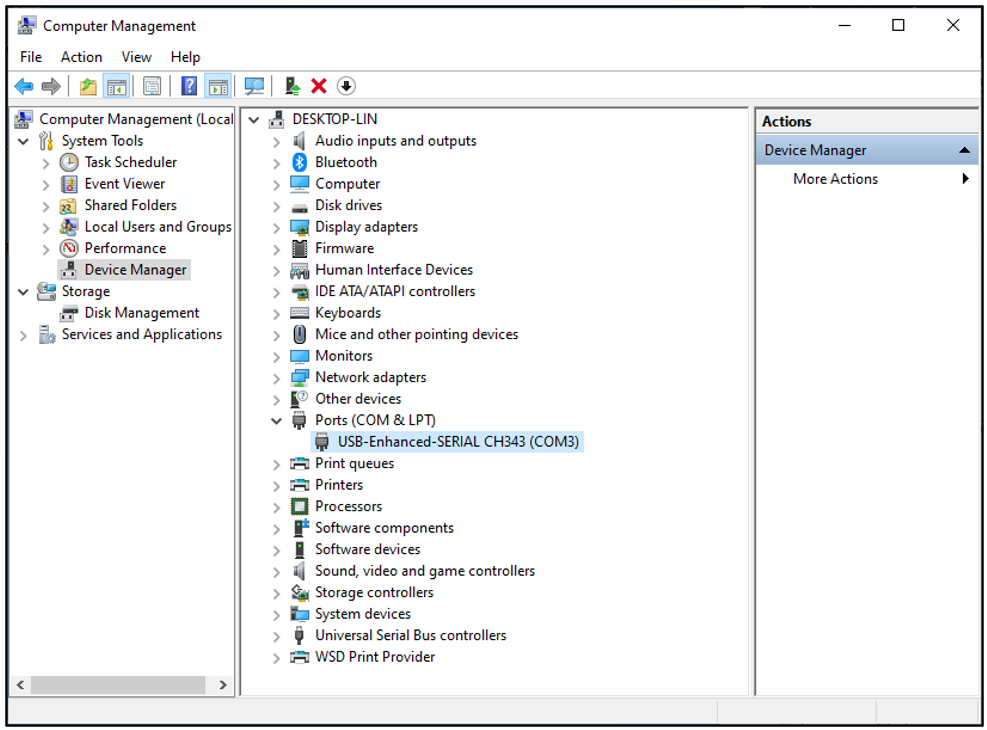

7.	So far, CH343 has been installed successfully. Close all dialog boxes. 

Mac
==================================

First, download CH343 driver, click http://www.wch-ic.com/search?t=all&q=ch343 to download the appropriate one based on your operating system.

.. image:: ../_static/imgs/XiaoZhi_AI_User_Guide_(Based_on_FNK0102)/Chapter01_10.png
    :align: center

If you would not like to download the installation package, you can open “ **Freenove_Basic_Starter_Kit_for_ESP32_S3/CH343** ”, we have prepared the installation package.

Second, open the folder “ **Freenove_Basic_Starter_Kit_for_ESP32_S3/CH343/MAC/** ”

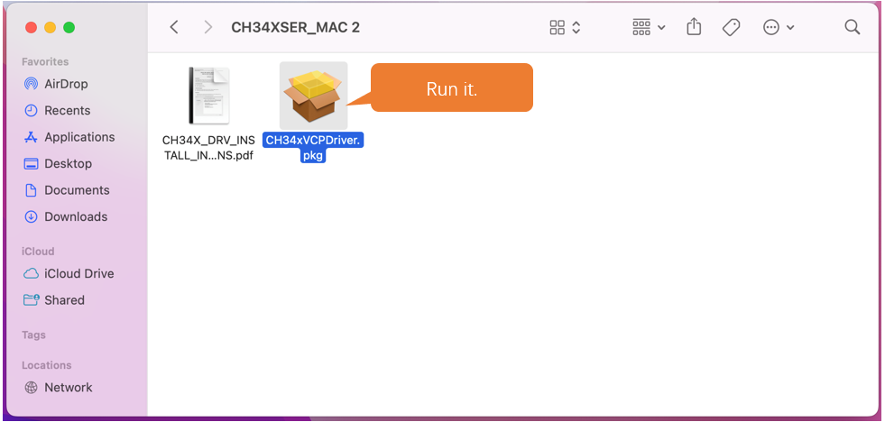

Third, click Continue.

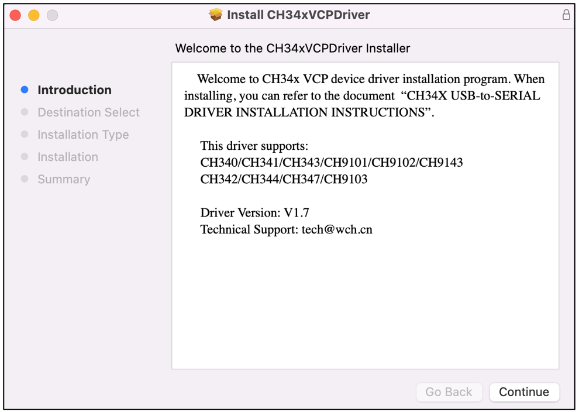

Fourth, click Install.

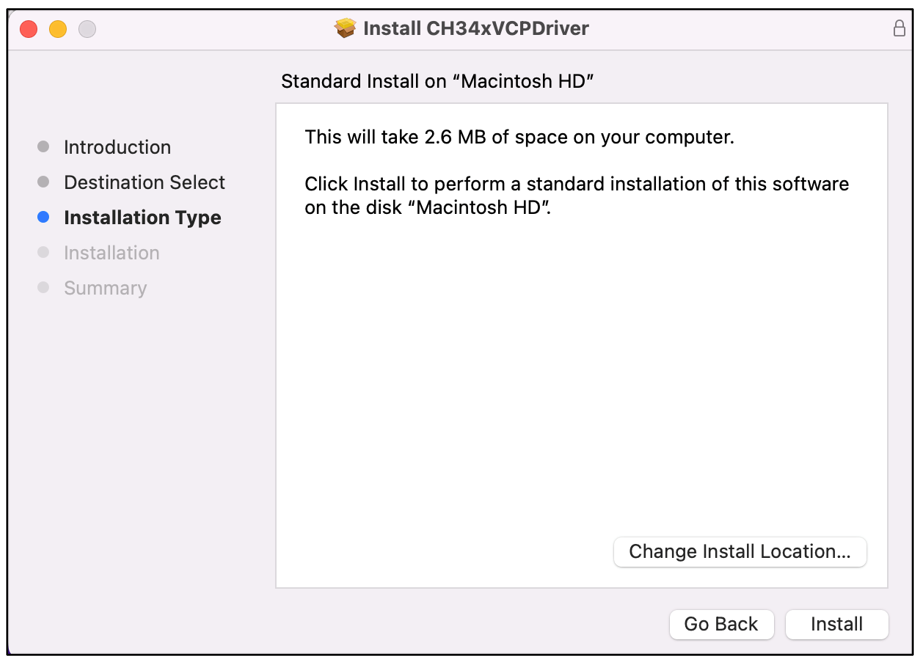

Then, waiting Finish.

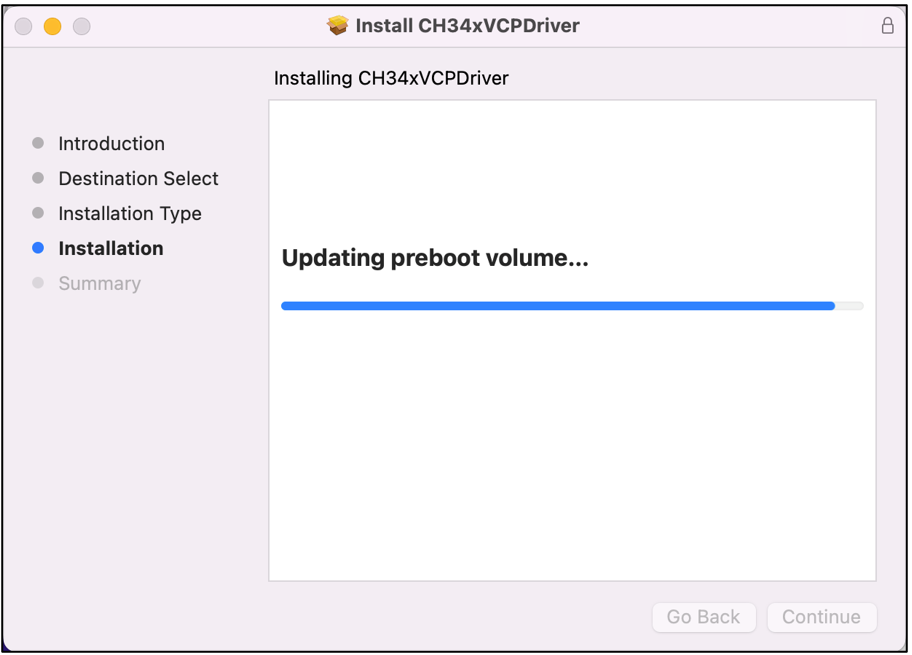

Finally, restart your PC.

.. image:: ../_static/imgs/XiaoZhi_AI_User_Guide_(Based_on_FNK0102)/Chapter01_15.png
    :align: center

If you still haven't installed the CH340 with the steps above, you can view readme.pdf to install it. 

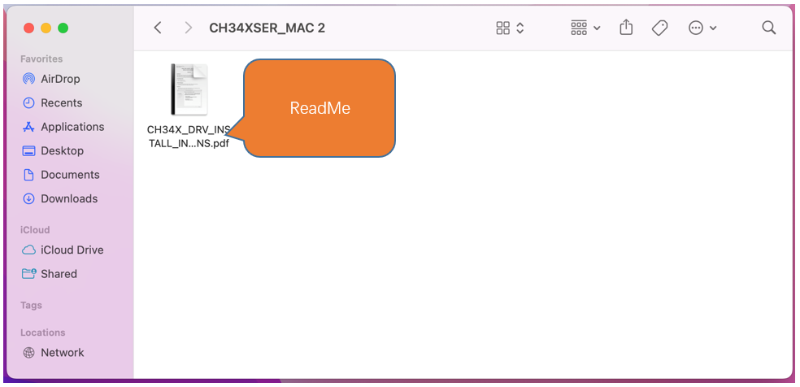

Linux
==================================

Here we take Ubuntu as an example. Open the terminal in Linux system.

.. image:: ../_static/imgs/XiaoZhi_AI_User_Guide_(Based_on_FNK0102)/Chapter01_17.png
    :align: center

Check the port with the command “lsusb”.

.. code-block:: console

    lsusb
    ls /dev/tty*

.. image:: ../_static/imgs/XiaoZhi_AI_User_Guide_(Based_on_FNK0102)/Chapter01_18.png
    :align: center

.. image:: ../_static/imgs/XiaoZhi_AI_User_Guide_(Based_on_FNK0102)/Chapter01_19.png
    :align: center

The CH34x driver is typically included in modern Linux kernels, so it should work automatically when the device is connected

If your computer does not have the CH343 driver, you can follow the steps below to install it. If your computer recognizes the CH343 driver, you may skip the following steps.

Run the following command to download the driver.

.. code-block:: console
    
    git clone https://github.com/WCHSoftGroup/ch343ser_linux.git

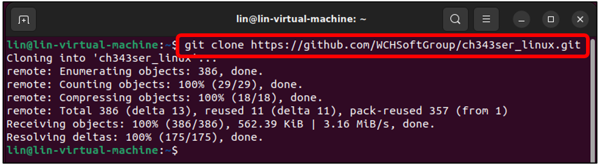

Enter the folder where the driver locates.

.. code-block:: console
    
    cd ch343ser_linux/driver/

.. image:: ../_static/imgs/XiaoZhi_AI_User_Guide_(Based_on_FNK0102)/Chapter01_21.png
    :align: center

Compile to generate a ch343.ko file.

.. code-block:: console
    
    make

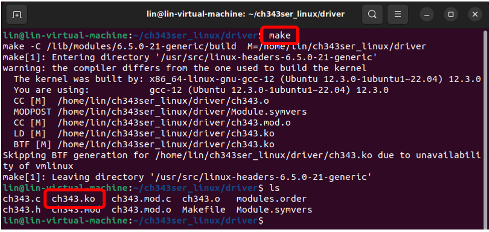

Load the generated file to the system.

.. code-block:: console
    
    sudo make load
    sudo make install

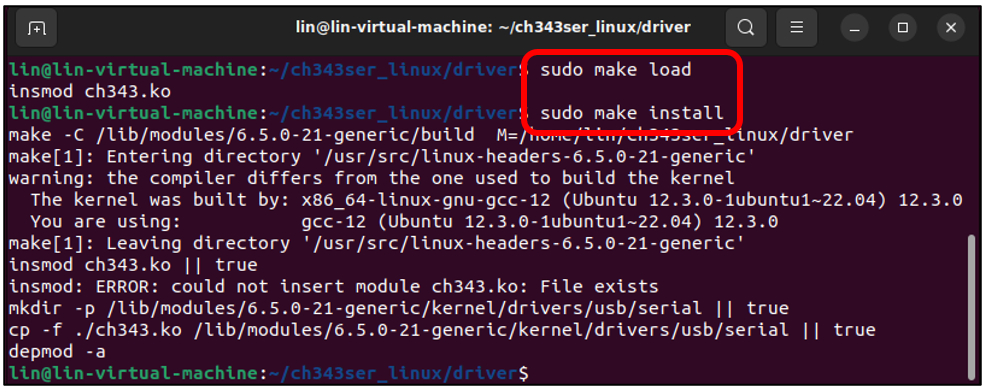

Connect the ESP32S3 to your computer, run the following command and you should see the port.

.. code-block:: console
    
    ls /dev/tty*

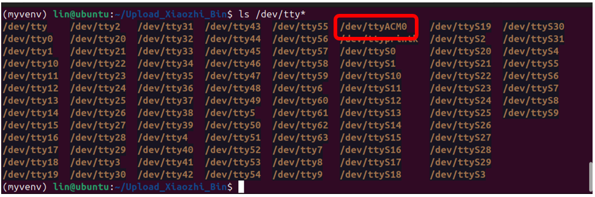

In Ubuntu, higher permissions are required to access "ttyACM0," so privilege escalation commands must be used.

.. code-block:: console
    
    sudo usermod -a -G dialout $USER
    sudo reboot

.. image:: ../_static/imgs/XiaoZhi_AI_User_Guide_(Based_on_FNK0102)/Chapter01_25.png
    :align: center

Reboot the system to have the configuration take effect.

XiaoZhi AI Firmware
*****************************************

If your hardware does not yet have XiaoZhi firmware installed, you can follow the upcoming tutorial to re-flash the firmware onto the ESP32-S3-WROOM.  

If your hardware already comes with XiaoZhi firmware pre-installed, you may skip this section.  

Installing Python (Required)
=======================================

Windows
--------------------------------------

Download and install Python3 package.

https://www.python.org/downloads/windows/

.. image:: ../_static/imgs/XiaoZhi_AI_User_Guide_(Based_on_FNK0102)/Chapter01_26.png
    :align: center

Click Download Python 3.13.3

**Please note that “Add Python 3.13 to PATH” MUST be check.**

.. image:: ../_static/imgs/XiaoZhi_AI_User_Guide_(Based_on_FNK0102)/Chapter01_27.png
    :align: center

Check all the options and then click “Next”.

.. image:: ../_static/imgs/XiaoZhi_AI_User_Guide_(Based_on_FNK0102)/Chapter01_28.png
    :align: center

Here you can select the installation path of Python. We install it at D drive. If you are a novice, you can select the default path.

.. image:: ../_static/imgs/XiaoZhi_AI_User_Guide_(Based_on_FNK0102)/Chapter01_29.png
    :align: center

Wait for it to finish installing.

.. image:: ../_static/imgs/XiaoZhi_AI_User_Guide_(Based_on_FNK0102)/Chapter01_30.png
    :align: center

Now the installation is finished.

Mac
----------------------------------------

Download installation package, link: https://www.python.org/downloads/

Click Download Python 3.13.3

.. image:: ../_static/imgs/XiaoZhi_AI_User_Guide_(Based_on_FNK0102)/Chapter01_31.png
    :align: center

Run the downloaded installation package. Click Continue

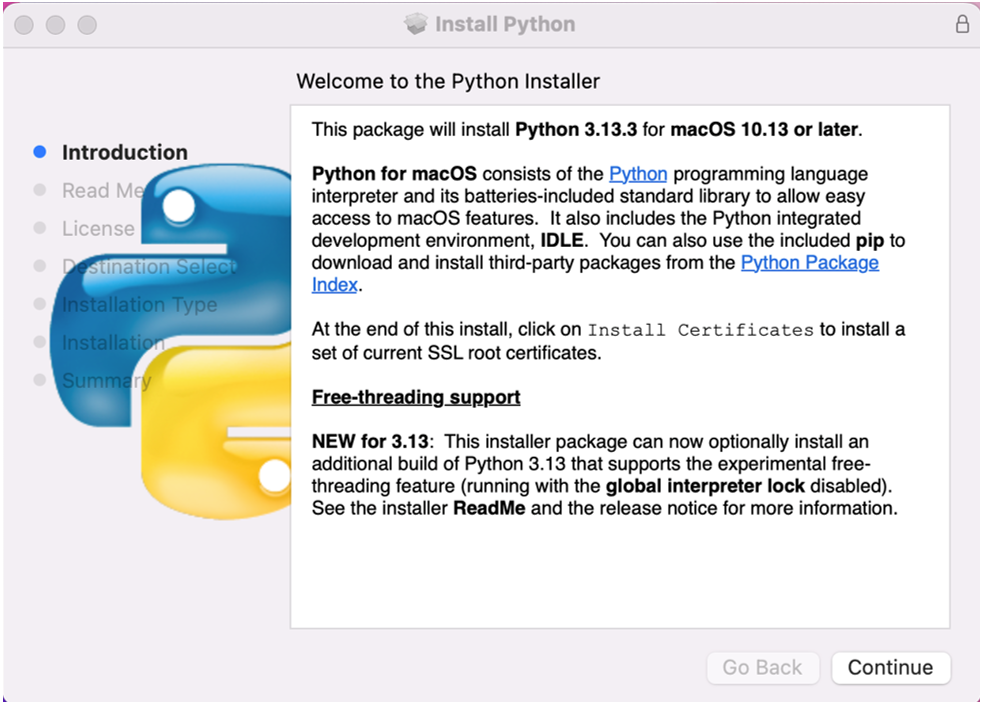

Click Continue

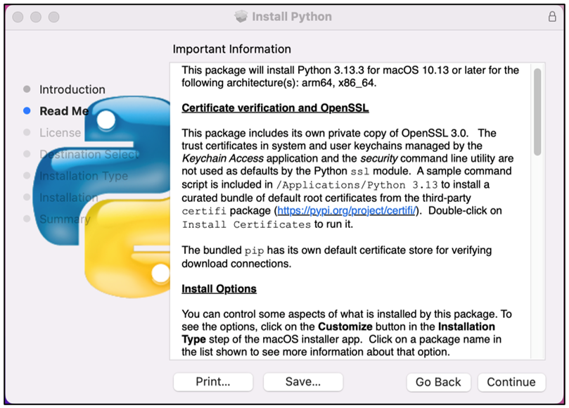

Click Continue

.. image:: ../_static/imgs/XiaoZhi_AI_User_Guide_(Based_on_FNK0102)/Chapter01_34.png
    :align: center

Click Install. If your computer has a password, enter the password and Install Software.

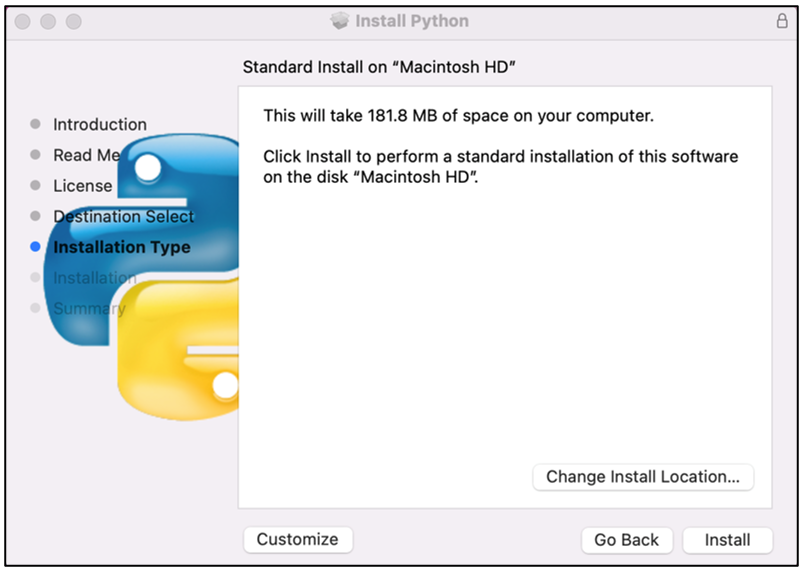

Now the installation succeeds.

.. image:: ../_static/imgs/XiaoZhi_AI_User_Guide_(Based_on_FNK0102)/Chapter01_36.png
    :align: center

Linux
---------------------------------------

Check whether Python3 has already been installed.

.. code-block:: console
    
    python -version
    python3 -version

If it is not installed yet, run the following command to install it. This will install the latest version by default.

.. code-block:: console
    
    sudo apt install python3

.. image:: ../_static/imgs/XiaoZhi_AI_User_Guide_(Based_on_FNK0102)/Chapter01_38.png
    :align: center

Link python to Python 3.

.. code-block:: console
    
    sudo rm /usr/bin/python
    sudo ln -s /usr/bin/python3 /usr/bin/python

.. image:: ../_static/imgs/XiaoZhi_AI_User_Guide_(Based_on_FNK0102)/Chapter01_39.png
    :align: center

Install python3.13-venv virtual environment.

.. code-block:: console
    
    sudo apt install python3-venv

.. image:: ../_static/imgs/XiaoZhi_AI_User_Guide_(Based_on_FNK0102)/Chapter01_40.png
    :align: center

Firmware Uploading
=========================================

Windows
-----------------------------------------

Enter the Upload_Xiaozhi_Bin folder.

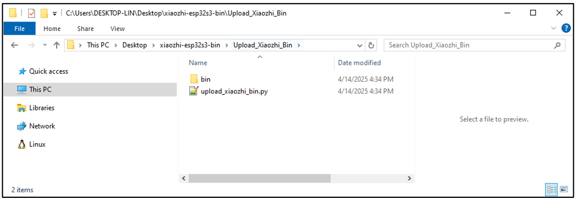

Type "CMD" in the file address bar and press Enter.

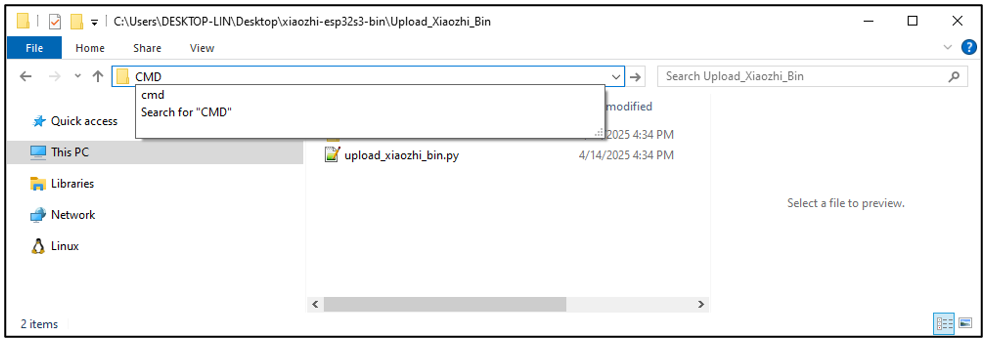

Type "python --version" to check if Python is installed. If no Python version information is displayed, it means Python is not properly installed—please reinstall it.

.. image:: ../_static/imgs/XiaoZhi_AI_User_Guide_(Based_on_FNK0102)/Chapter01_43.png
    :align: center

Connect the ESP32-S3-WROOM to your computer using a USB cable, making sure to plug it into the correct Type-C port (do not use the wrong connector).

.. image:: ../_static/imgs/XiaoZhi_AI_User_Guide_(Based_on_FNK0102)/Chapter01_44.png
    :align: center

Type "python upload_xiaozhi_bin.py" and press Enter.

If your computer does not have esptool or its required dependencies installed, they will be automatically installed.

.. image:: ../_static/imgs/XiaoZhi_AI_User_Guide_(Based_on_FNK0102)/Chapter01_45.png
    :align: center

Then, it will invoke esptool to upload the files from the bin folder to the ESP32-S3-WROOM.

.. image:: ../_static/imgs/XiaoZhi_AI_User_Guide_(Based_on_FNK0102)/Chapter01_46.png
    :align: center

You will see the following messages display on ESP32 S3 WROOM board.

.. image:: ../_static/imgs/XiaoZhi_AI_User_Guide_(Based_on_FNK0102)/Chapter01_47.png
    :align: center

Mac
-----------------------------------

Enter the Upload_Xiaozhi_Bin folder.

Type "python --version" to check if Python is installed. If no Python version information is displayed, it means Python is not properly installed—please reinstall it.

Connect the ESP32-S3-WROOM to your computer using a USB cable, making sure to plug it into the correct Type-C port (do not use the wrong connector).

.. image:: ../_static/imgs/XiaoZhi_AI_User_Guide_(Based_on_FNK0102)/Chapter01_50.png
    :align: center

Type "python upload_xiaozhi_bin.py" and press Enter.

.. image:: ../_static/imgs/XiaoZhi_AI_User_Guide_(Based_on_FNK0102)/Chapter01_51.png
    :align: center

Then, it will invoke esptool to upload the files from the bin folder to the ESP32-S3-WROOM.

.. image:: ../_static/imgs/XiaoZhi_AI_User_Guide_(Based_on_FNK0102)/Chapter01_52.png
    :align: center

You will see the following messages display on ESP32 S3 WROOM board.

.. image:: ../_static/imgs/XiaoZhi_AI_User_Guide_(Based_on_FNK0102)/Chapter01_53.png
    :align: center

Linux
-----------------------------------

Enter the Upload_Xiaozhi_Bin folder.

.. code-block:: console
    
    cd Upload_Xiaozhi_Bin

.. image:: ../_static/imgs/XiaoZhi_AI_User_Guide_(Based_on_FNK0102)/Chapter01_54.png
    :align: center

Enter "python --version" to check if the Python environment is installed. If the Python version information is not displayed, it means Python is not properly installed. Please reinstall it.

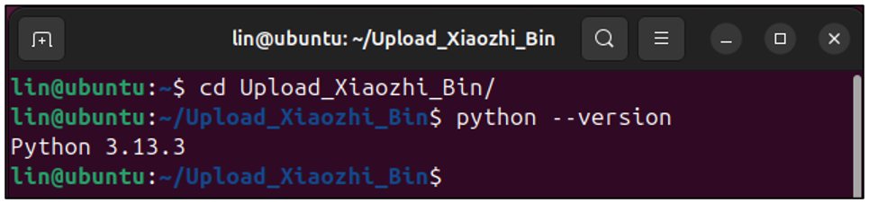

Connect the ESP32-S3-WROOM to your computer using a USB cable, making sure to plug it into the correct Type-C port (do not use the wrong connector).

.. image:: ../_static/imgs/XiaoZhi_AI_User_Guide_(Based_on_FNK0102)/Chapter01_56.png
    :align: center

Create a virtual environment and name it as “myvenv”.

.. code-block:: console
    
    python -m venv myvenv

.. image:: ../_static/imgs/XiaoZhi_AI_User_Guide_(Based_on_FNK0102)/Chapter01_57.png
    :align: center

You can run the following command to activate or exit the virtual environment.

.. code-block:: console
    
    source myvenv/bin/activate
    deactivate

.. image:: ../_static/imgs/XiaoZhi_AI_User_Guide_(Based_on_FNK0102)/Chapter01_58.png
    :align: center

Activate the virtual environment.

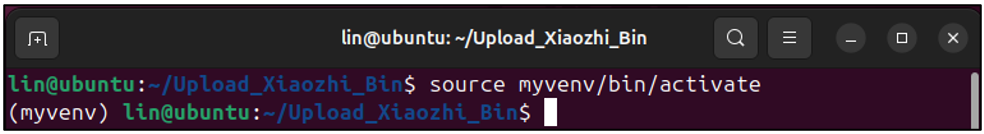

Run the command to check the port of ESP32S3.

.. code-block:: console
    
    ls /dev/tty*

When the ESP32S3 is not connected to the computer, the ports are as shown below.

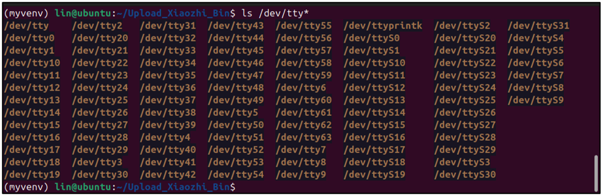

After connecting the ESP32S3, a new port is generated.

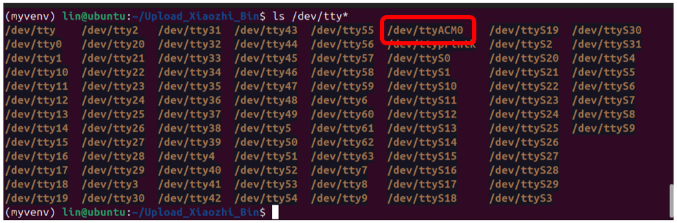

The newly generated one is the port of ESP32S3. Remember it.

Before running the python file, we need to modify the port.

Run the following command to open the python file.

.. code-block:: c
    
    sudo nano upload_xiaozhi_bin.py

.. image:: ../_static/imgs/XiaoZhi_AI_User_Guide_(Based_on_FNK0102)/Chapter01_62.png
    :align: center

In the text editor, locate the line '--port', 'COMx' and replace 'COMx' with the port number assigned to your ESP32-S3 on Linux computer.

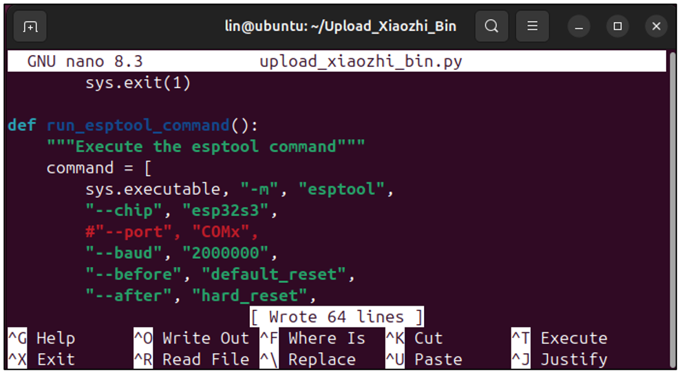

The modification is as shown below.

.. image:: ../_static/imgs/XiaoZhi_AI_User_Guide_(Based_on_FNK0102)/Chapter01_64.png
    :align: center

Press “Ctrl+O” to save the changes and “Ctrl+X” to exit the file.

Run the python file.

.. code-block:: console
    
    python upload_xiaozhi_bin.py

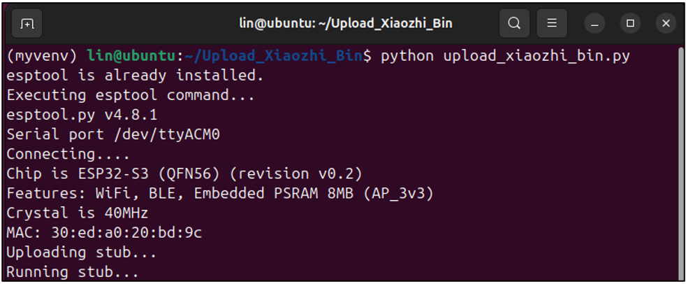

The successful code uploading is as shown below.

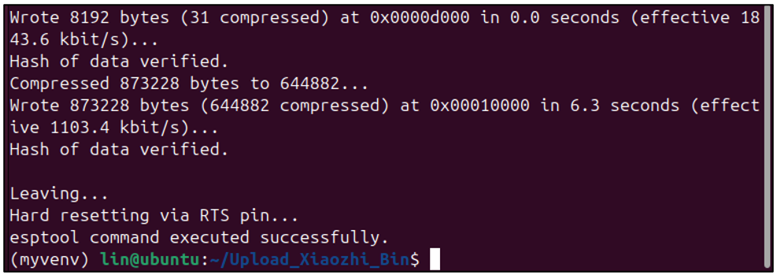

The display on the ESP32 S3 WROOM is as shown below.

.. image:: ../_static/imgs/XiaoZhi_AI_User_Guide_(Based_on_FNK0102)/Chapter01_67.png
    :align: center

ESP32 S3 WROOM Network Configuration

If your ESP32-S3-WROOM does not yet have the XiaoZhi AI firmware installed, proceed to the 

If you want to explore the XiaoZhi AI code, go to :ref:`the XiaoZhi AI Code section <fnk0102/codes/tutorial/xiaozhi_ai_code:xiaozhi ai code>`.

If your ESP32-S3-WROOM already has the XiaoZhi AI firmware integrated:

1.	On your smart phone, enable WiFi.

2.	Look for a hotspot named "Xiaozhi-XXXX" (an open network, no password required).

3.	Connect to it to proceed

.. image:: ../_static/imgs/XiaoZhi_AI_User_Guide_(Based_on_FNK0102)/Chapter01_68.png
    :align: center

After connecting to the WiFi, follow the on-screen prompts to tap the notification. This will automatically launch your mobile browser and direct you to http://192.168.4.1.

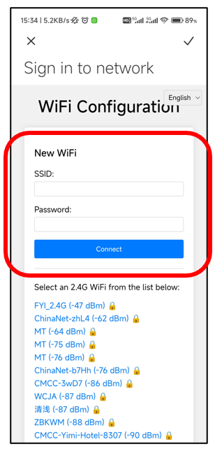

**WiFi Connection Setup for ESP32-S3-WROOM**

**Enter WiFi Credentials:**

SSID: Enter your WiFi network name (2.4GHz only).

Password: Enter your WiFi password.

Click Connect to proceed.

**Important Notes:**

- The ESP32-S3-WROOM only supports 2.4GHz WiFi networks.

- If your router broadcasts both 2.4GHz and 5GHz, ensure the ESP32 connects to the 2.4GHz band only.

- Avoid mixed-mode (2.4GHz + 5GHz combined) settings, as this may prevent successful connection.

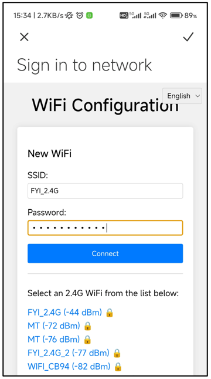

When you see the following screen, it means your ESP32-S3-WROOM has successfully connected to your WiFi network.

.. image:: ../_static/imgs/XiaoZhi_AI_User_Guide_(Based_on_FNK0102)/Chapter01_71.png
    :align: center

XiaoZhi AI Server Configuration
******************************************

Ensure your phone/computer and ESP32-S3-WROOM are connected to the same router WiFi network.

Open a browser on your device and visit: https://xiaozhi.me/

Click "Console" to start setting up your XiaoZhi AI server.

.. image:: ../_static/imgs/XiaoZhi_AI_User_Guide_(Based_on_FNK0102)/Chapter01_72.png
    :align: center

Click "Create Agent" to set up a new AI assistant.

.. image:: ../_static/imgs/XiaoZhi_AI_User_Guide_(Based_on_FNK0102)/Chapter01_73.png
    :align: center

Name it whatever you like and click “Confirm”.

.. image:: ../_static/imgs/XiaoZhi_AI_User_Guide_(Based_on_FNK0102)/Chapter01_74.png
    :align: center

Click “Configure Role” to configure your AI assistant.

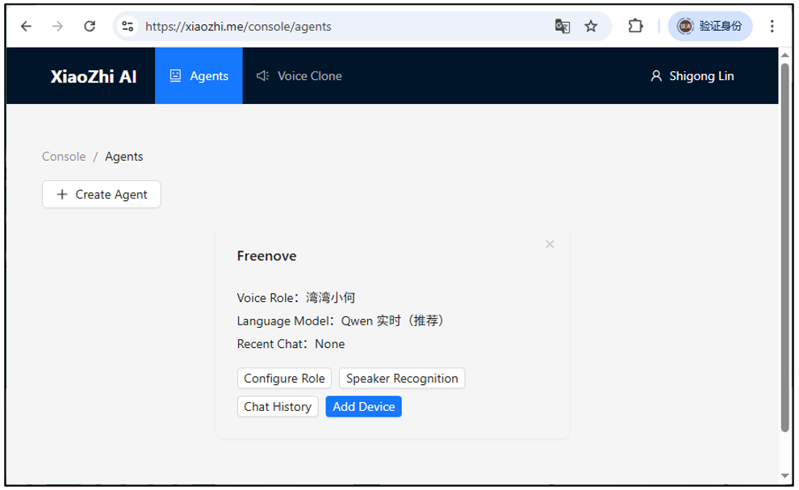

Click "English Tutor" (keep all other options unchanged). 

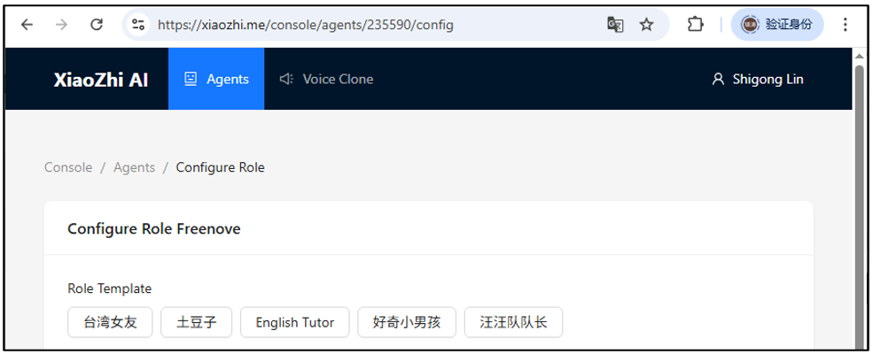

Scroll to the bottom of the page and click "Save" to confirm all settings.

.. image:: ../_static/imgs/XiaoZhi_AI_User_Guide_(Based_on_FNK0102)/Chapter01_77.png
    :align: center

Click "Agents" to return to the main dashboard and select "Add Device" to register new hardware.

.. image:: ../_static/imgs/XiaoZhi_AI_User_Guide_(Based_on_FNK0102)/Chapter01_78.png
    :align: center

In the new pop-up window, enter the on-screen numeric code displayed on your ESP32-S3-WROOM. Click "Confirm" to complete pairing.

.. image:: ../_static/imgs/XiaoZhi_AI_User_Guide_(Based_on_FNK0102)/Chapter01_79.png
    :align: center

The interface will now display as shown below.

.. image:: ../_static/imgs/XiaoZhi_AI_User_Guide_(Based_on_FNK0102)/Chapter01_80.png
    :align: center

Press the RST button on the ESP32S3 WROOM board to restart the board.

.. image:: ../_static/imgs/XiaoZhi_AI_User_Guide_(Based_on_FNK0102)/Chapter01_81.png
    :align: center

You've successfully finished configuring XiaoZhi AI!

To activate, say " **Hi, ESP** " to the microphone; the system will now respond to your voice commands

.. image:: ../_static/imgs/XiaoZhi_AI_User_Guide_(Based_on_FNK0102)/Chapter01_82.png
    :align: center

You can communicate with it in either Chinese or English.