##############################################################################
基于小智AI的AI语音助手
##############################################################################

本项目使用Media Kit实现一个AI语音助手, 需要有一定的编程基础, 且对于ESP-IDF和开源大模型有一定的了解。

项目介绍
**********************************

本语音助手项目(https://github.com/Freenove/xiaozhi-esp32)来自开源项目(https://github.com/78/xiaozhi-esp32), 该项目可以在嵌入式设备上调用市面上大多数长语言文本模型(LLM), 并通过语音活动检测(VAD)服务、语音识别(ASR)服务、语音转文本(STT)服务、文本转语音(TTS服务)、记忆存储(Memory)服务、意图识别(Intent)服务等多种服务, 来实现语音对话功能, 制作属于你自己的AI语音助手。Freenove将该项目适配到了产品Media Kit上。本文将介绍如何在Media Kit上运行该项目。

本项目有两种运行方式, 

1.	在线版本, 接入xiaozhi.me服务器, 目前个人用户可以免费试用。

2.	离线版本, 以上提到的各项服务都需要在本地个人电脑上搭建本地服务器, 使用体验完全取决模型的选取和本地电脑性能。本地服务器项目(https://github.com/Freenove/xiaozhi-esp32-server )来自开源项目(https://github.com/xinnan-tech/xiaozhi-esp32-server )。

对于偏向于使用AI助手的用户, 我们建议你使用在线版本。

对于偏向于开发者用户, 可以尝试部署离线版本, 以深入学习和了解AI助手所需要的各项服务。值得注意的是, 个人电脑难以同时运行以上各种服务, 尤其是核心服务LLM, 这可能导致你的AI助手体检较差, 因此, 离线版本仅具有更多的学习研究价值。

注意事项
**********************************

- 项目版权:

  - 语音助手项目原始作者署名为“虾哥”, Freenove公司fork该项目并适配到Media Kit中, 该项目遵守MIT协议。

  - 本地服务器项目原始作者为“xinnan-tech”, Freenove公司fork该项目并适配到Media Kit中, 该项目遵守MIT协议。

- 支持的国家或地区:

  - 在线版本, 这取决于xiaozhi.me 服务器支持的国家或地区, 并非所有国家或地区都受到支持。您可以注册页面查看(https://xiaozhi.me/login?redirect=/console/agents)。 对于使用体验, 也受xiaozhi.me服务器的影响。如果您访问xiaozhi.me服务器的网络较差, 则体验相对就差一些。

  - 离线版本, 无, 您可以在任意国家或地区部署离线版本。

- 支持的语言: 

  - 在线版本: 目前支持中文普通话、中文粤语、英语、日语、韩语等。如果您不会这些语言, 那么使用在线版本您将无法与小智AI正常交流。

  - 离线版本: 取决于您部署的ASR模型。默认的FunASR模型仅支持中文普通话、中文粤语、英语、日语、韩语。

- 费用

  - 在线版本: 当前xiaozhi.me提供免费服务, 我们不能保证在线服务器一直免费。

  - 离线版本: 上述提到的各项子服务中, 均有收费服务或免费服务, 取决于您自己的选择。

- 遇到问题, 如果您按照教程操作, 仍然无法使用, 请与我们联系(support.freenove.com)。由于在线服务由xiaozhi.me提供, 如果xiaozhi.me关闭了服务, 那么我们也将会关闭相关的文档、教程、代码。

小智AI使用声明
*************************************

我们仅在https://github.com/78/xiaozhi-esp32基础上提供适配，用做第三方学习和AI功能试用，不做商业性质推广和应用。本教程仅给爱好者附加学习使用。

请注意：

1. 由于这个项目是第三方开源项目，如果您在学习过程中遇见问题，请向开源项目发起issue：

https://github.com/78/xiaozhi-esp32/issues

2. 目前小智AI仅支持普通话，粤语，英语，韩语，日语这5种语言识别。其他语言暂时仍不支持。

3. 目前小智服务器的界面仅支持英语、中文、日语。且小智服务器目前仅支持下列国家使用手机注册账号。其他国家暂不支持。

在这个项目中，ESP32-S3使用websocket的方式，和小智AI服务器进行数据交互。

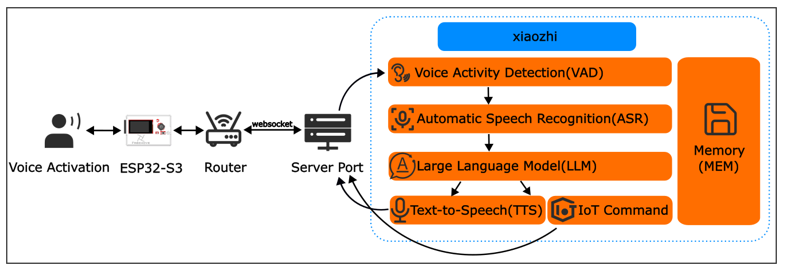

ESP32 S3硬件说明
*********************************

Freenove ESP32-S3 WROOM Board 

首先，我们使用Freenove ESP32-S3 Board作为主控板，它集成了16Mb的Flash和8Mb的Psram。

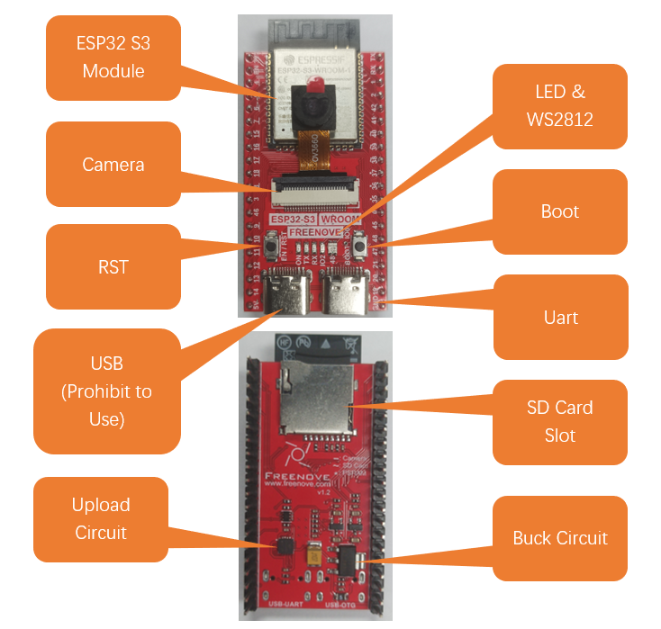

更多关于Freenove ESP32-S3 Board的资料，请查看

https://github.com/Freenove/Freenove_Ultimate_Starter_Kit_for_ESP32_S3

音频电路板
==============================

音频电路板集成了多个不同功能的硬件，比如1.14寸TFT显示屏，麦克风，电池充电电路，音频电路，耳机接口和集成喇叭等。如下图所示。

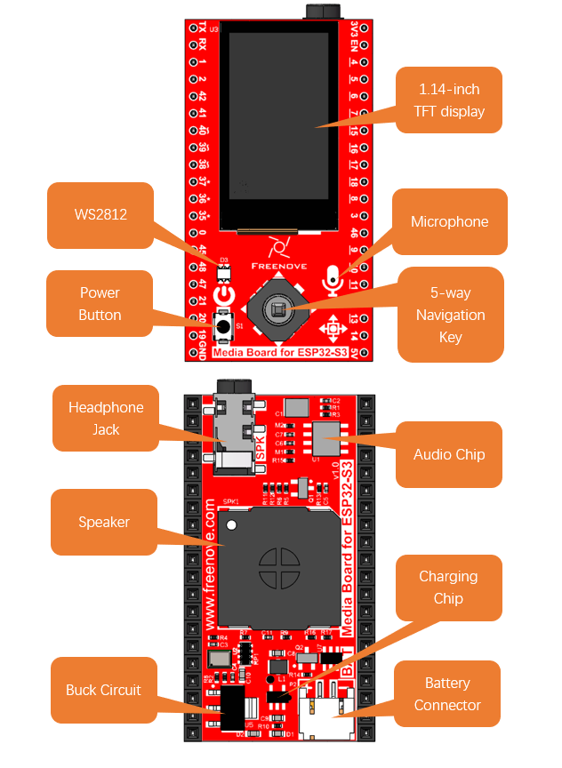

安装CH343 (Importance)
***********************************

ESP32-S3 WROOM 使用CH343芯片下载代码，因此在使用前，需在电脑上安装CH343 驱动程序。

Windows
=================================

1. 首先下载CH343驱动，点击http://www.wch-ic.com/search?t=all&q=ch343，根据您的操作系统选择对应版本进行下载。

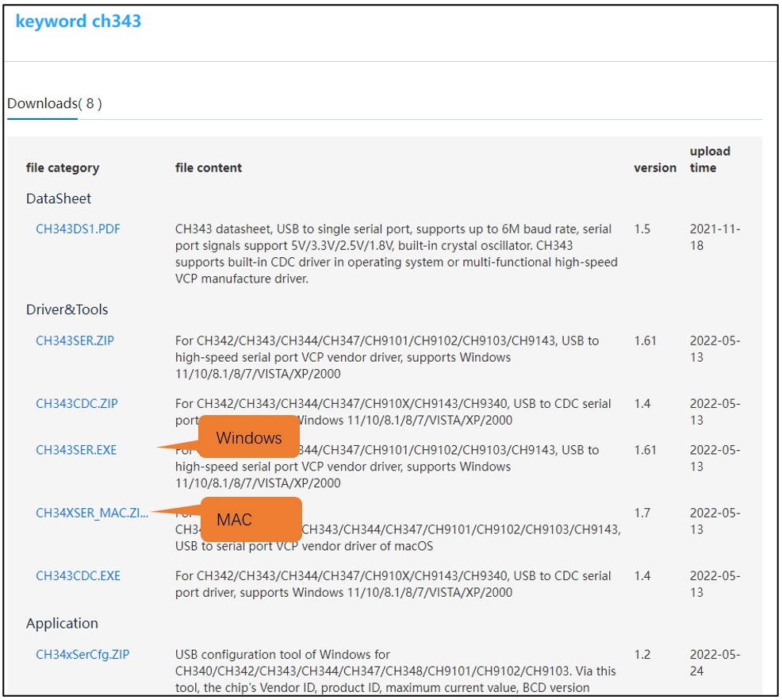

如果您不想从官网下载安装包，可以打开 “Freenove_Media_Kit_for_ESP32-S3/CH343” 文件夹，我们已为您准备好驱动安装包

.. image:: ../../_static/imgs/xiaozhi/XiaoZhi_AI_User_Guide_(Based_on_FNK0102)/Chapter01_03.png
    :align: center

2. 打开文件夹进入目录： “Freenove_Media_Kit_for_ESP32-S3/CH343/Windows/”

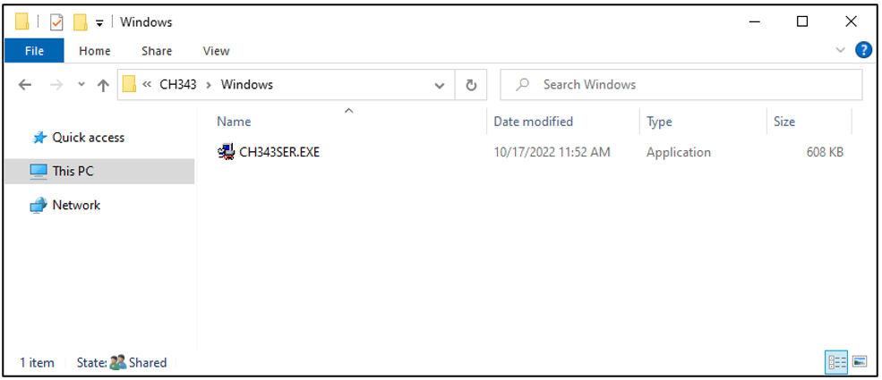

3.  双击运行“CH343SER.EXE”.
   
.. image:: ../../_static/imgs/xiaozhi/XiaoZhi_AI_User_Guide_(Based_on_FNK0102)/Chapter01_05.png
    :align: center

4. 点击 "INSTALL" 并等待安装完成

.. image:: ../../_static/imgs/xiaozhi/XiaoZhi_AI_User_Guide_(Based_on_FNK0102)/Chapter01_06.png
    :align: center

5. 安装成功！请关闭所有界面

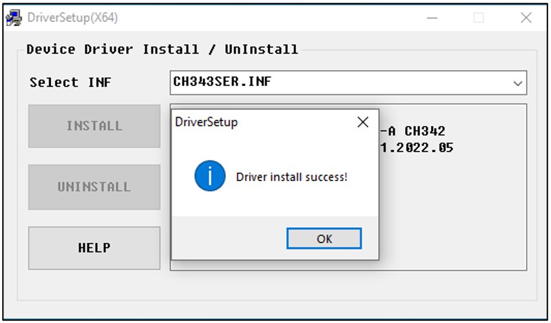

.. note::
    
    如果看到提示“驱动器已成功预安装”，则表明安装失败。

请确保使用的是USB数据线，而不是普通充电线

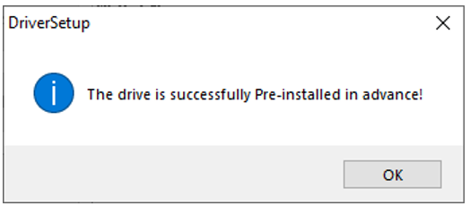

6. 当ESP32-S3 WROOM模块连接到电脑时，选中"此电脑"，右键选择"管理"，在弹出的新对话框中点击"设备管理器"，即可看到如下界面。

.. image:: ../../_static/imgs/xiaozhi/XiaoZhi_AI_User_Guide_(Based_on_FNK0102)/Chapter01_09.png
    :align: center

7. 至此，CH343驱动已成功安装，关闭所有对话框。

MAC
===============================

首先下载CH343驱动，点击http://www.wch-ic.com/search?t=all&q=ch343，根据您的操作系统选择对应版本进行下载。

如果不想下载安装包，您可以打开 **“Freenove_Media_Kit_for_ESP32-S3/CH343”** 文件夹，我们已准备好安装包。 

其次，打开 **“Freenove_Media_Kit_for_ESP32-S3/CH343/MAC/”** 目录。

.. image:: ../../_static/imgs/xiaozhi/XiaoZhi_AI_User_Guide_(Based_on_FNK0102)/Chapter01_11.png
    :align: center

第三步，点击Continue。

.. image:: ../../_static/imgs/xiaozhi/XiaoZhi_AI_User_Guide_(Based_on_FNK0102)/Chapter01_12.png
    :align: center

第四步，点击Install。

.. image:: ../../_static/imgs/xiaozhi/XiaoZhi_AI_User_Guide_(Based_on_FNK0102)/Chapter01_13.png
    :align: center

然后等待完成

.. image:: ../../_static/imgs/xiaozhi/XiaoZhi_AI_User_Guide_(Based_on_FNK0102)/Chapter01_14.png
    :align: center

最后，重新启动你的电脑

.. image:: ../../_static/imgs/xiaozhi/XiaoZhi_AI_User_Guide_(Based_on_FNK0102)/Chapter01_15.png
    :align: center

若按照上述步骤仍未成功安装CH340驱动，可查阅 readme.pdf 文件进行安装。

.. image:: ../../_static/imgs/xiaozhi/XiaoZhi_AI_User_Guide_(Based_on_FNK0102)/Chapter01_16.png
    :align: center

Linux
===============================

这里以Ubuntu为例。打开Linux系统的终端.

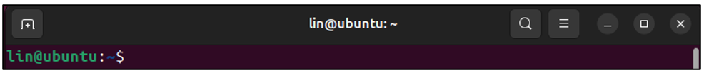

使用指令“lsusb”查看端口。

.. code-block:: console

    lsusb
    ls /dev/tty*

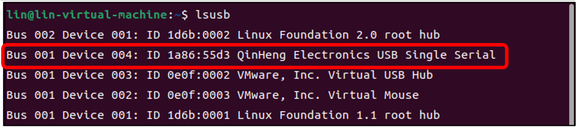

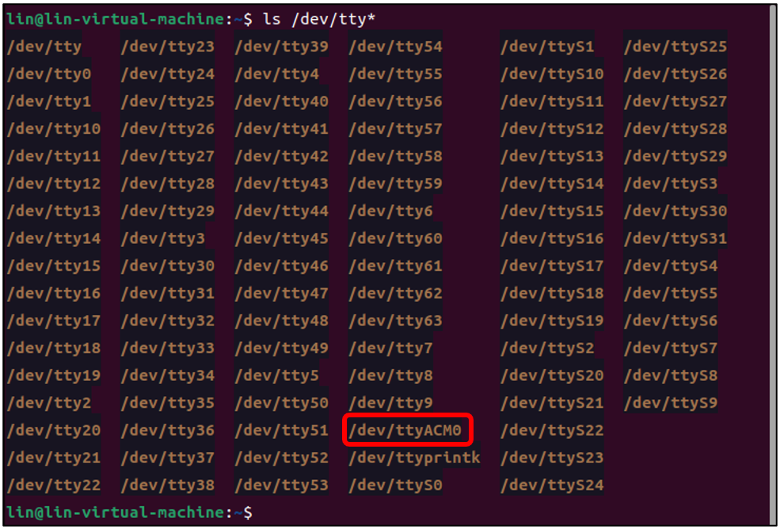

如果您的电脑没有CH343驱动，您可以按照接下来的步骤安装它。如果您的电脑能识别到CH343驱动，您可以跳过下面的步骤。

.. code-block:: console
    
    git clone https://github.com/WCHSoftGroup/ch343ser_linux.git

.. image:: ../../_static/imgs/xiaozhi/XiaoZhi_AI_User_Guide_(Based_on_FNK0102)/Chapter01_20.png
    :align: center

进入ch343驱动文件夹。

.. code-block:: console
    
    cd ch343ser_linux/driver/

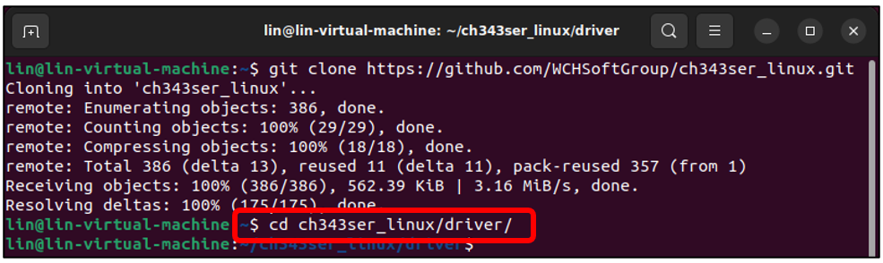

编译并生成ch343.ko文件。

.. code-block:: console
    
    make

.. image:: ../../_static/imgs/xiaozhi/XiaoZhi_AI_User_Guide_(Based_on_FNK0102)/Chapter01_22.png
    :align: center

安装ch343p芯片的驱动。

.. code-block:: console
    
    sudo make load
    sudo make install

.. image:: ../../_static/imgs/xiaozhi/XiaoZhi_AI_User_Guide_(Based_on_FNK0102)/Chapter01_23.png
    :align: center

当将ESP32S3连接到电脑时，使用指令后的显示内容如下图所示。

.. code-block:: console
    
    ls /dev/tty*

.. image:: ../../_static/imgs/xiaozhi/XiaoZhi_AI_User_Guide_(Based_on_FNK0102)/Chapter01_24.png
    :align: center

在Linux中调用”ttyACM0”通常需要较高的权限，因此使用指令提升用户权限是必须的。

.. code-block:: console
    
    sudo usermod -a -G dialout $USER
    sudo reboot

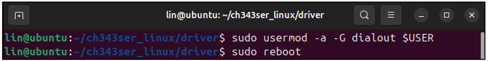

重启系统以使配置生效。

小智AI固件
*************************************

如果您的硬件还没有小智的固件，您可以参考接下来的教程，重新给ESP32 S3 WROOM上传固件。

如果您的硬件已经集成了小智的固件，您可以跳过这个章节。

安装Python (Importance)
==================================

Windows
-----------------------------

请下载并安装 **Python3** 软件包。

https://www.python.org/downloads/windows/

点击下载 **Python 3.13.3**

**重要提示：务必勾选 "Add Python 3.13 to PATH" 选项。**

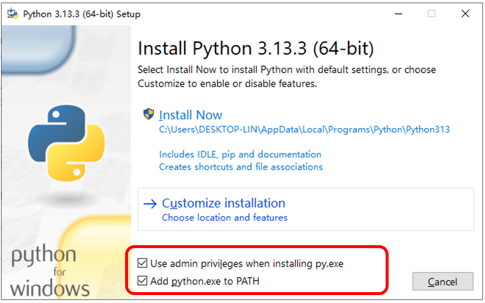

勾选所有选项后，点击 **“Next”**。

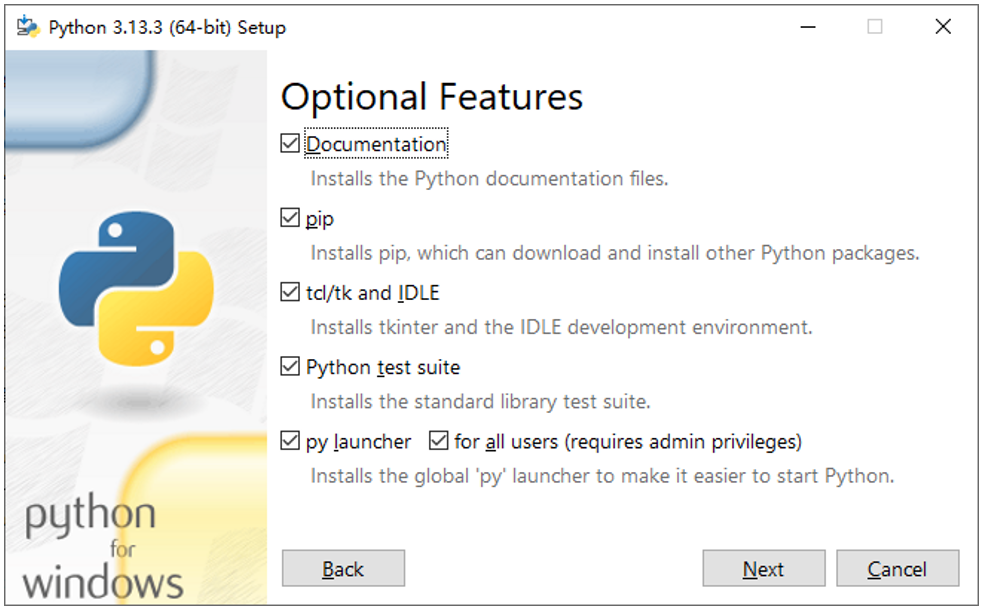

此处可设置 Python 的安装路径。我们将其安装在D盘。若您是新手，可直接选择默认路径。

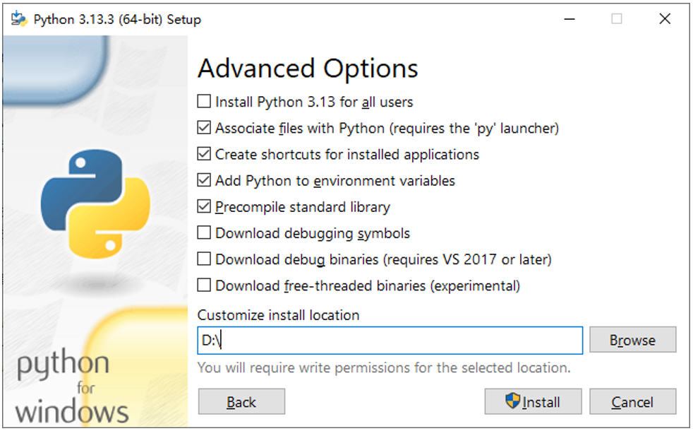

等待安装完成

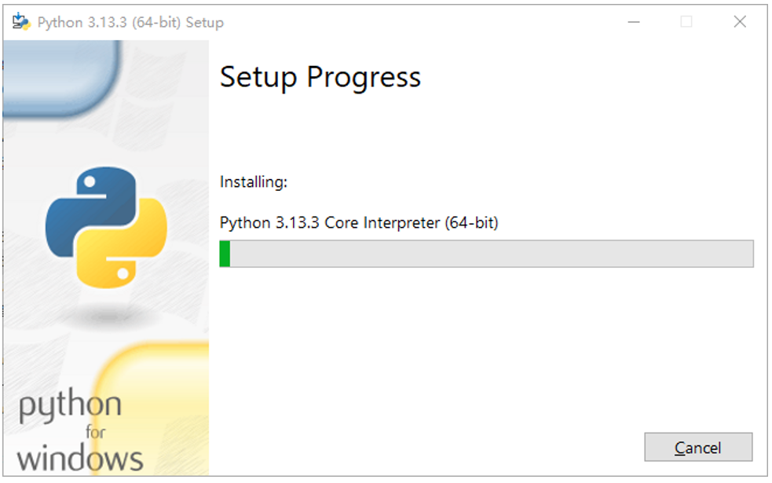

现在安装已完成。

MAC
-----------------------------

下载安装包（链接：https://www.python.org/downloads/） 

点击下载 **Python 3.13.3**

运行已下载的安装包，点击 "Continue" 按钮。

.. image:: ../../_static/imgs/xiaozhi/XiaoZhi_AI_User_Guide_(Based_on_FNK0102)/Chapter01_32.png
    :align: center

点击”Continue”

.. image:: ../../_static/imgs/xiaozhi/XiaoZhi_AI_User_Guide_(Based_on_FNK0102)/Chapter01_33.png
    :align: center

点击”Continue”

点击 "Install"。若电脑设有密码，请输入密码后继续安装。

.. image:: ../../_static/imgs/xiaozhi/XiaoZhi_AI_User_Guide_(Based_on_FNK0102)/Chapter01_35.png
    :align: center

安装完成

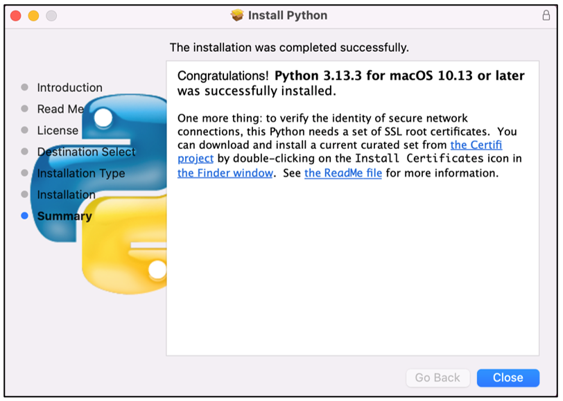

Linux
----------------------------

检查您的系统是否已经安装了Python3， Python要求Python3.10以上的版本。

.. code-block:: console
    
    python -version
    python3 -version

.. image:: ../../_static/imgs/xiaozhi/XiaoZhi_AI_User_Guide_(Based_on_FNK0102)/Chapter01_37.png
    :align: center

安装python3，默认安装最新版本。

.. code-block:: console
    
    sudo apt install python3

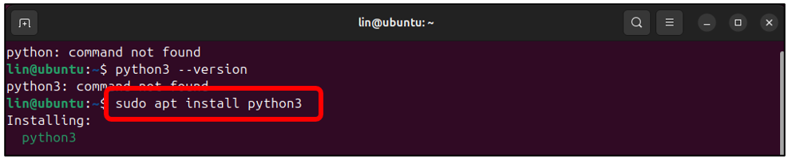

将python链接到python3.

.. code-block:: console
    
    sudo rm /usr/bin/python
    sudo ln -s /usr/bin/python3 /usr/bin/python

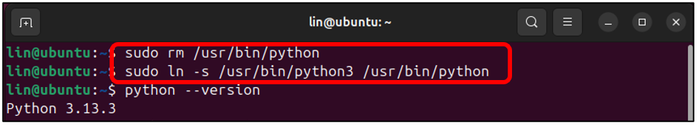

安装python3.13-venv虚拟环境。

.. code-block:: console
    
    sudo apt install python3-venv

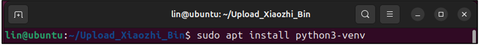

安装pip。

.. code-block:: console
    
    sudo apt install python3-pip

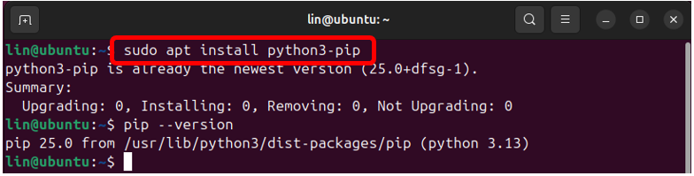

.. _upload_firmware:

上传固件
===============================

Windows
----------------------------------

进入Upload_Xiaozhi_Bin文件夹。

.. image:: ../../_static/imgs/xiaozhi/XiaoZhi_AI_User_Guide_(Based_on_FNK0102)/Chapter01_41.png
    :align: center

在文件栏输入“CMD”, 并按下回车键。

.. image:: ../../_static/imgs/xiaozhi/XiaoZhi_AI_User_Guide_(Based_on_FNK0102)/Chapter01_42.png
    :align: center

输入“python –version“，查看是否已经安装Python环境，如果没有打印Python的版本信息，说明Python没有正确安装环境，请重新安装。

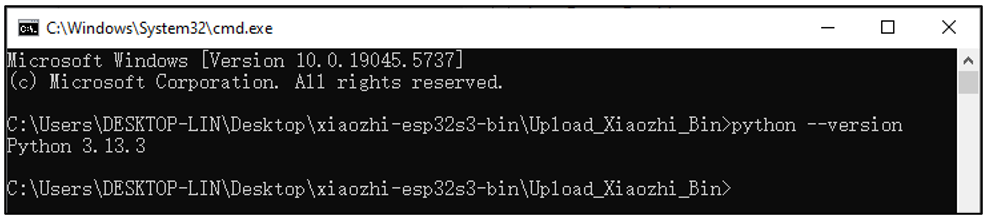

使用数据线连接电脑和ESP32 S3 WROOM，请注意，不要连接错Type C接口。

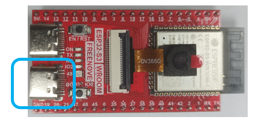

输入“python upload_xiaozhi_bin.py”，并按下回车。

如果您的电脑没有安装esptool及其相关的软件库，它会自动安装这些库。

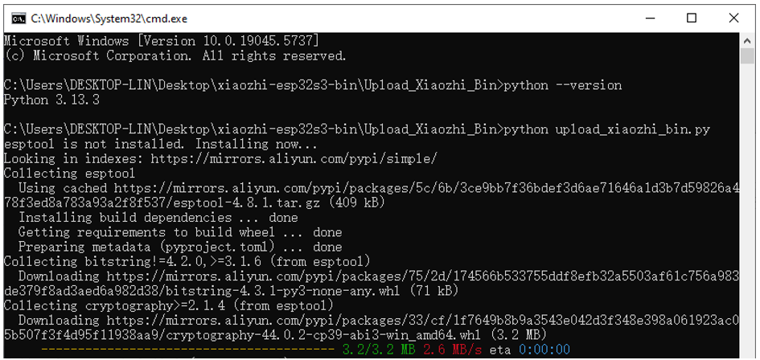

然后，它会调用esptool将bin文件夹中的文件上传到ESP32 S3 WROOM中。

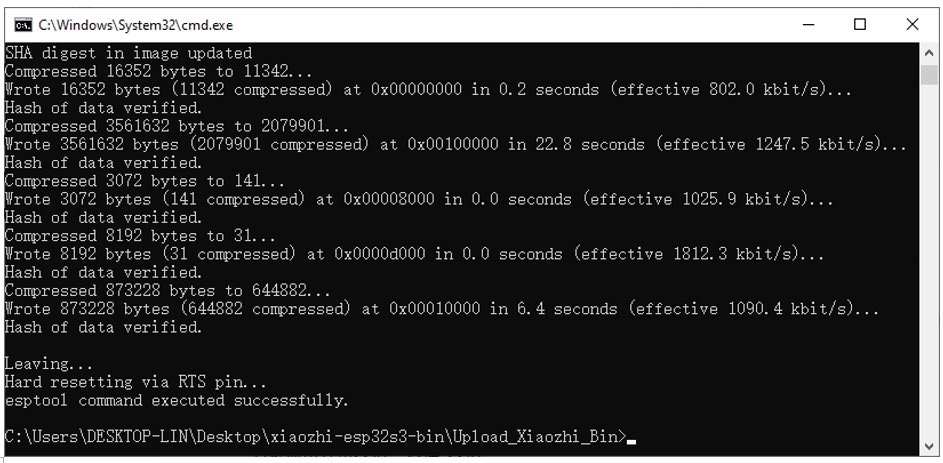

ESP32 S3 WROOM显示如下。

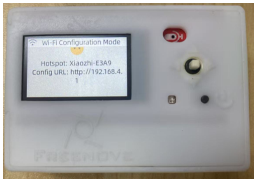

MAC
----------------------------

进入Upload_Xiaozhi_Bin文件夹。

.. image:: ../../_static/imgs/xiaozhi/XiaoZhi_AI_User_Guide_(Based_on_FNK0102)/Chapter01_48.png
    :align: center

输入“python –version“，查看是否已经安装Python环境，如果没有打印Python的版本信息，说明Python没有正确安装环境，请重新安装。

.. image:: ../../_static/imgs/xiaozhi/XiaoZhi_AI_User_Guide_(Based_on_FNK0102)/Chapter01_49.png
    :align: center

使用数据线连接电脑和ESP32 S3 WROOM，请注意，不要连接错Type C接口。

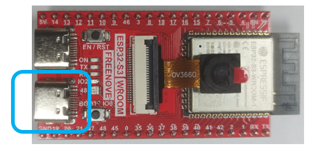

输入“python upload_xiaozhi_bin.py”，并按下回车。

然后，它会调用esptool将bin文件夹中的文件上传到ESP32 S3 WROOM中。

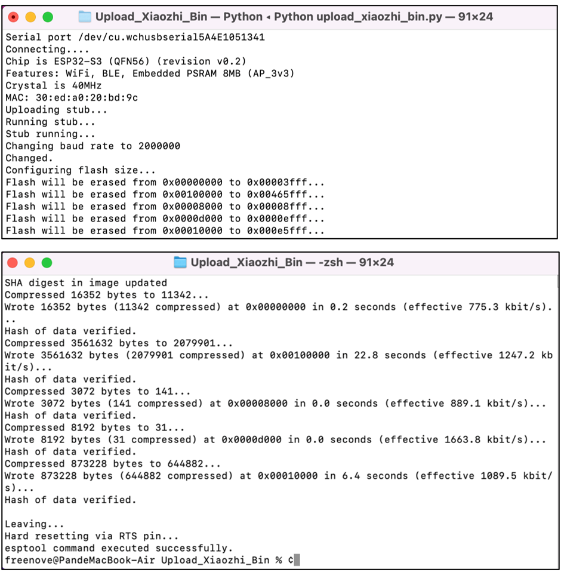

ESP32 S3 WROOM显示如下。

Linux
----------------------------

进入Upload_Xiaozhi_Bin文件夹

.. code-block:: console
    
    cd Upload_Xiaozhi_Bin

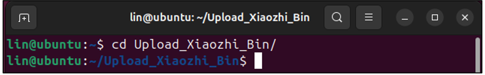

输入“python –version“，查看是否已经安装Python环境，如果没有打印Python的版本信息，说明Python没有正确安装环境，请重新安装。

.. image:: ../../_static/imgs/xiaozhi/XiaoZhi_AI_User_Guide_(Based_on_FNK0102)/Chapter01_55.png
    :align: center

使用数据线连接电脑和ESP32 S3 WROOM，请注意，不要连接错Type C接口。

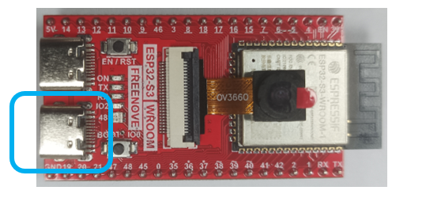

.. code-block:: console
    
    python -m venv myvenv

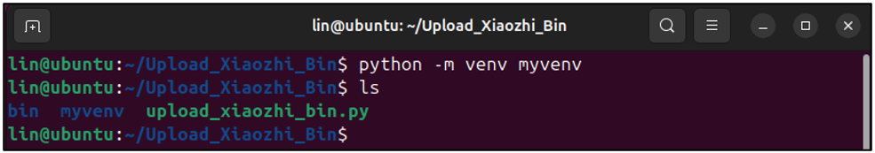

您可以使用下面的指令激活和关闭虚拟环境。

.. code-block:: console
    
    source myvenv/bin/activate
    deactivate

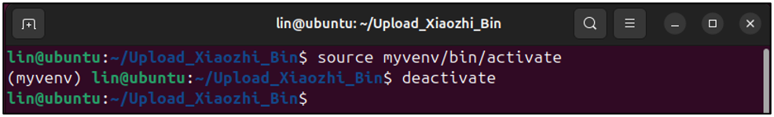

激活虚拟环境。

.. image:: ../../_static/imgs/xiaozhi/XiaoZhi_AI_User_Guide_(Based_on_FNK0102)/Chapter01_59.png
    :align: center

.. code-block:: console
    
    ls /dev/tty*

当ESP32S3没有连接到电脑时，使用指令后的显示内容如下图所示。

.. image:: ../../_static/imgs/xiaozhi/XiaoZhi_AI_User_Guide_(Based_on_FNK0102)/Chapter01_60.png
    :align: center

当将ESP32S3连接到电脑时，使用指令后的显示内容如下图所示。

.. image:: ../../_static/imgs/xiaozhi/XiaoZhi_AI_User_Guide_(Based_on_FNK0102)/Chapter01_61.png
    :align: center

对比前后的区别，多出来的端口就是ESP32S3连接到电脑上的端口号。

在运行python文件之前，需要修改文件中的端口号。

使用指令打开python文件。

.. code-block:: console
    
    sudo nano upload_xiaozhi_bin.py

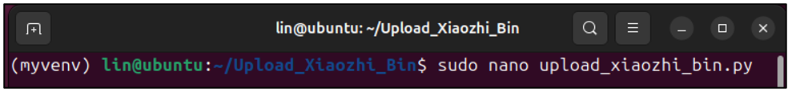

在文本编辑器中，找到’“--port”, “COMx”’这一行，将“COMx”修改为ESP32S3在电脑上的端口号。

.. image:: ../../_static/imgs/xiaozhi/XiaoZhi_AI_User_Guide_(Based_on_FNK0102)/Chapter01_63.png
    :align: center

修改后如下图所示。

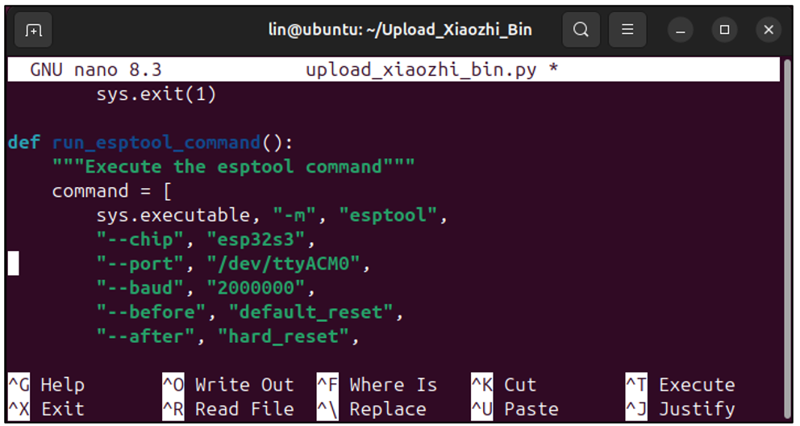

使用Crtl+O，保存文件。

使用Ctrl+X，退出编辑器。

运行python文件。

.. code-block:: console
    
    python upload_xiaozhi_bin.py

.. image:: ../../_static/imgs/xiaozhi/XiaoZhi_AI_User_Guide_(Based_on_FNK0102)/Chapter01_65.png
    :align: center

代码上传完成，如下图所示。

.. image:: ../../_static/imgs/xiaozhi/XiaoZhi_AI_User_Guide_(Based_on_FNK0102)/Chapter01_66.png
    :align: center

ESP32 S3 WROOM显示如下。

ESP32 S3 WROOM配网
*********************************

如果您的ESP32 S3 WROOM还没有集成小智AI固件，请跳转到 :ref:`小智AI固件 <upload_firmware>`。

如果您想学习小智AI的代码，请跳转到小智AI代码, 请跳转到小智AI代码。

如果您的ESP32 S3 WROOM已经集成了小智AI的固件，请使用您的手机，打开WiFi功能，您可以搜索到一个叫“Xiaozhi-XXXX”的路由器WiFi。请连接它，它是无密码的。

.. image:: ../../_static/imgs/xiaozhi/XiaoZhi_AI_User_Guide_(Based_on_FNK0102)/Chapter01_68.png
    :align: center

连接WiFi后，请按照提示点击它。它将会打开您的手机浏览器，并访问“192.168.4.1”这个网址。

.. image:: ../../_static/imgs/xiaozhi/XiaoZhi_AI_User_Guide_(Based_on_FNK0102)/Chapter01_69.png
    :align: center

在SSID中输入您的家庭路由器WiFi名称，在Password中输入您的家庭路由器WiFi密码。然后点击Connect。

请注意，ESP32 S3 WROOM只接收2.4GHz频段的路由器，如果您的路由器同时支持2.4GHz和5GHz，请注意，不能让ESP32 S3 WROOM连接5Ghz频段。也不能将2.4Ghz和5Ghz设置为混合模式。这都会导致ESP32 S3 WROOM无法正常联网工作。

.. image:: ../../_static/imgs/xiaozhi/XiaoZhi_AI_User_Guide_(Based_on_FNK0102)/Chapter01_70.png
    :align: center

当您看到这个界面时，说明您已经成功让ESP32 S3 Wroom配网成功，它将会加入您的家庭路由器WiFi网络中。您可以看到ESP32 S3 WROOM自动连接WiFi，然后屏幕显示如下图所示。

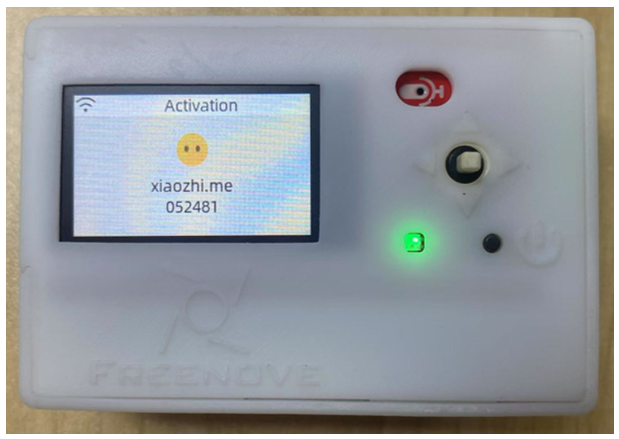

配置小智AI服务器
***********************************

请确保您的手机或者电脑和ESP32 S3 WROOM连接到同一个路由器WiFi网络中。

打开手机或者电脑的浏览器功能，访问网址：https://xiaozhi.me/

:red:`请注意，由于不同国家的网络政策原因，可能会存在部分国家的用户无法正常访问网站。具体情况请查看相关国家网络政策。`

如果您还没有账号，请点击Console，使用手机号进行注册。

如果您还没有账号，请先注册一个账号，并登陆它。

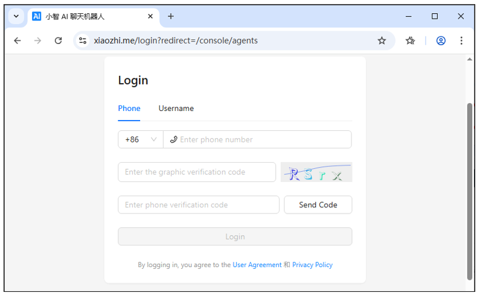

点击Console，开始配置小智AI服务器。

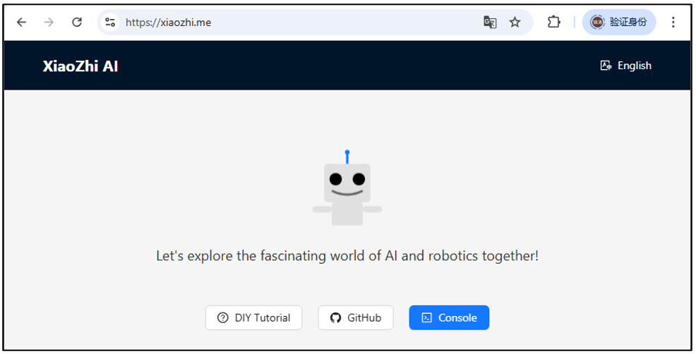

点击“Create Agent”，创建一个新的智能体。

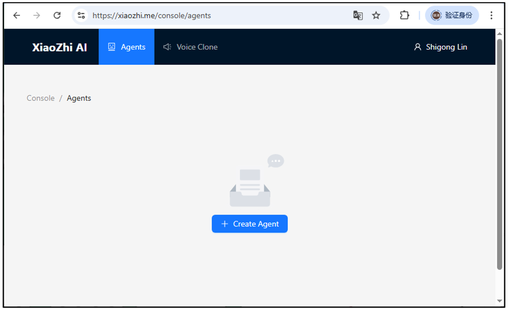

填写任意名称。点击“Confirm”。

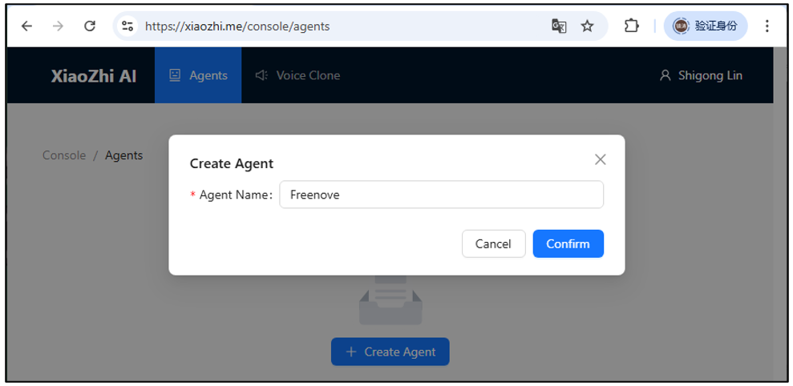

点击“Configure Role”，配置您的智能体。

.. image:: ../../_static/imgs/xiaozhi/XiaoZhi_AI_User_Guide_(Based_on_FNK0102)/Chapter01_75.png
    :align: center

点击“English Tutor”，其他选项内容保持不变。

.. image:: ../../_static/imgs/xiaozhi/XiaoZhi_AI_User_Guide_(Based_on_FNK0102)/Chapter01_76.png
    :align: center

滚动鼠标，将界面移动到最底部，点击“Save”。

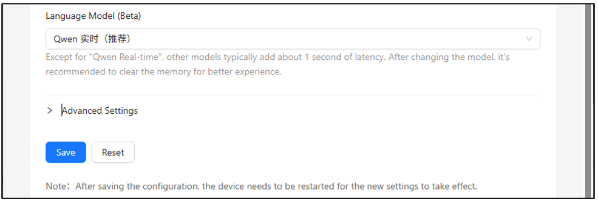

点击“Agents”回到智能体界面，然后点击”Add Device”。

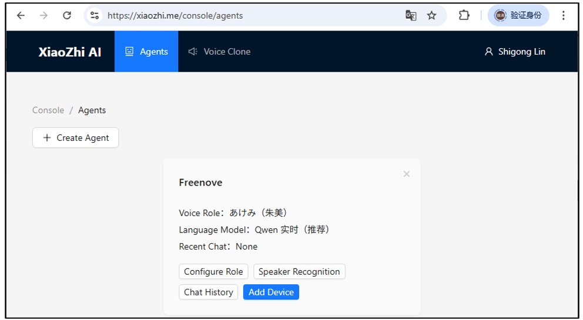

在新弹出的界面中，填写ESP32 S3 WROOM屏幕的数字。然后点击“Confirm”。

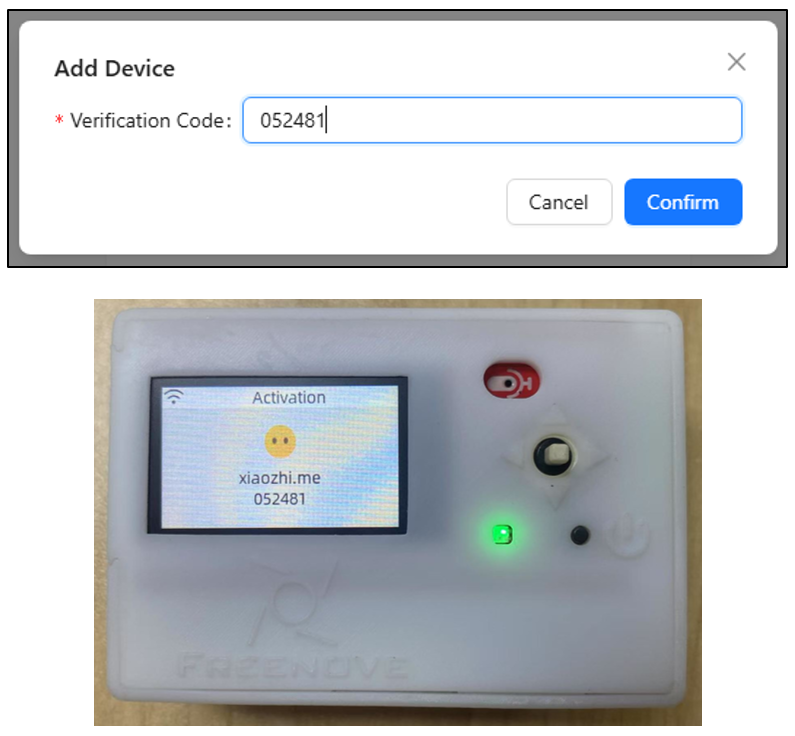

添加完成后，界面如下。

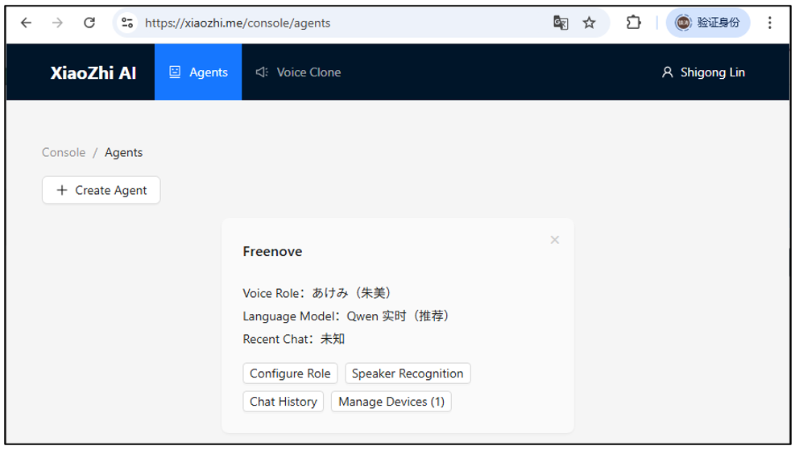

点击ESP32 S3 WROOM上的RST按键。它将让ESP32 S3 WROOM重新启动。

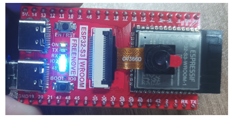

至此，您已经完成小智AI的全部工作。对着麦克风说，“Hi, ESP”。

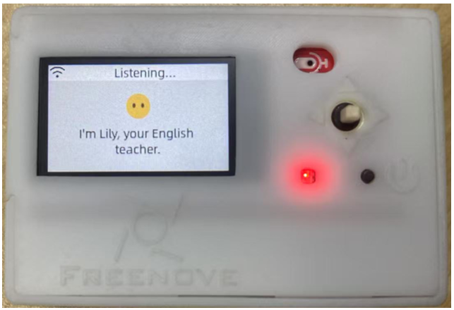

您可以和它进行中文，英文交流。