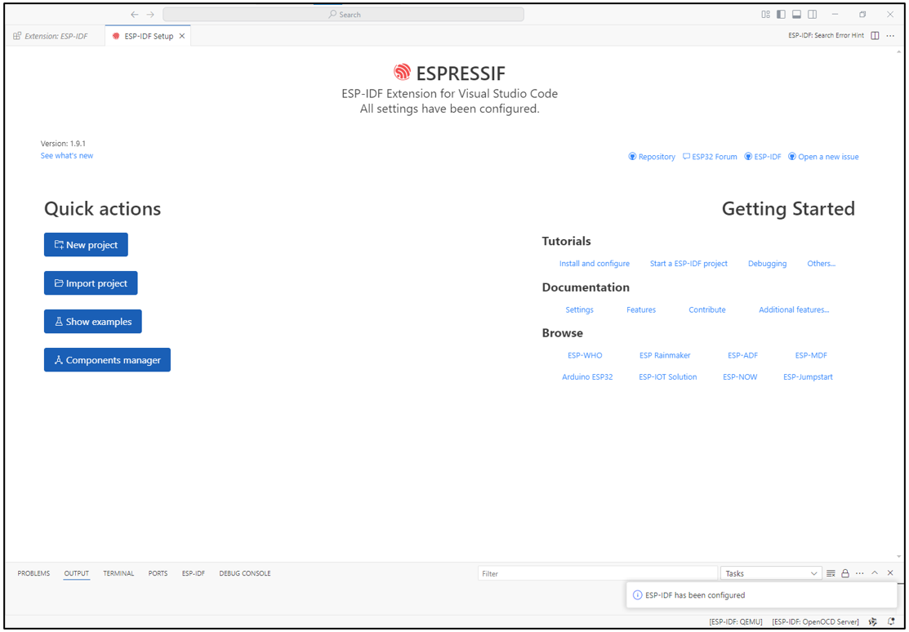
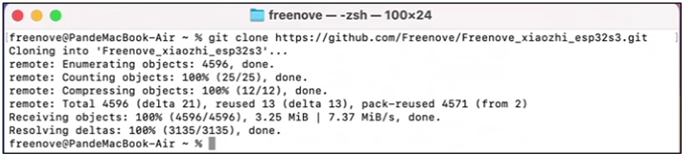

##############################################################################
小智AI代码
##############################################################################

Visual Studio Code
***************************

Window
=======================

首先，我们需要先下载Visual Studio Code，请访问https://code.visualstudio.com/Download。选择适合您电脑平台的版本，下载并安装它。

双击运行下载的exe文件。勾选”I accept the agreement”。然后点击next.

安装的位置可以保持默认选项，也可以自行修改到合适的位置。然后一直点击Next。

在这个界面时，请注意查看“Add to PATH”是否勾选中，如果没有，请勾选它。然后一直点击Next，直到软件安装完成。

.. image:: ../../_static/imgs/xiaozhi/XiaoZhi_AI_Code/Chapter02_03.png
    :align: center

安装完成如下图所示。

MAC
========================

通常，MAC系统自带Visual Studio Code，如果您的电脑没有Visual Studio Code，请先安装它。

请访问https://code.visualstudio.com并点击“Download for macOS”.

.. image:: ../../_static/imgs/xiaozhi/XiaoZhi_AI_Code/Chapter02_05.png
    :align: center

双击运行它。

Linux
========================

如果您的电脑没有Visual Studio Code，请先安装它。

请访问https://code.visualstudio.com。并点击“.deb”.

.. image:: ../../_static/imgs/xiaozhi/XiaoZhi_AI_Code/Chapter02_07.png
    :align: center

打开下载的“code_xxx.deb”文件。

点击“Install”，安装Visual Studio Code.

.. image:: ../../_static/imgs/xiaozhi/XiaoZhi_AI_Code/Chapter02_09.png
    :align: center

等待安装完成，安装完成如下图所示。

点击Show Apps，可以看到，Visual Studio Code已经出现在系统中。

安装ESP-IDF V5.3.2
*********************************

Visual Studio Code是一个通用的代码编辑器，为了编程ESP-IDF的SDK，我们需要给Visual Studio Code安装一个ESP-IDF插件。

打开Visual Studio Code。

Window系统和Linux系统：点击菜单栏的“File” -> ”Preferences” -> ”Extensions”.

.. image:: ../../_static/imgs/xiaozhi/XiaoZhi_AI_Code/Chapter02_12.png
    :align: center

Mac系统：点击屏幕左上方的“Code” -> ”Preferences” -> ”Extensions”.

输入“ESP-IDF”，点击搜索出来的“ESP-IDF”，然后点击右边的“Install”。

在左边可以看到出现了一个“ESP-IDF”的图标。点击它。

.. image:: ../../_static/imgs/xiaozhi/XiaoZhi_AI_Code/Chapter02_15.png
    :align: center

滚动鼠标，找到并点击“Advanced”。

.. image:: ../../_static/imgs/xiaozhi/XiaoZhi_AI_Code/Chapter02_16.png
    :align: center

点击第一个选项，“Configure ESP-IDF Extension”。

在右边选择“EXPRESS”。

.. note:: 
    
    如果您是MAC系统或者Ubuntu系统，请根据提示做好准备工作再进行安装。

勾选“Show all ESP-IDF tags”，选择”v5.3.2 (release version)”，并选择您的ESP-IDF环境将要保存的位置。然后点击“Install”。不同的系统保存的路径不同，请记住这些存放路径。

.. image:: ../../_static/imgs/xiaozhi/XiaoZhi_AI_Code/Chapter02_20.png
    :align: center

等待安装完成即可。如果您安装失败了，请找到上一步中的路径，删除对应的文件夹，并重新开始安装。

这一步需要等待一段较长的时间，请确保您的网络良好，且网速较快。

如果您始终无法正常安装，根据您的电脑系统，查看对应的链接：

Window: https://docs.espressif.com/projects/esp-idf/en/latest/esp32/get-started/windows-setup.html 

Mac & Linux: https://docs.espressif.com/projects/esp-idf/en/latest/esp32/get-started/linux-macos-setup.html 

插件安装完成如下图所示。

更多关于ESP-IDF的消息，请访问：

https://docs.espressif.com/projects/vscode-esp-idf-extension/en/latest/installation.html 

下载代码
****************************

Window
==============================

打开浏览器，输入“https://github.com/Freenove/xiaozhi-esp32”。

点击“Code”，然后点击“Dowmload ZIP”，将代码下载到本地。

.. image:: ../../_static/imgs/xiaozhi/XiaoZhi_AI_Code/Chapter02_24.png
    :align: center

将下载的压缩文件解压到本地。请注意，将解压后的文件夹重命名为“xiaozhi-esp32”。

.. image:: ../../_static/imgs/xiaozhi/XiaoZhi_AI_Code/Chapter02_25.png
    :align: center

MAC 
===============================

打开终端，使用git下载代码。

.. code-block:: console
    
    git clone https://github.com/Freenove/Freenove_xiaozhi_esp32s3.git

Linux
=============================

打开终端，使用git下载代码。

.. code-block:: console
    
    git clone https://github.com/Freenove/Freenove_xiaozhi_esp32s3.git

配置代码环境
==============================

使用Visual Studio Code，点击“File” -> ”Open Folder...”。

选择xiaozhi-esp32文件夹。这里以Window系统举例，在MAC系统和Ubuntu系统上的操作类似。

.. image:: ../../_static/imgs/xiaozhi/XiaoZhi_AI_Code/Chapter02_29.png
    :align: center

勾选复选框，并点击”Yes，I trust the authors of all files in the parent floder ‘Downloads’”。

.. image:: ../../_static/imgs/xiaozhi/XiaoZhi_AI_Code/Chapter02_30.png
    :align: center

请注意，右下角会弹出一个提示框，请点击“Generate comple_commands.json”，它将根据文件下载对应的组件模块代码。

.. image:: ../../_static/imgs/xiaozhi/XiaoZhi_AI_Code/Chapter02_31.png
    :align: center

组件安装需要一些时间，请注意等待，不要进行其他操作。组件安装完成会在右下角打印提示。

使用数据线连接电脑和ESP32 S3 WROOM，请注意，不要连接错Type C接口。

点击左下角的COMx，在上方会出现电脑上所有的COM设备端口号。找到ESP32-S3，并选择那一项。

点击左下角的ESP32，在上方会出现很多ESP32型号，选择ESP32S3。

在新的选择框中，选择“ESP32-S3 Chip (via ESP-PROG) ESP32-S3 debugging via ESP-PROG Board ...”。

.. image:: ../../_static/imgs/xiaozhi/XiaoZhi_AI_Code/Chapter02_36.png
    :align: center

请等待一会，直到下方出现“Target ESP32S3 Set Successfully.”的提示。

接下来点击SDK Configuration Editor (menuconfig)选项。

.. image:: ../../_static/imgs/xiaozhi/XiaoZhi_AI_Code/Chapter02_38.png
    :align: center

在新的界面中，点击“Serial flasher config”，并检查配置是否和下图一致。

.. image:: ../../_static/imgs/xiaozhi/XiaoZhi_AI_Code/Chapter02_39.png
    :align: center

点击“Partition Table”，并检查配置是否和下图一致。

.. image:: ../../_static/imgs/xiaozhi/XiaoZhi_AI_Code/Chapter02_40.png
    :align: center

点击“Xiao Assistant”，并检查配置是否和下图一致。

.. image:: ../../_static/imgs/xiaozhi/XiaoZhi_AI_Code/Chapter02_41.png
    :align: center

点击Load Multiple Wake Words”，并勾选“Hi, ESP”、“Hi, Lily”等选项。

.. image:: ../../_static/imgs/xiaozhi/XiaoZhi_AI_Code/Chapter02_42.png
    :align: center

最后，点击”Save”，保存您的配置。保存成功，下方会给出提示信息。

.. image:: ../../_static/imgs/xiaozhi/XiaoZhi_AI_Code/Chapter02_43.png
    :align: center

编译代码
====================================

确保一切都配置完成之后，我们开始编译代码。

点击下方的“Full Clean”，它将会清除之前的所有编译信息。

点击下方的“Build Project”，开始编译整个工程代码。首次编译需要等待的时间较长，请耐心等待，直到下方出现编译成功的提示。

.. image:: ../../_static/imgs/xiaozhi/XiaoZhi_AI_Code/Chapter02_45.png
    :align: center

点击下方的“Flash Device”。准备开始上传代码到ESP32 S3 Wroom中。

在新出现的选项中，选择“UART”，然后等待代码上传完成即可。

看到“Flash has finished. You can monitor your device with 'ESP-IDF: Monitor command'”的提示，说明您已经将小智AI的代码上传到ESP32 S3 WROOM中。

.. image:: ../../_static/imgs/xiaozhi/XiaoZhi_AI_Code/Chapter02_48.png
    :align: center

至此，您已经编译完成，可以进行二次创作了。