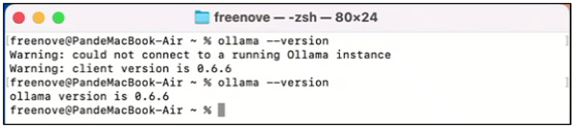
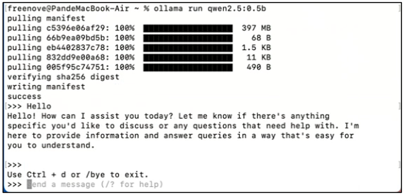
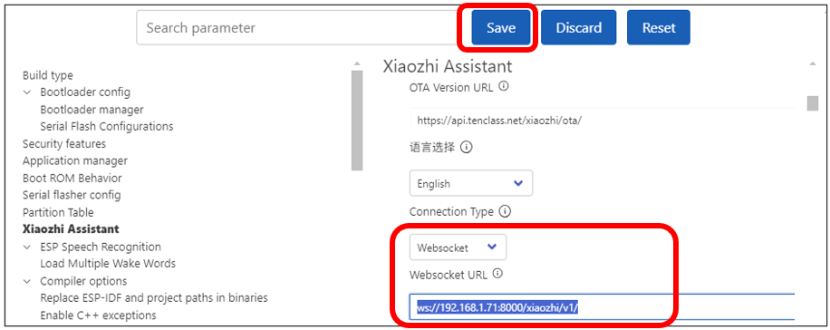

##############################################################################
本地服务器
##############################################################################

小智AI服务器使用声明
********************************

本项目基于网络开源项目https://github.com/xinnan-tech/xiaozhi-esp32-server。该项目开源协议类型为MIT协议。我们仅在此基础上提供适配，用做第三方学习和AI功能试用，不做商业性质推广和应用。本教程仅给爱好者附加学习使用。

小智AI本地服务器部署
********************************

如果您不想使用小智AI服务器，您也可以使用自己的电脑搭建一个简易版本的服务器，这个章节我们将使用开源项目https://github.com/xinnan-tech/xiaozhi-esp32-server来部署一个本地服务器，并和ESP32 S3 WROOM建立连接。如果您在使用过程中发现代码存在bug，请在https://github.com/xinnan-tech/xiaozhi-esp32-server上提交issue，我们对此项目并不进入深入了解，无法为您提供太多帮助。

安装Ollama
===============================

Window
-------------------------------

在开始之前，我们需要在本地先安装Ollama工具，它可以在我们的电脑上安装任意开源模型。

如果您还没有安装Ollama，请访问https://ollama.com/download 进行下载和安装。

运行Ollama安装包，点击Install.

安装完成后，您可以在电脑的右下角看到图标。

回到电脑的桌面位置，选择此电脑，按下鼠标右键，选择“Properties”.

在新弹出的界面中，找到“Advances system settings”，然后点击它。

在新的窗口中，点击“Environment Variables”.

点击”New”.

变量名称输入“OLLAMA_HOST”，变量值输入“0.0.0.0:11434”，然后点击OK。

这样局域网内所有的设备都可以通过IP地址访问Ollama。否则只能电脑本身访问Ollama.

.. image:: ../../_static/imgs/xiaozhi/Local_Server/Chapter03_07.png
    :align: center

MAC 
---------------------------------

在开始之前，我们需要在本地先安装Ollama工具，它可以在我们的电脑上安装任意开源模型。

如果您还没有安装Ollama，请访问https://ollama.com/download 进行下载和安装。

在Downloads中找到“Ollama.app”，双击运行它。

点击”Next”，然后点击“Install”，最后点击“Finish”

安装完成后，界面会直接关闭。

打开终端，通过指令查看Ollama是否已经安装完成。

.. code-block:: console
    
    ollama --version

请注意，Ollama存放在Applications中。如上图所示，如果您的Ollama已经在运行，则运行“ollama --version”时，会直接打印Ollama的版本号。如果您的Ollama没有运行，则运行“ollama --version”时，会提示您无法连接到运行中的Ollama.

Linux 
------------------------------

在开始之前，我们需要在本地先安装Ollama工具，它可以在我们的电脑上安装任意开源模型。

如果您还没有安装Ollama，请访问https://ollama.com/download 进行下载和安装。

打开终端。输入指令，开始安装Ollama.

安装完成如下图所示。当然，您可以使用“ollama --version”查看是否已经安装Ollama.

.. _LLM:

LLM模型
-----------------------------------

请访问https://ollama.com/search，选择适合您电脑的，或者您喜欢的LLM模型。

这里我以qwen2.5举例。点击“qwen2.5”模型。

请注意，在选择模型时，需要根据您的电脑显卡内存或者CPU内存条配置，选择合适的模型。

1，模型越大，智能化程度越高。模型越小，智能化程度越低。

2，如果您的配置比较高，您可以选择比较大的模型，如果您的电脑配置比较低，您可以选择比较小的模型。

3，如果您的电脑配置较低，而您选择的模型过大，可能会导致模型无法运行，或者运行的速度变慢。

通过下拉框，可以选择合适的模型参数。

模型越小，越不智能，但是运行速度越快，这里只是作为演示，我们选择qwen2.5:0.5b来作为示范。复制网页中的指令：“ollama run qwen2.5:0.5b”

接下来请根据您的电脑系统，安装您喜欢的LLM模型。

Window
^^^^^^^^^^^^^^^^^^^^^^^^^^^^^^^^^

您可以使用指令“Win+R”，在弹出的窗口中输入“CMD”，打开CMD界面。

输入指令“ollama --version”，查看是否已经安装了ollama。

输入“ollama run qwen2.5:0.5b”，将模型下载到本地中。

MAC
^^^^^^^^^^^^^^^^^^^^^^^^^^^^^^^^^

打开终端，输入指令“ollama --version”，查看是否已经安装了ollama。

如果出现“Warning: could not connect to a running Ollama instance”的提示，请先运行Ollama.

重新使用指令，查看Ollama是否正常运行。

输入“ollama run qwen2.5:0.5b”，将模型下载到本地中。

当安装完成后，你可以直接在终端界面中和qwen2.5:0.5b进行聊天。

您可以使用指令“Ctrl+d”，退出聊天模式。

您可以通过指令“ollama serve”来运行ollama服务器。

如果您的Ollama已经运行，则会提示您下面的界面。

:red:`您可以输入Ollama，查看Ollama的使用说明。`

Linux
^^^^^^^^^^^^^^^^^^^^^^^^^^^^^^^^

打开终端，输入指令“ollama --version”，查看是否已经安装了ollama。

输入“ollama run qwen2.5:0.5b”，将模型下载到本地中。

当安装完成后，你可以直接在终端界面中和qwen2.5:0.5b进行聊天。

您可以使用指令“Ctrl+d”，退出聊天模式。
 
您可以输入Ollama，查看Ollama的使用说明。

安装Conda
===================================

xiaozhi-esp32-server这个开源项目提供了4种安装方式，在本教程中，我们选择最简单的配置示例作为示范，其他使用方法请参考网站进行探索学习。

Window
-----------------------------------

本示例使用conda管理依赖环境。因此我们需要事先在电脑上安装Conda环境。如果您的电脑还没安装Conda，您可以访问这个链接下载并安装它：https://www.anaconda.com/download/success  

选择适合您电脑平台的软件包下载。Miniconda is an installer by Anaconda that comes preconfigured for use with the Anaconda Repository.

双击打开Conda软件，点击Next.

点击“I Agree”.

根据需求，选择合适的安装类型，一般我们选择“All Users”.

选择安装软件的位置。

保持默认即可。点击Install。

等待安装，可能需要等待一小会。

至此，软件就安装完成了。

您可以使用“Win+R”打开Run界面。输入“CMD”，并按下回车键，进入CMD界面。

输入“conda --version”，并按下回车键。如果您的Anaconda3已经安装完成，您可以看到下面的提示信息。

Mac
-----------------------------------

本示例使用conda管理依赖环境。因此我们需要事先在电脑上安装Conda环境。如果您的电脑还没安装Conda，您可以访问这个链接下载并安装它：https://www.anaconda.com/download/success  

选择适合您电脑平台的软件包下载。Miniconda is an installer by Anaconda that comes preconfigured for use with the Anaconda Repository.

双击打开Conda软件，点击Continue.

点击Continue.

点击Continue.

点击Agree.

保持默认，点击Continue.

点击Install.

这里需要等待几分钟。

点击Continue.

点击Close.

至此，您可以安装了Conda。您可以在您的应用列表中找到它。

双击运行它，这一步不会有任何现象。

再次打开终端。您可以发现，出现了”(base)”的提示词。您也可以通过指令“conda --version”查看conda的版本。

您可以使用conda -h来查看更多的使用方法。

如果您是第一次使用conda，您需要使用指令“conde init”，让安装的conda环境初始化并生效。

.. code-block:: console
    
    conda init

您可以使用conda activate来激活虚拟环境。或者通过conda deactivate来退出虚拟环境。 

.. code-block:: console
    
    conda activate
    conda deactivate

如果您想要打开终端就自动进入虚拟环境，您可以使用“conda config --set auto_activate_base true”指令。如果您不想要打开终端就自动进入虚拟环境，您可以使用“conda config --set auto_activate_base flase”指令。

.. code-block:: console
    
    conda config --set auto_activate_base false
    conda config --set auto_activate_base true

Linux
-------------------------------

本示例使用conda管理依赖环境。因此我们需要事先在电脑上安装Conda环境。

如果您的电脑还没安装Conda，您可以访问这个链接下载并安装它：https://www.anaconda.com/download/success

选择适合您电脑平台的软件包下载。Miniconda is an installer by Anaconda that comes preconfigured for use with the Anaconda Repository.

此处我下载的文件名称为“Anaconda3-2024.10-1-Linux-x86_64.sh”，不同的电脑，名称可能不同。

打开终端，使用下面的指令安装Anaconda。

.. code-block:: console
    
    sh Anaconda3-2024.10-1-Linux-x86_64.sh

按住回车键不松开，直到出现下方的的提示信息。输入“Yes”。

安装过程需要网络，请确保您的网络稳定，并耐心等待几分钟。直到您的界面出现下方的提示信息。

请注意，这里需要输入Yes.

出现下方的提示，说明您已经成功安装conda.

如果您想要打开终端就自动进入虚拟环境，您可以使用“conda config --set auto_activate_base true”指令。

如果您不想要打开终端就自动进入虚拟环境，您可以使用“conda config --set auto_activate_base flase”指令。

.. code-block:: console
    
    conda config --set auto_activate_base false
    conda config --set auto_activate_base true

这里，我们建议使用“conda config --set auto_activate_base false”。

重启终端，您可以通过指令查看conda的版本号。

.. code-block:: console
    
    conda -version

您可以使用conda activate来激活虚拟环境。或者通过conda deactivate来退出虚拟环境。 

.. code-block:: console
    
    conda activate
    conda deactivate

如果您查看conda的版本号时报错如下。

.. code-block:: console
    
    conda -version

这说明您的文件Conda虽然已经安装，但是没有添加到PATH中。

请按照下面的步骤将conda添加到PATH中。

使用nano编辑”.bashrc”文件.

.. code-block:: console
    
    cd ~
    sudo nano ./.bashrc

在文件的最下方，添加一行内容。

使用Ctrl+O保存文件，使用Ctrl+X退出编辑器。

使用source指令，让文件生效。并查看conda的版本。

.. code-block:: console
    
    source ./.bashrc
    conda --version

部署虚拟环境
================================

请注意，部署虚拟环境的指令，在Window，MAC，Ubuntu中是通用的，这里以Window举例，其他平台操作相同。

打开CMD界面，使用指令创建一个带有python3.10的虚拟环境，并命名为“xiaozhi-esp32-server”

.. code-block:: console
    
    conda create -n xiaozhi-esp32-server python=3.10 -y

当看到下面的消息，说明虚拟环境已经创建完成。

如果您想删除这个虚拟环境，请使用下面的指令。

.. code-block:: console
    
    conda remove -n xiaozhi-esp32-server --all -y

同样，您随时可以使用这两个指令，开启和关闭虚拟环境：

.. code-block:: console
    
    conda activate xiaozhi-esp32-server
    conda deactivate

:red:`请注意，有时候使用开启虚拟环境会提示您需要使用“conda init”指令。请执行它，并重启终端。`

部署xiaozhi-esp32-server服务器
==========================================

如果您是Window用户，请打开CMD界面。如果您是MAC或者Ubuntu用户，请打开终端。接下来的教程以window系统配图作为示例，有不同之处，我们会附上其他系统图片作为补充解释。

激活虚拟环境。

.. code-block:: console
    
    conda activate xiaozhi-esp32-server 

在虚拟环境中安装libopus。

.. code-block:: console
    
    conda install libopus -y

.. image:: ../../_static/imgs/xiaozhi/Local_Server/Chapter03_77.png
    :align: center

在虚拟环境中安装ffmpeg。

.. code-block:: console
    
    conda install ffmpeg -y

在虚拟环境中在虚拟环境中安装git.

.. code-block:: console
    
    conda install git -y

使用git clone指令下载服务器源码。

.. code-block:: console
    
    git clone https://github.com/Freenove/xiaozhi-esp32-server.git

进入服务器源码文件夹。

如果您是window用户，请注意路径是反斜杠。

.. code-block:: console
    
    cd xiaozhi-esp32-server\\main\\xiaozhi-server

如果您是mac用户或者Linux用户，请注意路径是正斜杠。

.. code-block:: console
    
    cd xiaozhi-esp32-server/main/xiaozhi-server

安装服务器源码需要的库环境。这个步骤需要较长一段时间，请确保您的网络良好，不要退出安装。

.. code-block:: console
    
    pip config set global.index-url https://mirrors.aliyun.com/pypi/simple/
    pip install -r requirements.txt

安装完成如下图所示。

下载声音模型。

.. code-block:: console
    
    git clone https://www.modelscope.cn/iic/SenseVoiceSmall.git

使用复制指令，将SenseVoiceSmall中的model.pt文件拷贝到models/SenseVoiceSmall文件夹中。

如果您是window用户，使用copy指令。

.. code-block:: console
    
    copy .\\SenseVoiceSmall\\model.pt .\\models\\SenseVoiceSmall\\

如果您是mac用户或者Linux用户，使用cp指令。

.. code-block:: console
    
    cp ./SenseVoiceSmall/model.pt ./models/SenseVoiceSmall/

在CMD界面中输入“mkdir data && copy config.yaml data\.config.yaml”，它将在xiaozhi-server中创建一个文件夹并命名为“data”，并将当前目录下的“config.yaml”复制到“data”文件夹下，然后命名为“.config.yaml”。

如果您是window用户，请执行这个指令。

.. code-block:: console
    
    mkdir data && copy config.yaml data\\.config.yaml

如果您是MAC/Linux用户，请执行这个指令。

.. code-block:: console
    
    mkdir data && cp config.yaml data/.config.yaml

打开并修改.config.yaml文件。

如果您是window用户，请执行这个指令。

.. code-block:: console
    
    code .\data\.config.yaml

如果您是MAC/Linux用户，请执行这个指令。

.. code-block:: console
    
    code ./data/.config.yaml

.. note:: 
    
    :red:`如果您的Vscode没有正确安装，使用指令可能会报错。您同样可以手动使用Vscode打开这个文件。`

找到“selected_module:”，将其中的“LLM: ChatGLMLLM”修改为“LLM: OllamaLLM”

找到”LLM:”中的“OllamaLLM:”，将其中的“model_name: qwen2.5”修改为“model_name: qwen2.5:0.5b”. 

保存文件并退出。

当然，您可以也选择其他模型，比如默认的ChatGLMLLM。请注意，配置不同的LLM模型需要您自行探索并配置。

运行xiaozhi-esp32-verser代码。

.. code-block:: console
    
    python app.py

请注意，此时，服务器会打印一个访问端口。记住它，后面的教程需要用到。

此时，您可以使用浏览器，打开“xiaozhi-esp32-server\\main\\xiaozhi-server\\test”中的html文件。

测试步骤如下所示。

点击 **“连接”**.

您可以在文本框中输入任意内容，并点击发送，测试xiaozhi-esp32-server是否正常运行。

如果服务器正常工作，您可以和它进行聊天。

请注意，必须同时运行xiaozhi-esp32-server和Ollama，如果您的Ollama没有运行，您可以看到如下方所示的提示。

您可以查看 :ref:`LLM模型 <LLM>` 来运行Ollama。

ESP32S3访问xiaozhi-esp-server服务器
*************************************************

请注意，前面的代码中，我们讲解了小智AI代码的配置，在这个章节中，我们需要对工程的配置进行修改，从而让ESP32S3可以访问xiaozhi-esp32-server本地服务器。

打开Visual Studio Code，选择之前的xiaozhi-esp32工程。点击SDK Configuration Editor (menuconfig)。

将Connection Type设置为“Websocket”，并填写xiaozhi-esp32-server打印的服务器端口链接。

点击保存，然后重新编译代码。如下所示。

在界面下方点击“Build Project”，编译代码。

在界面下方点击“Flash Device”，将代码上传到ESP32S3中。

至此，您已经完成小智AI的全部工作。对着麦克风说，“Hi, ESP”。您就可以和本地服务器进行聊天。

请注意，本地服务器对电脑的配置要求较高，如果您的电脑配置不高，您可以考虑将LLM模型选择大公司开放的LLM接口。这样对电脑的配置相对要低很多。